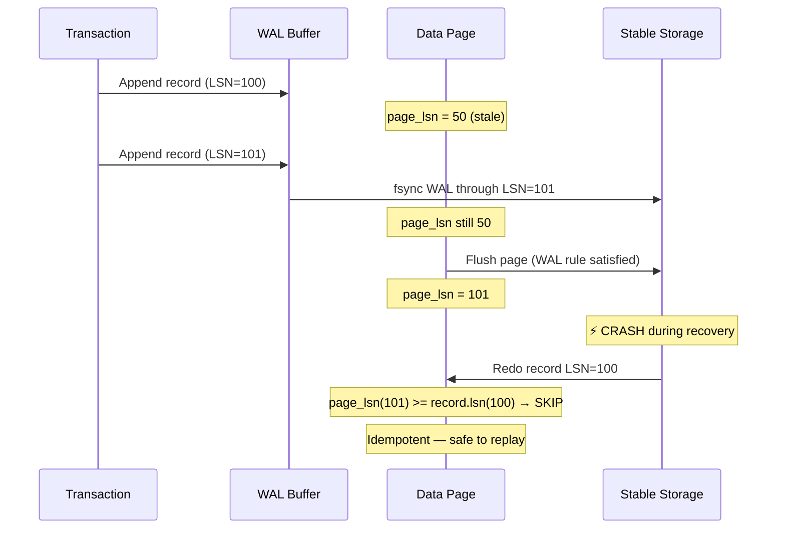
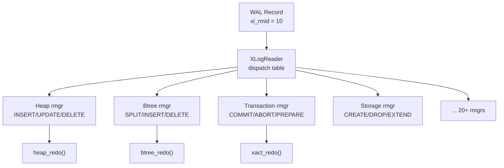
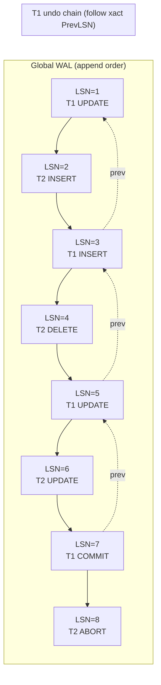

import { Aside } from '@astrojs/starlight/components';

Every WAL system ultimately boils down to one primitive: **log records** — self-describing, sequentially numbered units of change. Understanding their structure and the **Log Sequence Number (LSN)** that identifies each one is the foundation for everything else in this chapter: file formats, checkpoints, group commit, and concurrency.

## What Is a Log Record?

A log record is a **contiguous byte sequence** that describes a single atomic change to the database. It is the smallest unit the recovery manager can replay or undo. Every modification — inserting a tuple, splitting a B-tree page, committing a transaction — produces one or more log records.

At minimum, a log record must answer four questions:

1. **What changed?** (page ID, object ID, key range)
2. **How did it change?** (operation type + payload)
3. **Who caused it?** (transaction ID)
4. **Where am I in the log?** (LSN + link to previous record)

```
┌─────────────────────────────────────────────────────────────┐
│                    Generic Log Record                        │
├──────────────────┬──────────────────────────────────────────┤
│     HEADER       │              DATA                        │
│  (fixed size)    │         (variable size)                  │
│                  │                                          │
│  • total length  │  • block references (which pages)        │
│  • LSN           │  • full-page images (optional)           │
│  • prev LSN      │  • operation-specific payload            │
│  • xact ID       │  • undo information (if needed)          │
│  • rmgr / type   │                                          │
│  • checksum      │                                          │
└──────────────────┴──────────────────────────────────────────┘
```

<Aside type="tip" title="Memory Hook: The Record Receipt">
Think of each log record as a **numbered receipt** for a single change. The LSN is the receipt number. The page-LSN on a data page is the highest receipt number applied to that page. Recovery is just matching receipts to pages.
</Aside>

## Log Sequence Numbers (LSN)

An **LSN** is a monotonically increasing identifier assigned to every log record. It serves as both a **position in the log** and a **version stamp** for data pages.

### Key Properties

| Property | Description | Why It Matters |
|----------|-------------|----------------|
| **Monotonic** | Each new record gets LSN > previous | Total ordering of all changes |
| **Unique** | No two records share an LSN | Unambiguous identification |
| **Persistent** | Survives crash (stored in log + page headers) | Recovery knows where to start |
| **Comparable** | `lsn_a < lsn_b` is well-defined | Enables idempotent redo |

### LSN as Byte Offset (PostgreSQL Model)

In PostgreSQL, an LSN is a **64-bit byte offset** into the WAL stream:

```
LSN = (log segment file × 16MB) + byte offset within segment

Example: 0/1A2B3C4D
         │  └─ 32-bit offset within segment
         └─ 32-bit segment number (high half)
```

This design makes LSN arithmetic trivial: `next_lsn = current_lsn + record_length`. The buffer manager can ask "has WAL been flushed through LSN X?" by comparing a single 64-bit integer.

```c
/* PostgreSQL: src/include/access/xlogdefs.h */
typedef uint64 XLogRecPtr;  /* LSN — byte offset in WAL */

#define LSN_FORMAT_ARGS(lsn) \
    (uint32) ((lsn) >> 32), (uint32) (lsn)

/* Example: 0/1A2B3C4D printed as segment/offset */
```

Other systems use different LSN encodings but preserve the same semantics:

| System | LSN Representation | Notes |
|--------|-------------------|-------|
| **PostgreSQL** | 64-bit byte offset in WAL | `0/XXXXXXXX` hex display |
| **InnoDB** | 64-bit `(epoch, byte_offset)` | Circular log; epoch wraps |
| **SQLite WAL** | Frame number (implicit LSN) | Each frame = one page write |
| **LevelDB/RocksDB** | Sequence number (separate from log offset) | Seqno in WriteBatch, not byte offset |
| **SQL Server** | `(VLF, offset)` pair | Virtual log file + offset |

<Aside type="note" title="LSN vs Sequence Number">
Don't confuse **LSN** (position in the physical log) with **transaction sequence numbers** or **MVCC transaction IDs**. LSNs order *log records*; transaction IDs order *transactions*. A single transaction produces many log records, each with its own LSN but sharing one transaction ID.
</Aside>

## The Page-LSN Mechanism

Every data page stores a **page-LSN** in its header — the LSN of the most recent log record that modified this page. This single field enables two critical operations:

### 1. WAL Rule Enforcement (Write Path)

Before flushing a dirty page to disk, the buffer manager checks:

```python
def flush_page(page):
    if wal_flushed_lsn < page.page_lsn:
        flush_wal(up_to=page.page_lsn)  # WAL rule: log before data
    write_to_disk(page)
```

### 2. Idempotent Redo (Recovery Path)

During redo, compare page-LSN against record LSN:

```python
def redo(record, page):
    if page.page_lsn >= record.lsn:
        return  # Already applied — skip (idempotent!)
    apply_change(record, page)
    page.page_lsn = record.lsn
```



<Aside type="caution" title="Page-LSN Must Be Updated Atomically">
The page-LSN update and the actual data modification must appear atomic to recovery. If recovery sees new data with an old page-LSN, it will re-apply the change (usually harmless due to idempotency, but can corrupt with non-idempotent operations). Systems enforce this by updating page-LSN within the same mini-transaction that modifies the page.
</Aside>

## WAL Record Structure: PostgreSQL XLogRecord

PostgreSQL's record format is representative of modern ARIES-style systems. Let's examine it in detail.

### The XLogRecord Header (24 bytes)

```c
/* PostgreSQL: src/include/access/xlogrecord.h */
typedef struct XLogRecord {
    uint32      xl_tot_len;     /* total len, including header */
    TransactionId xl_xid;       /* xact ID (0 if not xact-related) */
    XLogRecPtr  xl_prev;        /* ptr to previous record in log */
    uint8       xl_info;        /* rmgr-specific flags + opcode */
    RmgrId      xl_rmid;        /* resource manager ID */
    /* 2 bytes of padding */
    pg_crc32c   xl_crc;         /* CRC-32C of entire record */
} XLogRecord;
```

### Block References and Data

After the header, the record contains zero or more **block references** (identifying affected pages) followed by the **main data payload**:

```
XLogRecord layout on disk:
┌────────────┬──────────────┬──────────────┬─────────────┐
│ XLogRecord │ BlockRef #0  │ BlockRef #1  │  Main Data  │
│  (24 B)    │  (var, ~10B) │  (var, ~10B) │   (var)     │
└────────────┴──────────────┴──────────────┴─────────────┘
                    │                              │
                    │                              └─ rmgr-specific payload
                    └─ RelFileLocator + BlockNumber + flags
```

```c
/* Block reference flags (xl_info lower bits per block) */
#define BKPBLOCK_HAS_IMAGE      0x02  /* Full-page image follows */
#define BKPBLOCK_HAS_DATA       0x04  /* Per-block data in main section */
#define BKPBLOCK_WILL_INIT      0x08  /* Page will be re-initialized (no redo) */
#define BKPBLOCK_SAME_REL       0x10  /* Same relation as previous block ref */
```

### A Complete Record Example: Heap Insert

```
LSN 0/1000: INSERT into page 42, transaction 1001

Header:
  xl_tot_len = 156
  xl_xid     = 1001
  xl_prev    = 0/0F80        ← previous record by this xact
  xl_info    = 0x00 | XLOG_HEAP_INSERT
  xl_rmid    = RM_HEAP_ID    (= 10)
  xl_crc     = 0xDEADBEEF

BlockRef #0:
  fork       = MAIN_FORKNUM
  flags      = BKPBLOCK_HAS_DATA
  rel        = (db=1, rel=16384, spc=1663)
  block      = 42

Main Data:
  offnum     = 3             ← insert at line pointer 3
  [tuple bytes...]
```

## Resource Managers (rmgr)

Log records are not interpreted by a single monolithic parser. Instead, each **resource manager** (rmgr) owns a category of operations and knows how to redo/undo its records.



| rmgr ID | Name | Example Operations |
|---------|------|--------------------|
| 0 | XLOG | WAL management itself |
| 1 | Transaction | COMMIT, ABORT, PREPARE |
| 10 | Heap | INSERT, UPDATE, DELETE, HOT prune |
| 11 | Btree | INSERT, SPLIT, DELETE, NEWROOT |
| 17 | Sequence | nextval, setval |
| 21 | Logical Message | Logical decoding output |

<Aside type="tip" title="Memory Hook: rmgr = Department Store">
Each rmgr is a **department** in the recovery store. The WAL reader is the **receipt scanner** — it reads the department code (`xl_rmid`) and routes the record to the right specialist for redo. You don't need one mega-function that understands every operation type.
</Aside>

## The PrevLSN Chain: Transaction Threading

Every log record stores `xl_prev` — the LSN of the **previous record in the log** (not necessarily by the same transaction). Additionally, each transaction maintains a **PrevLSN pointer** in its transaction table: the LSN of the most recent record *this transaction* produced.

```
Log stream (global order):          Transaction chains (per-xact):

LSN=1: UPDATE T1, page 5             T1: 1 → 3 → 5 → 7 (COMMIT)
LSN=2: INSERT T2, page 8             T2: 2 → 4 → 6 (ABORT)
LSN=3: INSERT T1, page 5
LSN=4: DELETE T2, page 8
LSN=5: UPDATE T1, page 12
LSN=6: UPDATE T2, page 3
LSN=7: COMMIT T1
LSN=8: ABORT T2
```

### Why PrevLSN Matters

The per-transaction chain enables **efficient undo**:

```python
def undo_transaction(xact_id, last_lsn):
    lsn = last_lsn
    while lsn != INVALID_LSN:
        record = read_log_record(lsn)
        rmgr.undo(record)           # Reverse this change
        lsn = record.xact_prev_lsn  # Walk backward through THIS xact's records
```

Without the transaction chain, undo would have to scan the entire log backward looking for records belonging to one transaction — O(total_log_size) instead of O(xact_records).



<Aside type="note" title="xl_prev vs Transaction PrevLSN">
**`xl_prev`** in the record header is the global previous LSN (used for log integrity and debugging). The **transaction PrevLSN** is stored in the transaction status table (`pg_clog` / `PGPROC`) and updated each time the transaction generates a record. Undo follows the transaction chain, not `xl_prev`.
</Aside>

## How LSN Enables Idempotent Redo

Idempotent redo is the property that makes crash-safe recovery possible without special cases. The algorithm is embarrassingly simple:

```
For each log record R (in LSN order):
    For each page P referenced by R:
        if P.page_lsn >= R.lsn:
            SKIP    ← change already on page (or superseded)
        else:
            APPLY R to P
            P.page_lsn = R.lsn
```

### Why This Works After Any Crash Scenario

| Crash Point | Page State | Redo Behavior |
|-------------|-----------|---------------|
| Before WAL flush | Record not in log | Never seen — no redo |
| After WAL flush, before page write | page_lsn < record.lsn | Apply change ✓ |
| After page write | page_lsn = record.lsn | Skip (already applied) ✓ |
| During recovery (re-crash) | Partial redo done | Re-run from checkpoint; skip completed pages ✓ |
| Page written twice (steal) | page_lsn ≥ record.lsn | Skip — idempotent ✓ |

This is why **Steal + No-Force** is viable: you can safely write a page to disk, crash, and replay the log without worrying about double-application corrupting the page.

## Record Types Across Systems

| Record Category | PostgreSQL | InnoDB | SQLite WAL |
|----------------|-----------|--------|------------|
| Data modification | XLOG_HEAP_INSERT | MLOG_REC_INSERT | Frame (whole page) |
| Transaction control | XLOG_XACT_COMMIT | MLOG_REC_CLR (commit) | commit_size in frame header |
| Structural change | XLOG_DBASE_CREATE | MLOG_FILE_CREATE | N/A (schema in data file) |
| Checkpoint | XLOG_CHECKPOINT_SHUTDOWN | LOG_CHECKPOINT | Checkpoint frame |
| Compensation (CLR) | N/A (uses undo records) | MLOG_REC_CLR | N/A |

## Key Takeaways

1. **Log records** are the atomic unit of WAL — header + variable data, checksummed and typed
2. **LSN** is a monotonic 64-bit identifier serving as both log position and page version stamp
3. **Page-LSN** on every data page enforces the WAL rule and enables idempotent redo
4. **Resource managers** dispatch redo/undo to specialized handlers per operation category
5. **Transaction PrevLSN chains** enable efficient backward traversal for undo
6. **Idempotent redo** (`page_lsn >= record_lsn → skip`) is what makes recovery crash-safe at every point

<div class="self-check">
<details>
<summary>Quick Quiz: Log Records & LSN</summary>

1. **What are the four questions every log record must answer?**
   → What changed, how it changed, who caused it, and where it is in the log (LSN).

2. **In PostgreSQL, what does an LSN of `0/1A2B3C4D` represent?**
   → A 64-bit byte offset into the WAL stream: segment 0x1A at offset 0x2B3C4D within that segment.

3. **Why does the page-LSN enable idempotent redo?**
   → If `page_lsn >= record.lsn`, the change is already applied (or superseded). Redo skips it safely, so replay can be repeated after any crash.

4. **What is the difference between `xl_prev` and a transaction's PrevLSN?**
   → `xl_prev` is the globally previous record in the log. Transaction PrevLSN is the previous record *by that specific transaction*, used for efficient undo traversal.

5. **What is a resource manager (rmgr)?**
   → A module that owns a category of log operations (heap, btree, transaction, etc.) and implements redo/undo for its record types.

6. **Why must page-LSN be updated atomically with the data change?**
   → If recovery sees new data with an old page-LSN, it would re-apply the change. While usually harmless (idempotent), non-idempotent operations could corrupt the page.
</details>
</div>
