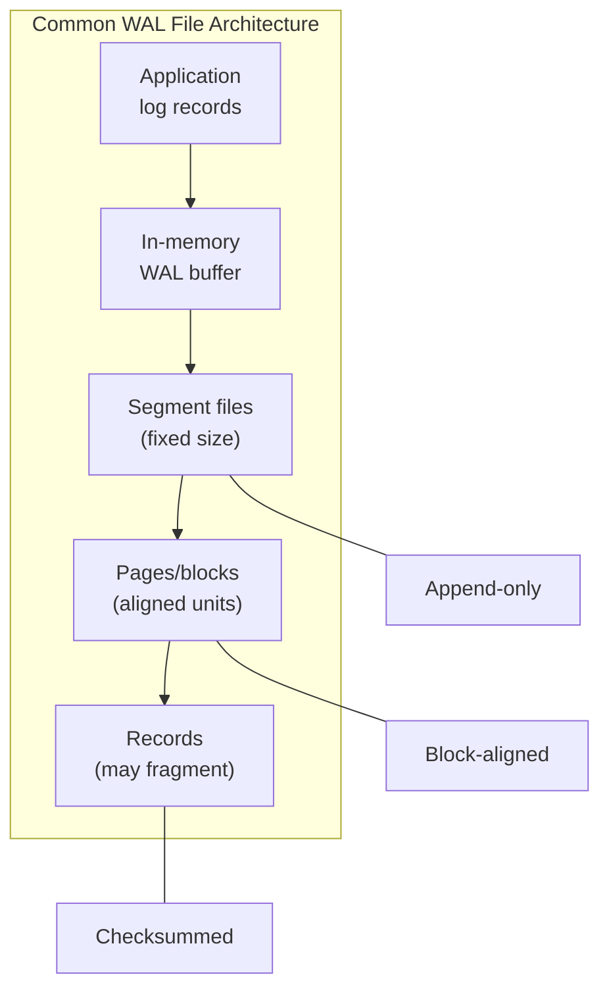
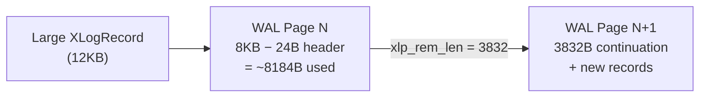
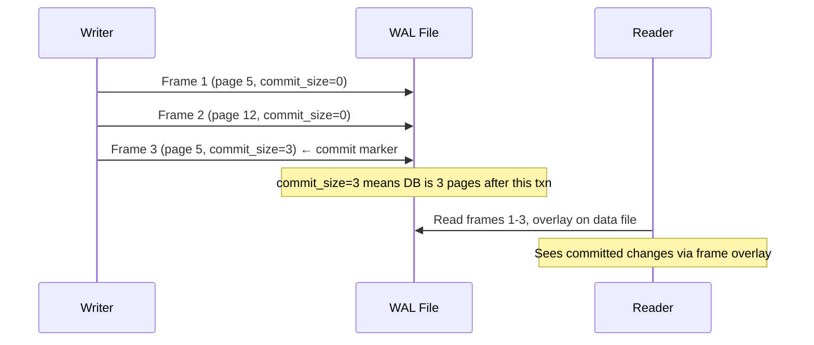
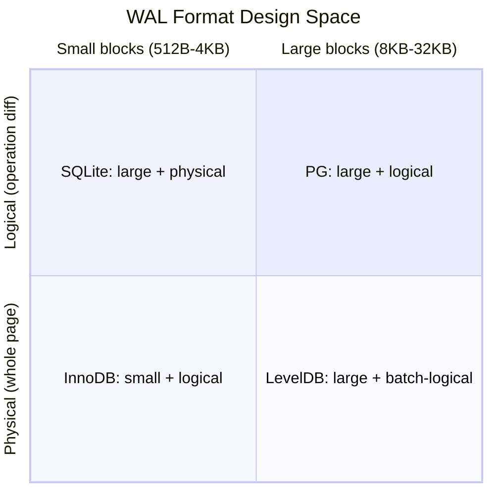

import { Aside } from '@astrojs/starlight/components';
import WalFormatExplorer from '../../../components/WalFormatExplorer';

Log records don't float in memory — they live inside **WAL files** on disk, organized into segments, pages, and blocks. Every database makes the same fundamental trade-offs: append-only sequential writes, checksums for corruption detection, alignment for direct I/O, and fragmentation rules for records that span boundaries. This page compares how four major systems solve these problems.

## Universal WAL File Patterns

Before diving into specific formats, recognize the patterns that appear in virtually every WAL implementation:



| Pattern | Purpose | Typical Values |
|---------|---------|----------------|
| **Append-only segments** | Sequential write performance; easy archival | 16MB (PG), 4MB (InnoDB), unbounded (SQLite) |
| **Block/page alignment** | Direct I/O compatibility; atomic sector writes | 8KB (PG), 512B (InnoDB), 4KB (SQLite page) |
| **Checksums per record/block** | Detect torn writes and bit rot | CRC-32C (PG, LevelDB), custom (SQLite) |
| **Record fragmentation** | Handle records larger than one block | PG: span pages; LevelDB: FIRST/MIDDLE/LAST |
| **Segment recycling** | Avoid unbounded disk growth | Circular log (InnoDB), archive+delete (PG) |

<Aside type="tip" title="Memory Hook: WAL Files Are a Tape Reel">
Imagine a **tape reel** chopped into fixed-length **segments**, each segment divided into **frames** (pages/blocks). Records are **messages** written sequentially on the tape. If a message is too long for one frame, it continues on the next frame. Checksums are the **parity bits** that tell you if a frame got corrupted.
</Aside>

## PostgreSQL: WAL Pages and Segments

PostgreSQL organizes WAL into **16MB segment files**, each containing **8KB pages** (configurable, but 8KB is default).

### Segment File Layout

```
WAL Directory (pg_wal/):
├── 000000010000000000000001   ← 16MB segment (timeline 1, log 0, seg 1)
├── 000000010000000000000002   ← segment 2
├── 000000010000000000000003
└── archive_status/            ← .ready / .done markers for archiving

Segment filename: TTTTTTTTLLLLLLLLSSSSSSSS
  T = timeline (8 hex digits)
  L = log file number (8 hex digits)
  S = segment number within log file (8 hex digits)
```

Each 16MB segment is a plain file of 2048 consecutive 8KB pages:

```
Segment (16MB = 2048 × 8KB):
┌──────────┬──────────┬──────────┬─────┬──────────┐
│ Page 0   │ Page 1   │ Page 2   │ ... │ Page 2047│
│ (8KB)    │ (8KB)    │ (8KB)    │     │ (8KB)    │
└──────────┴──────────┴──────────┴─────┴──────────┘
```

### XLogPageHeaderData (24 bytes per page)

Every WAL page begins with a page header:

```c
/* PostgreSQL: src/include/access/xlog_internal.h */
typedef struct XLogPageHeaderData {
    uint16      xlp_magic;      /* 0xD10D — magic number */
    uint16      xlp_info;       /* flag bits */
    TimeLineID  xlp_tli;        /* timeline ID */
    XLogRecPtr  xlp_pageaddr;   /* LSN of page start */
    uint32      xlp_rem_len;    /* bytes of record spanning from prev page */
} XLogPageHeaderData;
```

| Field | Size | Purpose |
|-------|------|---------|
| `xlp_magic` | 2B | `0xD10D` — identifies valid WAL page |
| `xlp_info` | 2B | Flags: long/short page, continuation, etc. |
| `xlp_tli` | 4B | Timeline this page belongs to |
| `xlp_pageaddr` | 8B | LSN where this page begins |
| `xlp_rem_len` | 4B | Remaining bytes from record started on previous page |

### Record Fragmentation Across Pages

When a record exceeds the remaining space in a WAL page, PostgreSQL splits it:

```
Page N (8KB):                          Page N+1 (8KB):
┌──────────────┬───────────────────┐   ┌──────────────┬───────────────┐
│ PageHeader   │ Record part 1     │   │ PageHeader   │ Record part 2 │
│ (24B)        │ (rest of page)    │   │ (24B)         │ xlp_rem_len>0│
│              │ xlp_info=XLP_     │   │ xlp_rem_len=  │ (continuation)│
│              │   CONTINUATION    │   │   remaining   │               │
└──────────────┴───────────────────┘   └──────────────┴───────────────┘
         │                                        │
         └──── Same XLogRecord, split ────────────┘
              xl_tot_len covers both parts
```



<Aside type="caution" title="Page Header Overhead">
Every WAL page loses 24 bytes (plus alignment padding) to the page header. For small records, this overhead is significant. PostgreSQL batches small records into shared buffers before flushing to amortize the cost.
</Aside>

## LevelDB/RocksDB: 32KB Block Format

LevelDB (and RocksDB, which inherited its WAL format) uses a fundamentally different approach: **fixed 32KB blocks** with a lightweight 7-byte record header and explicit fragmentation types.

### Block Structure

```
WAL File (unsegmented, single file per DB):
┌─────────────────────────────────────────────────────────┐
│ Block 0 (32KB)  │ Block 1 (32KB)  │ Block 2 (32KB) │ ...│
└─────────────────────────────────────────────────────────┘

Each block:
┌──────────────────────────────────────────────────────┐
│ Record 1 (FULL)  │ Record 2 (FULL) │ padding (zeros)│
└──────────────────────────────────────────────────────┘
```

### Record Header (7 bytes)

```c
/* LevelDB: db/log_format.h */
enum RecordType {
    kFullType   = 1,  /* Complete record in this block */
    kFirstType  = 2,  /* First fragment of a multi-block record */
    kMiddleType = 3,  /* Middle fragment */
    kLastType   = 4,  /* Final fragment */
};

// Per-record header:
//   checksum: uint32  (CRC-32C of type + data)
//   length:   uint16  (data bytes)
//   type:     uint8   (FULL/FIRST/MIDDLE/LAST)
//   data:     bytes[length]
```

### Fragmentation Rules

```
Small record (less than block capacity):
  Block: [FULL: WriteBatch] [FULL: WriteBatch] [padding...]

Large record (spans 3 blocks):
  Block 0: [FIRST: part1...........................]
  Block 1: [MIDDLE: part2..........................]
  Block 2: [LAST: part3........] [FULL: next rec..] [pad]

Edge case — insufficient space for header:
  If fewer than 7 bytes remain in block → pad with zeros, start on next block
```

| Type | Meaning | Recovery Action |
|------|---------|-----------------|
| **FULL** | Complete record | Parse immediately |
| **FIRST** | Start of fragmented record | Buffer, wait for more |
| **MIDDLE** | Continuation | Append to buffer |
| **LAST** | Final fragment | Assemble + parse complete record |

<Aside type="note" title="WriteBatch: LevelDB's Logical Record">
LevelDB doesn't log individual key-value operations. Instead, each WAL record contains a **WriteBatch** — a serialized batch of puts and deletes. On recovery, the entire WriteBatch is replayed atomically. This is logical logging at the batch level, physical at the block level.
</Aside>

## SQLite: WAL Header and Frames

SQLite's WAL mode uses a radically different model: each WAL entry is a **complete database page**, not a diff or operation description.

### WAL File Structure

```
SQLite WAL file (-wal):
┌──────────────────┬──────────┬──────────┬──────────┬─────┐
│ WAL Header (32B) │ Frame 1  │ Frame 2  │ Frame 3  │ ... │
└──────────────────┴──────────┴──────────┴──────────┴─────┘

WAL Header (32 bytes):
  magic:          4B  (0x377f0682 or 0x377f0683)
  format:         4B  (currently 3007000)
  page_size:      4B  (database page size, e.g., 4096)
  checkpoint_seq: 4B  (back-reference counter)
  salt1:          4B  (random, changes on each checkpoint)
  salt2:          4B  (random, changes on each checkpoint)
  checksum1:      4B  (checksum of header fields)
  checksum2:      4B  (checksum of header fields)
```

### Frame Structure (24B header + full page)

```
Each frame:
┌──────────────────────┬─────────────────────────────────┐
│ Frame Header (24B)   │ Page Data (page_size bytes)     │
│                      │                                 │
│ page_number:    4B   │ Complete copy of database page  │
│ commit_size:    4B   │ (default 4096B)                 │
│ salt1:          4B   │                                 │
│ salt2:          4B   │                                 │
│ checksum1:      4B   │                                 │
│ checksum2:      4B   │                                 │
└──────────────────────┴─────────────────────────────────┘
```

Key properties of SQLite's approach:

- **Physical logging**: entire page stored, not a diff
- **commit_size**: non-zero only on the last frame of a transaction (marks commit point)
- **Salt values**: copied from WAL header; mismatch after checkpoint invalidates old frames
- **Checksums**: cumulative over all frames since WAL header — detects reordering/corruption



<Aside type="tip" title="Memory Hook: SQLite = Photocopier">
SQLite WAL is a **photocopier**, not a diary. Each frame is a full-page photocopy, not a description of what changed. Readers hold up the photocopies over the original pages to see the latest version.
</Aside>

## InnoDB: 512-Byte Redo Log Blocks

InnoDB uses the smallest block size of the four systems — **512 bytes** — reflecting its origin on page-size-independent storage and its mini-transaction (mtr) grouping model.

### Redo Log File Layout

```
InnoDB redo log (ib_logfile0, ib_logfile1 — circular pair):
┌──────────────────────────────────────────────────────────┐
│ Block 0 │ Block 1 │ Block 2 │ ... │ Block N │ Block 0 │...│
│ (512B)  │ (512B)  │ (512B)  │     │ (512B)  │ (wrap)  │   │
└──────────────────────────────────────────────────────────┘
         ↑ Circular — wraps around when full
```

### Block Header (12 bytes) + Trailer (4 bytes)

```c
/* InnoDB: storage/innobase/include/log0log.h */
/* Block layout (512 bytes total): */
#define LOG_BLOCK_HDR_SIZE  12   /* header */
#define LOG_BLOCK_DATA_SIZE 496  /* max redo data per block */
#define LOG_BLOCK_TRL_SIZE  4    /* trailer (checksum) */

/* Header fields: */
LOG_BLOCK_HDR_NO           /* 4B: block number */
LOG_BLOCK_DATA_LEN         /* 2B: valid data bytes in block */
LOG_BLOCK_FIRST_REC_GROUP  /* 2B: offset of first mtr start in block */
LOG_BLOCK_CHECKPOINT_NO    /* 4B: checkpoint number when written */
/* Trailer: */
LOG_BLOCK_CHECKSUM         /* 4B: CRC-32C of entire block */
```

### Mini-Transaction (mtr) Grouping

InnoDB groups related log records into **mini-transactions** — atomic bundles that must be replayed together:

```
Block 512B:
┌────────────┬─────────────────────────────────────────────┬──────────┐
│ Header 12B │ mtr records (≤496B)                         │ CRC 4B   │
│            │ ┌─────────┬─────────┬─────────┐             │          │
│            │ │ mtr #1  │ mtr #2  │ mtr #3  │ (partial)   │          │
│            │ └─────────┴─────────┴─────────┘             │          │
│ FIRST_REC  │ ↑ mtr boundaries tracked by FIRST_REC_GROUP │          │
└────────────┴─────────────────────────────────────────────┴──────────┘
```

| Concept | Description |
|---------|-------------|
| **mtr** | Mini-transaction: group of page latches + log records released atomically |
| **FIRST_REC_GROUP** | Byte offset in block where an mtr begins — recovery starts here if block is partial |
| **Circular log** | Two (or more) files; write pointer wraps; old data overwritten after checkpoint |
| **Checkpoint** | Oldest block still needed for recovery — everything before can be reused |

## Cross-System Comparison

| Feature | PostgreSQL | LevelDB/RocksDB | SQLite WAL | InnoDB |
|---------|-----------|-----------------|------------|--------|
| **Segment size** | 16MB files | Unbounded single file | Unbounded single file | 4MB–4GB files (circular) |
| **Block/page size** | 8KB | 32KB | DB page size (4KB default) | 512B |
| **Record unit** | XLogRecord (operation) | WriteBatch (KV batch) | Full page copy | mtr record (operation) |
| **Fragmentation** | Span WAL pages | FIRST/MIDDLE/LAST | N/A (one page per frame) | Span 512B blocks |
| **Checksum scope** | Per record (CRC-32C) | Per record (CRC-32C) | Cumulative per frame | Per block (CRC-32C) |
| **Commit marker** | XLOG_XACT_COMMIT record | Sequence in WriteBatch | commit_size in frame header | MLOG_REC_CLR at commit |
| **Log recycling** | Archive + delete | Truncate on open | Checkpoint + reset | Circular overwrite |

### Alignment and Direct I/O

| System | Alignment Requirement | Direct I/O |
|--------|----------------------|------------|
| PostgreSQL | 8KB (WAL page = buffer page) | Optional (`wal_sync_method`) |
| LevelDB | 32KB blocks | No (uses buffered I/O) |
| SQLite | Page size (must match DB) | No |
| InnoDB | 512B blocks | Yes (InnoDB native AIO) |

<Aside type="caution" title="Torn WAL Pages vs Torn Data Pages">
WAL block/page checksums detect **torn WAL writes** (partial block written during crash). This is distinct from **torn data pages** (partial 8KB page write), which require Full-Page Images — covered in the next chapter on checkpoints.
</Aside>

## Explore the Formats Interactively

Use the explorer below to inspect each system's record layout field-by-field:

<div class="simulator-container">
<h3>Interactive: WAL Format Explorer</h3>
<WalFormatExplorer client:visible />
</div>

## Design Trade-offs



**Physical logging** (SQLite): simpler recovery (just copy pages), but larger log volume — every modified page is logged in full.

**Logical/physiological logging** (PostgreSQL, InnoDB): smaller logs (only changes recorded), but recovery must interpret operation types and apply them to pages.

**Batch logical** (LevelDB): groups operations into WriteBatch for atomic replay, trading per-operation granularity for simplicity.

## Key Takeaways

1. **All WAL files** share append-only segments, block alignment, checksums, and fragmentation — but implement them differently
2. **PostgreSQL** uses 16MB segments of 8KB pages with XLogPageHeaderData and cross-page record continuation
3. **LevelDB/RocksDB** uses 32KB blocks with FULL/FIRST/MIDDLE/LAST fragmentation for large WriteBatches
4. **SQLite WAL** stores complete page copies in frames — physical logging, not operation diffs
5. **InnoDB** uses tiny 512B blocks with mtr grouping in a circular log — optimized for low-latency commits
6. **Checksum scope** varies: per-record (PG, LevelDB), per-block (InnoDB), cumulative (SQLite)

<div class="self-check">
<details>
<summary>Quick Quiz: WAL File Formats</summary>

1. **What are the four universal WAL file patterns?**
   → Append-only segments, block/page alignment, checksums, and record fragmentation across boundaries.

2. **How does PostgreSQL handle a record larger than one 8KB WAL page?**
   → Split across pages using `xlp_rem_len` in the page header to track continuation bytes from the previous page.

3. **What do LevelDB's FIRST/MIDDLE/LAST record types mean?**
   → FIRST starts a multi-block record, MIDDLE continues it, LAST completes it. FULL means the entire record fits in one block.

4. **Why does SQLite store complete pages in WAL frames instead of diffs?**
   → Physical logging simplifies recovery (copy page over data file) and enables readers to overlay WAL frames on the data file without interpreting operation types.

5. **What is an InnoDB mini-transaction (mtr)?**
   → An atomic group of page latches and log records that must be replayed together. mtr boundaries are tracked by LOG_BLOCK_FIRST_REC_GROUP in each 512B block.

6. **What's the difference between torn WAL pages and torn data pages?**
   → Torn WAL pages are partial block writes detected by block checksums. Torn data pages are partial page writes to the data file, requiring Full-Page Images for recovery.
</details>
</div>
