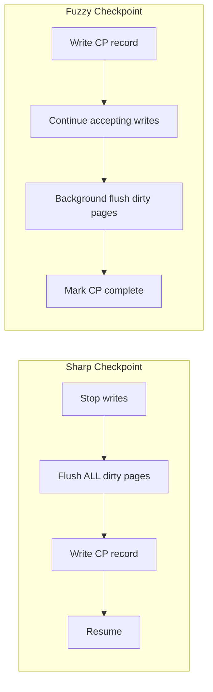
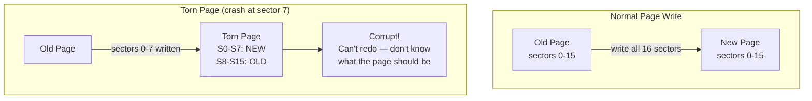
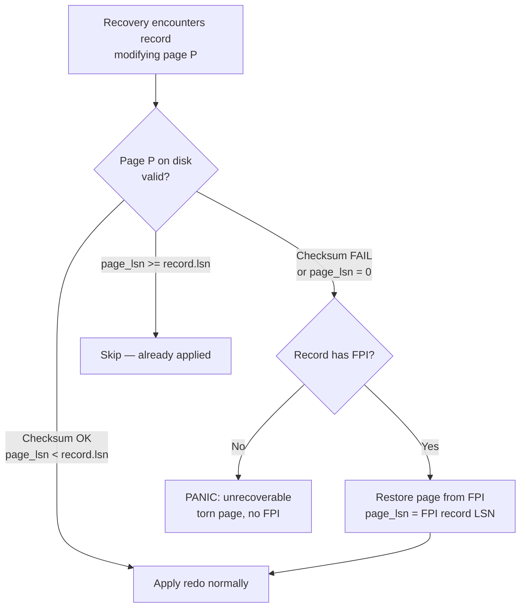
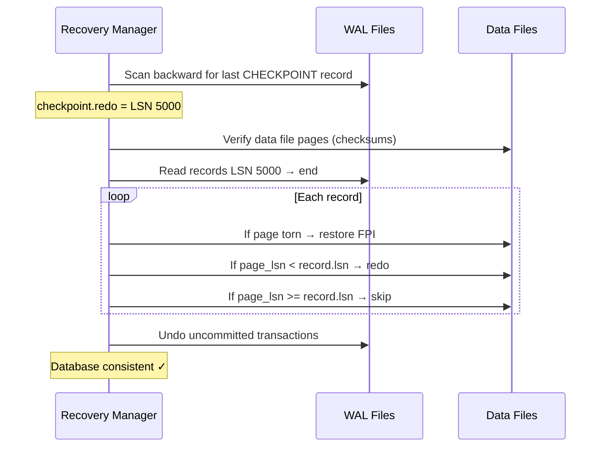

import { Aside } from '@astrojs/starlight/components';
import CheckpointVisualizer from '../../../components/CheckpointVisualizer';

Checkpoints are the bridge between steady-state operation and crash recovery. Without them, every restart would replay the entire WAL from the beginning of time. Without **Full-Page Images (FPIs)**, recovery couldn't handle **torn pages** — the subtle failure mode where a multi-sector write is interrupted mid-flight. Together, checkpoints and FPIs make bounded, correct recovery possible.

## What Checkpoints Do

A checkpoint is a **synchronization point** that:

1. **Flushes dirty data pages** to their home files (or schedules their flush)
2. **Writes a checkpoint record** to the WAL with recovery metadata
3. **Resets the FPI cycle** — pages modified after the checkpoint may need new FPIs
4. **Advances the redo start point** — recovery only replays WAL after this LSN

```
Before checkpoint:                    After checkpoint:
┌─────────────────────────┐          ┌─────────────────────────┐
│ WAL: [R1][R2]...[R500]  │          │ WAL: [R1]...[R500][CP]  │
│ Data: pages 1-50 dirty  │          │       [R501][R502]...   │
│ Recovery from: R1       │          │ Data: pages 1-50 clean  │
│ FPI needed: all pages   │          │ Recovery from: CP (R500)│
└─────────────────────────┘          │ FPI needed: only new    │
                                     └─────────────────────────┘
```

<Aside type="tip" title="Memory Hook: Checkpoint = Save Game">
A checkpoint is a **save game** in a video game. You don't replay from the tutorial every time you die — you restart from the last save. The checkpoint record is the save file; everything after it is the "unsaved progress" that recovery must replay.
</Aside>

## Sharp vs Fuzzy Checkpoints

Two fundamentally different checkpoint strategies exist, reflecting a trade-off between recovery time and runtime impact.

### Sharp Checkpoints (System R)

**Stop the world.** No new transactions start. All dirty pages are flushed. Then write the checkpoint record.

```
Timeline (Sharp):
  ──── normal operation ──── │ STOP │ flush all │ write CP │ ── resume ──
                              ↑
                         No new txns allowed
                         All dirty pages written
                         Recovery starts exactly at CP
```

| Property | Value |
|----------|-------|
| Recovery time | Minimal — all data current at CP |
| Runtime impact | Severe — blocks all writes during flush |
| Used by | Early systems (System R), some embedded DBs |

### Fuzzy Checkpoints (ARIES / PostgreSQL)

**Keep running.** Write the checkpoint record first, then gradually flush dirty pages in the background. New transactions continue normally.

```
Timeline (Fuzzy):
  ──── normal operation ──── │ write CP record │ ── gradual flush ── │ done ──
                              ↑                    ↑
                         CP LSN recorded      Dirty pages flushed
                         New WAL continues    asynchronously
                         Recovery replays     (may take minutes)
                         from CP LSN
```

| Property | Value |
|----------|-------|
| Recovery time | Longer — must redo WAL from CP to crash |
| Runtime impact | Minimal — only brief WAL write pause |
| Used by | PostgreSQL, InnoDB, Oracle, SQL Server |



<Aside type="note" title="Why Fuzzy Won">
Sharp checkpoints don't scale. On a database with 100GB of dirty pages, stopping all writes for minutes is unacceptable. Fuzzy checkpoints accept slightly longer recovery in exchange for zero write stalls. Modern systems universally use fuzzy checkpoints.
</Aside>

## The Checkpoint Record

PostgreSQL's checkpoint record captures everything recovery needs:

```c
/* PostgreSQL: src/include/access/xlogrecord.h */
typedef struct CheckPoint {
    XLogRecPtr  redo;           /* LSN to start redo from */
    TimeLineID  ThisTimeLineID; /* Current timeline */
    TimeLineID  PrevTimeLineID; /* Previous timeline (if promoted) */
    bool        fullPageWrites; /* FPI mode active? */
    FullTransactionId nextXid; /* Next transaction ID */
    Oid         nextOid;       /* Next OID */
    MultiXactId nextMulti;     /* Next multixact ID */
    MultiXactOffset nextMultiOffset;
    TransactionId oldestXact;  /* Oldest running xact (for clog) */
    XLogRecPtr  oldestXactMem; /* LSN of oldest xact's first record */
    /* ... additional catalog state ... */
} CheckPoint;
```

The critical field is **`redo`** — the LSN where recovery begins. Everything before this LSN has been flushed to data files (or will be, in the fuzzy model).

## The Torn Page Problem

This is one of the most important and least understood failure modes in database systems.

### Anatomy of a Torn Write

Modern disks write in **sectors** (512 bytes or 4KB). A database **page** is typically 8KB (PostgreSQL) or 16KB (InnoDB). Writing one page requires **multiple sector writes** that are NOT atomic as a group:

```
8KB Page = 16 × 512-byte sectors:

Sector:  [S0][S1][S2][S3][S4][S5][S6][S7][S8][S9][S10][S11][S12][S13][S14][S15]
         ─────────────────────────────────────────────────────────────────────
         One "page write" = 16 independent sector writes

⚡ CRASH after S7 written, S8-S15 not yet written:

Result: "Torn page" — first half new data, second half old data
        Checksum (if any) fails
        Page is corrupt and unrecoverable WITHOUT a backup copy
```



### Why Redo Can't Fix Torn Pages

Redo applies **incremental changes** to a page. It assumes the page on disk is a valid starting point (even if stale). A torn page is not valid — it contains a Frankenstein mix of old and new data. Applying redo on top of a torn page produces garbage.

```
Torn page scenario:
  1. Page on disk: sectors 0-7 new, sectors 8-15 old (CORRUPT)
  2. WAL says: "at LSN 100, insert tuple at offset 500" (in sector 8 area)
  3. Redo tries to insert into sector 8 — but sector 8 has OLD data layout
  4. Insert corrupts page further → unrecoverable
```

<Aside type="caution" title="This Is Why Checksums Exist">
Page checksums (PostgreSQL `data_checksums`, InnoDB `innodb_checksum_algorithm`) detect torn pages but **cannot repair them**. Detection without FPIs means: "Your database is corrupt and we can't fix it." FPIs are the repair mechanism.
</Aside>

## Full-Page Images: The Solution

A **Full-Page Image (FPI)** is a complete copy of a data page stored inside a WAL record. If the on-disk page is torn or corrupt, recovery replaces it with the FPI before applying subsequent redo records.

### When FPIs Are Written

PostgreSQL writes an FPI on the **first modification** of a page after a checkpoint:

```
Checkpoint at LSN 1000
  │
  ├── LSN 1001: UPDATE page 5 → includes FPI of page 5 (first mod after CP)
  ├── LSN 1002: UPDATE page 5 → no FPI (already captured at 1001)
  ├── LSN 1003: UPDATE page 5 → no FPI
  ├── LSN 1004: INSERT page 8 → includes FPI of page 8 (first mod after CP)
  │
  Checkpoint at LSN 2000 → FPI cycle resets
  │
  ├── LSN 2001: UPDATE page 5 → includes FPI again (new cycle)
  └── ...
```

```c
/* FPI is included when BKPBLOCK_HAS_IMAGE flag is set */
#define BKPBLOCK_HAS_IMAGE  0x02

/* PostgreSQL compresses FPIs with PGLZ by default */
/* Full 8KB page → typically 1-3KB compressed */
```

### FPI Recovery Flow



### FPI Size Impact

FPIs significantly increase WAL volume. This is the primary cost of torn page protection:

| Scenario | WAL Volume Impact |
|----------|------------------|
| `full_page_writes = on` (default) | ~2-5× normal WAL size |
| Heavy sequential scan + update | Every page gets FPI on first touch after CP |
| Index build | Massive FPI burst (every index page) |
| `full_page_writes = off` | No FPIs — torn pages unrecoverable |

<Aside type="tip" title="Memory Hook: FPI = Page Insurance Policy">
An FPI is **insurance** on a page. You pay the premium (extra WAL space) on the first modification after each checkpoint. If the page gets torn, you cash in the policy (restore from FPI). No FPI = no insurance = total loss on torn page.
</Aside>

## Checkpoint Completion Target

PostgreSQL spreads checkpoint I/O over time to avoid I/O spikes:

```
checkpoint_completion_target = 0.9 (default)

Checkpoint interval: 5 minutes (checkpoint_timeout)
Spread window:       4.5 minutes (5 × 0.9)

Without spreading:          With spreading:
  │████ peak I/O ████│         │█░█░█░█░█░█░█░█░█░│
  0s              30s          0s              270s
  (all dirty pages               (gradual flush
   flushed at once)               spread over 4.5 min)
```

| Parameter | Default | Effect |
|-----------|---------|--------|
| `checkpoint_timeout` | 5 min | Max time between checkpoints |
| `max_wal_size` | 1GB | Soft limit — triggers checkpoint when WAL exceeds this |
| `checkpoint_completion_target` | 0.9 | Fraction of interval to spread I/O over |
| `checkpoint_warning` | 30s | Warn if checkpoints occur closer than this |

## Recovery Starting Point

Recovery always begins from the **last completed checkpoint**:

```
Recovery algorithm:
1. Find latest checkpoint record in WAL (scan backward from end)
2. Read checkpoint.redo LSN
3. Restore any pages needed from FPIs (between checkpoint and crash)
4. REDO: replay all records from checkpoint.redo to end of WAL
5. UNDO: reverse uncommitted transactions (if Steal policy)
6. Database is consistent
```



### Recovery Time Factors

| Factor | Impact on Recovery Time |
|--------|------------------------|
| Time since last checkpoint | More WAL to replay → longer recovery |
| WAL volume since checkpoint | More records → longer redo |
| Number of torn pages | FPI restore adds I/O |
| Number of uncommitted txns | Undo pass adds work |
| `full_page_writes = off` | Faster WAL replay but torn pages = fatal |

## Checkpoint Interaction with Other Subsystems

### WAL Recycling

Checkpoints enable WAL segment recycling. Once all data is flushed past a checkpoint, old WAL segments can be deleted or archived:

```
WAL segments:
[seg1: archived ✓] [seg2: archived ✓] [seg3: active] [seg4: being written]
                     ↑
              Can delete after checkpoint
              confirms all pages flushed
```

### Replication

Standby servers receive WAL continuously but apply it lazily. Checkpoints on the primary don't directly affect standbys, but long checkpoint intervals mean more WAL buffering on standbys.

### Autovacuum

PostgreSQL's autovacuum can trigger during checkpoint I/O spreading, adding to the I/O load. Heavy checkpoint periods may temporarily slow vacuum.

## Cross-System Checkpoint Comparison

| Feature | PostgreSQL | InnoDB | SQLite WAL |
|---------|-----------|--------|------------|
| **Type** | Fuzzy | Fuzzy | Sharp (sync checkpoint) |
| **Trigger** | Time + WAL size | Redo log full | WAL size threshold |
| **FPI mechanism** | First page mod after CP | Changed page log (similar) | Whole page in every frame |
| **I/O spreading** | `checkpoint_completion_target` | Innodb adaptive flushing | N/A (blocking) |
| **Recovery start** | Checkpoint.redo LSN | Checkpoint LSN in header | WAL frame 0 after checkpoint |
| **Torn page protection** | FPI in WAL | Doublewrite buffer + redo | Full page copies |

<Aside type="note" title="InnoDB's Doublewrite Buffer">
InnoDB uses a **doublewrite buffer** instead of (or in addition to) FPIs: pages are first written to a shared doublewrite area, then to their final location. On recovery, if the final page is torn, the copy from the doublewrite buffer is used. This avoids the WAL bloat that FPIs cause but adds a separate I/O path.
</Aside>

## See It In Action

<div class="simulator-container">
<h3>Interactive: Checkpoint & FPI Visualizer</h3>
<CheckpointVisualizer client:visible />
</div>

## Key Takeaways

1. **Checkpoints** bound recovery time by flushing dirty pages and recording a redo start point
2. **Fuzzy checkpoints** (ARIES model) keep the database running during flush — used by all modern systems
3. **Torn pages** occur when multi-sector writes are interrupted — redo alone cannot fix them
4. **Full-Page Images** store a complete page copy in WAL on first modification after checkpoint
5. **`checkpoint_completion_target`** spreads I/O to avoid performance spikes
6. **Recovery** starts from the last checkpoint's redo LSN, restores FPIs for torn pages, then replays WAL

<div class="self-check">
<details>
<summary>Quick Quiz: Checkpoints & FPIs</summary>

1. **What four things does a checkpoint do?**
   → Flush dirty pages, write a checkpoint record, reset the FPI cycle, and advance the redo start point.

2. **What's the difference between sharp and fuzzy checkpoints?**
   → Sharp stops all writes until every dirty page is flushed. Fuzzy writes the checkpoint record first and flushes pages in the background while accepting new writes.

3. **Why can't redo fix a torn page?**
   → A torn page has a mix of old and new sectors — it's not a valid starting point. Redo assumes the page structure is intact and only applies incremental changes.

4. **When does PostgreSQL write a Full-Page Image?**
   → On the first modification of a page after a checkpoint. Subsequent modifications of the same page before the next checkpoint don't include FPIs.

5. **What does `checkpoint_completion_target = 0.9` do?**
   → Spreads checkpoint dirty-page flushing over 90% of the checkpoint interval, avoiding I/O spikes.

6. **How does InnoDB protect against torn pages differently from PostgreSQL?**
   → InnoDB uses a doublewrite buffer (write pages to a shared area first, then to final location) instead of storing FPIs in the WAL, avoiding WAL bloat.
</details>
</div>
