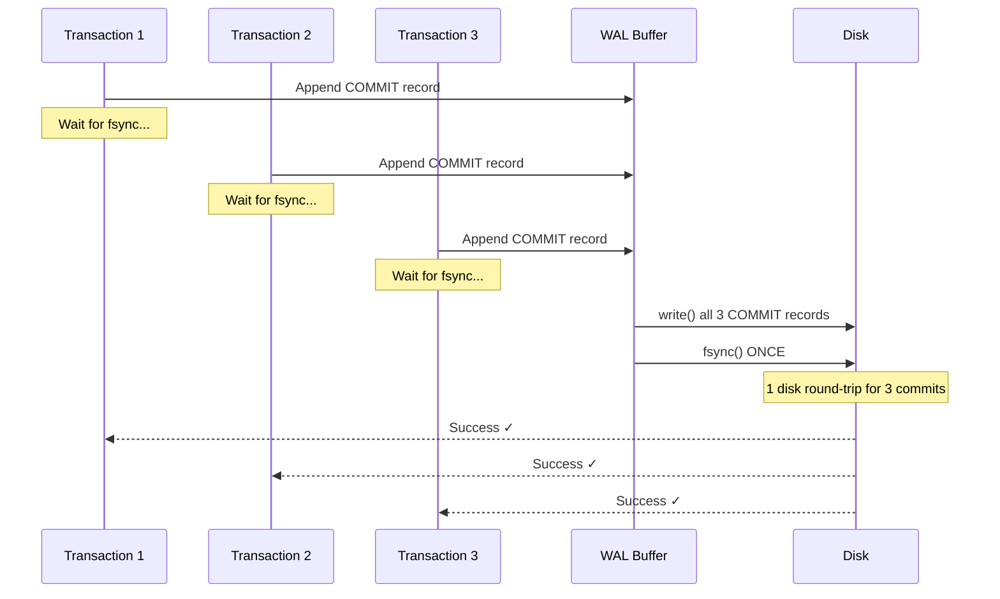
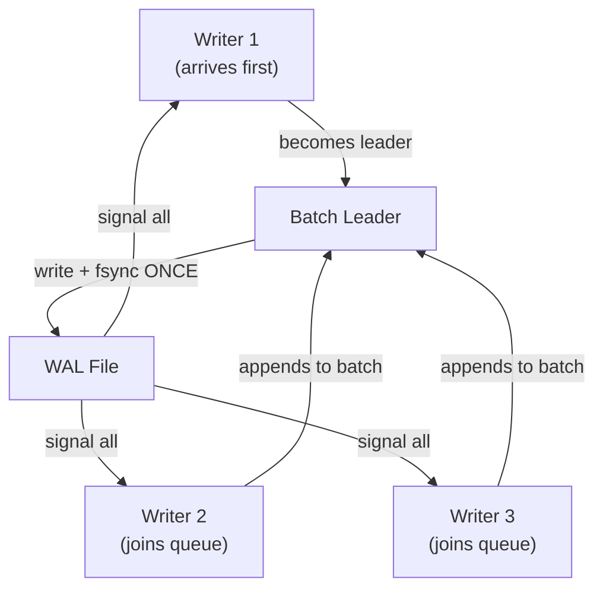

import { Aside } from '@astrojs/starlight/components';
import GroupCommitDemo from '../../../components/GroupCommitDemo';

Every committed transaction must fsync the WAL — that's the durability guarantee. But `fsync()` costs one disk round-trip (~0.1–10ms depending on hardware). At 1000 TPS, that's 1000 fsyncs per second, which becomes the **primary throughput bottleneck**. Group commit solves this by batching multiple transactions into a single fsync, amortizing the cost across N commits.

## The fsync Bottleneck

Recall the commit protocol from Chapter 1:

```
COMMIT Transaction T:
1. Append COMMIT record to WAL buffer
2. write() WAL buffer to OS page cache
3. fsync() WAL file                    ← THE BOTTLENECK
4. Return SUCCESS to client
```

The problem: **fsync is serial and expensive**. Even on fast NVMe (~0.1ms), 10,000 concurrent commits need 1 second of pure fsync time — and fsync doesn't parallelize well because it's a single file.

```
Single-commit latency breakdown (typical NVMe):

  WAL append:  ~0.01ms  █
  write():     ~0.01ms  █
  fsync():     ~0.15ms  ████████████████
  Return:      ~0.001ms ▏
               ─────────────────────────
  Total:       ~0.17ms  (88% is fsync!)
```

| Hardware | fsync Latency | Max Commits/sec (1 fsync each) |
|----------|--------------|-------------------------------|
| HDD (7200 RPM) | 5–10ms | 100–200 |
| SATA SSD | 0.5–2ms | 500–2000 |
| NVMe | 0.05–0.2ms | 5000–20000 |
| Optane | 0.01–0.05ms | 20000–100000 |

<Aside type="tip" title="Memory Hook: fsync = Toll Booth">
Every commit must pass through the **toll booth** (fsync). One car at a time costs one toll per car. Group commit is a **bus** — pack 50 cars together, pay one toll, everyone gets through. Throughput goes up; individual wait time may increase slightly.
</Aside>

## Group Commit: The Core Idea

Instead of each transaction fsyncing independently, **collect multiple committing transactions and fsync once for all of them**:



### The Math

```
Without group commit:
  N transactions × 1 fsync each = N × fsync_latency
  1000 TPS × 0.15ms = 150ms/sec of fsync (15% CPU-wait)

With group commit (batch size = 50):
  1000 TPS / 50 per batch = 20 fsyncs/sec
  20 × 0.15ms = 3ms/sec of fsync (0.3% CPU-wait)
  → ~50× reduction in fsync overhead
```

## PostgreSQL Group Commit

PostgreSQL implements group commit through a combination of **WAL insertion locks** and configurable delay parameters.

### The Commit Path

```c
/* Simplified PostgreSQL commit path */
void RecordTransactionCommit(void) {
    /* 1. Insert COMMIT record into WAL */
    XLogInsert(RM_XACT_ID, XLOG_XACT_COMMIT);

    /* 2. Enter group commit queue */
    XLogFlush(recptr);  /* This is where group commit happens */

    /* 3. Return success after WAL is durable */
}
```

Inside `XLogFlush()`:

```python
def xlog_flush(target_lsn):
    # Acquire WAL write lock
    with wal_write_lock:
        # Write WAL buffer to disk
        write_wal_buffer_to_disk()

        # GROUP COMMIT: collect all waiters
        waiters = [current_xact]
        while has_more_committing_xacts():
            waiters.append(next_committing_xact())

        # ONE fsync for ALL waiters
        fsync(wal_fd)

        # Wake all waiters
        for w in waiters:
            w.signal_commit_complete()
```

### Tunable Parameters

| Parameter | Default | Effect |
|-----------|---------|--------|
| `commit_delay` | 0 (µs) | Microseconds to wait for more committers before fsync |
| `commit_siblings` | 5 | Minimum concurrent committers before delay activates |
| `synchronous_commit` | `on` | `off` = skip fsync entirely (async commit) |

```sql
-- Enable group commit delay (usually not needed — see "natural group commit")
SET commit_delay = 100;        -- wait 100µs for siblings
SET commit_siblings = 5;       -- need 5+ concurrent committers

-- Disable durability for bulk loads (DANGEROUS)
SET synchronous_commit = off;  -- no fsync, ~10× faster commits
```

<Aside type="caution" title="commit_delay Is Usually Zero">
PostgreSQL defaults `commit_delay = 0` because **natural group commit** (described below) already batches fsyncs at high concurrency. Setting `commit_delay > 0` adds latency to *every* commit (even solo ones) and is rarely beneficial on modern NVMe storage. It was more useful on HDDs where fsync cost 5-10ms.
</Aside>

## Natural Group Commit

At high concurrency, group commit happens **automatically** without any special configuration:

```
Timeline (high concurrency):

  T1: append COMMIT ──┐
  T2: append COMMIT ──┤ all arrive within ~0.01ms
  T3: append COMMIT ──┤
  T4: append COMMIT ──┘
                       │
                  write() all 4 records
                       │
                  fsync() ONCE  ← natural batch of 4
                       │
  T1: ✓  T2: ✓  T3: ✓  T4: ✓
```

This works because:
1. Multiple transactions finish their work at roughly the same time
2. They all queue up at `XLogFlush()` waiting for the WAL write lock
3. The first transaction to acquire the lock writes ALL pending WAL and fsyncs once
4. All waiting transactions are released together

```
Throughput vs Concurrency (natural group commit):

  Commits/sec
  │
  │                              ╭────────── plateau
  │                         ╭────╯
  │                    ╭────╯
  │               ╭────╯
  │          ╭────╯
  │     ╭────╯
  │ ╭───╯
  └───────────────────────────── Concurrency
    1   10   100   1000   10000

  At low concurrency: 1 fsync per commit (linear)
  At high concurrency: many commits share 1 fsync (plateau)
```

## RocksDB WriteThread: Batch Leader

RocksDB implements group commit through its **WriteThread** with a batch leader pattern:



```cpp
/* RocksDB: db/write_thread.cc (simplified) */
Status WriteThread::JoinBatchGroup(WriteGroup* write_group) {
    if (is_leader) {
        // Leader writes ALL batched WriteBatches to WAL
        status = WriteBatchInternal::Append(wal_writer, batch_group);
        status = wal_writer->Sync();  // ONE fsync for entire group
        // Signal all followers
        for (auto& follower : write_group->members) {
            follower.signal_done(status);
        }
    } else {
        // Follower waits for leader to complete
        wait_for_leader();
    }
}
```

Key RocksDB optimizations:
- **Pipelined writes**: while one batch fsyncs, the next batch can begin writing
- **Parallel memtable insert**: followers insert into memtable while leader fsyncs
- **max_write_batch_group_size**: caps batch size to bound latency

## WiredTiger: Lock-Free Slot Consolidation

WiredTiger (MongoDB's storage engine) uses a **lock-free slot array** for group commit:

```
WiredTiger commit slots:

  Slot 0: [T1 COMMIT] ──┐
  Slot 1: [T2 COMMIT] ──┤ consolidated into
  Slot 2: [T3 COMMIT] ──┤ single log write
  Slot 3: [empty]       │
  Slot 4: [T4 COMMIT] ──┘
                         │
                    write + fsync ONCE
                         │
  All 4 transactions committed ✓
```

| Feature | RocksDB WriteThread | WiredTiger Slots |
|---------|-------------------|-----------------|
| Synchronization | Mutex + condition variable | Lock-free CAS on slot array |
| Batch formation | Leader-follower queue | Slot consolidation window |
| Pipelining | Write ∥ memtable insert | Write ∥ cache update |
| Latency cap | max_write_batch_group_size | Consolidation timeout |

## Throughput vs Latency Tradeoff

Group commit is fundamentally a **throughput-latency tradeoff**:

```
                    Throughput ↑
                         │
    commit_delay=0       │    commit_delay=1000
    (low latency,        │    (high latency,
     lower throughput)    │     higher throughput)
                         │
    ─────────────────────┼─────────────────────
                         │
                    Latency ↑
```

| Configuration | Throughput | p50 Latency | p99 Latency | Use Case |
|--------------|-----------|-------------|-------------|----------|
| No group commit | Low | 0.15ms | 0.15ms | Single-user, latency-critical |
| Natural group commit | High | 0.15ms | 0.5ms | Default — best of both |
| `commit_delay=100` | Higher | 0.25ms | 1.0ms | HDD, write-heavy batch |
| `synchronous_commit=off` | Maximum | 0.01ms | 0.01ms | Bulk load (risk data loss) |

### The Latency Tax

When N transactions share one fsync, the **last transaction in the batch** waits for all preceding ones:

```
Batch of 4, fsync takes 0.15ms:

  T1: waited 0.00ms → latency 0.15ms
  T2: waited 0.01ms → latency 0.16ms
  T3: waited 0.02ms → latency 0.17ms
  T4: waited 0.03ms → latency 0.18ms  ← worst case

  Average latency: 0.165ms (10% increase over solo)
  Throughput: 4× improvement
```

<Aside type="note" title="When Group Commit Doesn't Help">
Group commit only helps when **multiple transactions commit simultaneously**. A single-threaded workload (one client, one transaction at a time) gets zero benefit — each commit still triggers its own fsync. This is why OLTP benchmarks with high client counts show much better TPS than single-connection tests.
</Aside>

## Cross-System Group Commit Comparison

| System | Mechanism | Batch Trigger | Configurable Delay |
|--------|-----------|--------------|-------------------|
| **PostgreSQL** | WAL flush queue + insertion locks | Natural concurrency or `commit_delay` | `commit_delay`, `commit_siblings` |
| **RocksDB** | WriteThread batch leader | Queue depth | `max_write_batch_group_size` |
| **WiredTiger** | Lock-free slot consolidation | Slot fill + timeout | Consolidation window |
| **InnoDB** | Log write mutex + queue | Natural concurrency | None (always groups) |
| **SQLite** | Single writer (implicit batch) | Sequential commits | N/A (single writer) |

## Implementation Patterns

### Pattern 1: Leader-Follower (PostgreSQL, RocksDB)

One transaction becomes the "leader" and performs the fsync on behalf of all queued "followers."

```python
class GroupCommitQueue:
    def commit(self, xact):
        self.queue.append(xact)
        if self.is_leader(xact):
            self.write_all_pending()
            self.fsync_once()
            self.wake_all_waiters()
        else:
            xact.wait_for_signal()
```

### Pattern 2: Slot Consolidation (WiredTiger)

Transactions claim slots in a fixed array. A consolidation pass groups filled slots into one write.

```python
class SlotArray:
    def commit(self, xact):
        slot = self.claim_slot(xact)
        if self.should_consolidate():
            batch = self.collect_filled_slots()
            self.write_and_fsync(batch)
            self.release_all(batch)
```

### Pattern 3: Implicit Batching (SQLite)

SQLite's single-writer model means commits are naturally serialized. Multiple frames written in one transaction are implicitly batched into one fsync at commit.

## See It In Action

<div class="simulator-container">
<h3>Interactive: Group Commit Demo</h3>
<GroupCommitDemo client:visible />
</div>

Adjust the commit delay slider and watch how transactions batch together before a single fsync. Notice how fsync count stays flat while transaction count grows.

## Key Takeaways

1. **fsync is the commit bottleneck** — typically 80-95% of commit latency
2. **Group commit** batches N transactions into 1 fsync, improving throughput N×
3. **Natural group commit** happens automatically at high concurrency — no config needed
4. **PostgreSQL's `commit_delay`** is rarely useful on modern hardware; natural batching suffices
5. **RocksDB and WiredTiger** use leader-follower and slot consolidation patterns respectively
6. **Tradeoff**: higher throughput at the cost of slightly increased tail latency for batched transactions

<div class="self-check">
<details>
<summary>Quick Quiz: Group Commit</summary>

1. **Why is fsync the commit bottleneck?**
   → fsync requires a disk round-trip (~0.1-10ms) and doesn't parallelize well on a single WAL file. It typically accounts for 80-95% of commit latency.

2. **How does group commit improve throughput?**
   → Multiple transactions append their COMMIT records to WAL, then share a single fsync. N transactions cost 1 fsync instead of N.

3. **What is "natural group commit"?**
   → At high concurrency, multiple transactions naturally queue at the WAL flush point. The first to acquire the write lock fsyncs for all waiters — no special configuration needed.

4. **When does `commit_delay` help, and when doesn't it?**
   → Helps on slow storage (HDD) with moderate concurrency by artificially waiting for batch mates. Doesn't help on fast NVMe or at low concurrency — it just adds latency.

5. **What's the throughput-latency tradeoff of group commit?**
   → Larger batches mean fewer fsyncs (higher throughput) but the last transaction in each batch waits longer (higher tail latency). Average latency increase is typically small (~10%).

6. **Why doesn't group commit help single-threaded workloads?**
   → With only one committing transaction at a time, there's nothing to batch with. Each commit triggers its own fsync regardless of group commit logic.
</details>
</div>
