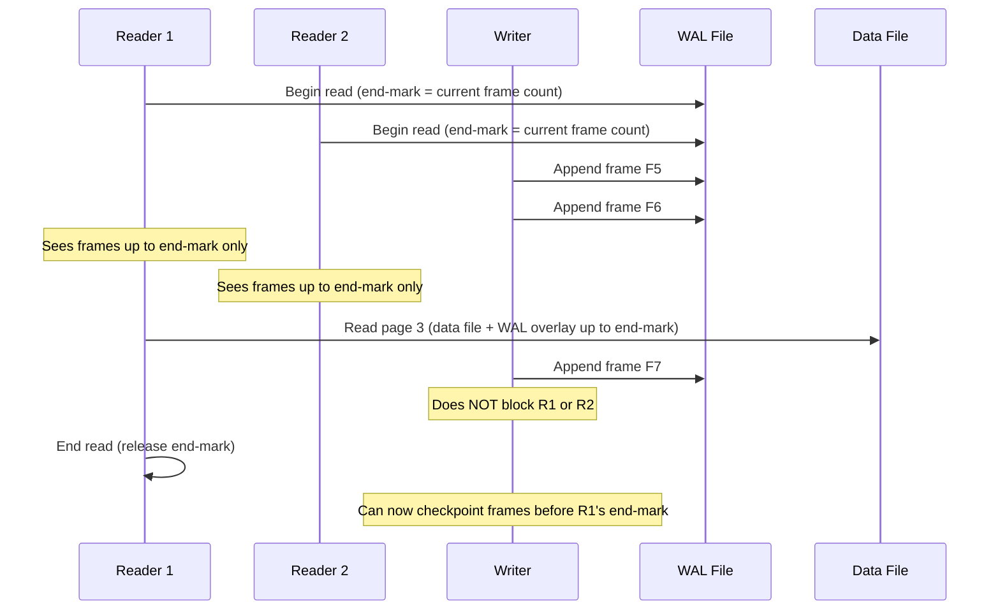
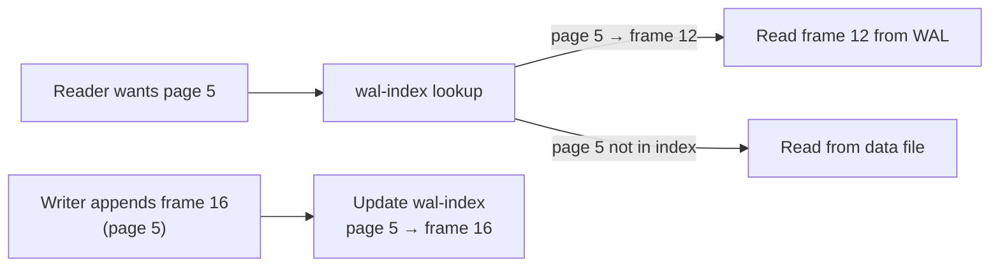
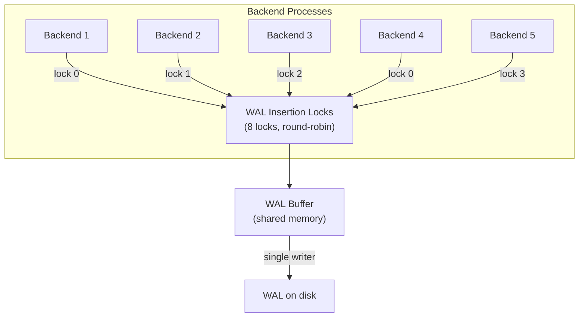
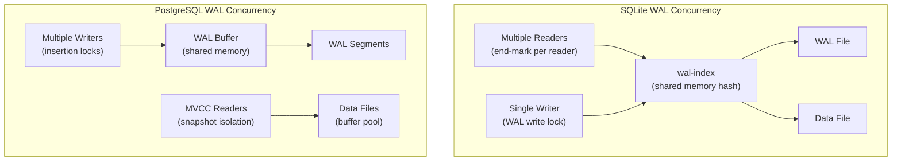

import { Aside } from '@astrojs/starlight/components';

WAL enables a powerful concurrency property: **readers don't block writers, and writers don't block readers**. But this comes with its own coordination challenges — tracking which pages each reader has seen, serializing WAL writes, and preventing checkpoints from starving. This page examines how SQLite and PostgreSQL solve these problems.

## The WAL Concurrency Promise

Traditional rollback-journal mode (SQLite's default before WAL) serializes readers and writers:

```
Rollback Journal Mode:
  Reader holds SHARED lock → Writer BLOCKED
  Writer holds RESERVED lock → Readers BLOCKED
  → Readers and writers cannot overlap
```

WAL mode inverts this:

```
WAL Mode:
  Readers read data file + WAL overlay → never blocked by writers
  Writer appends to WAL file → never blocked by readers
  Single writer at a time → but readers proceed freely
  → Readers and writers overlap freely
```

| Mode | Readers Block Writers? | Writers Block Readers? | Concurrent Readers |
|------|------------------------|----------------------|-------------------|
| Rollback journal | Yes (SHARED lock) | Yes (EXCLUSIVE on commit) | One at a time with writer |
| WAL mode | No | No | Unlimited |
| PostgreSQL (MVCC) | No (snapshot isolation) | No (row-level locks) | Unlimited |

<Aside type="tip" title="Memory Hook: WAL = Overlay Transparency">
WAL concurrency is like a **transparent overlay** on a document. Readers look through the overlay (WAL) to see the latest version. Writers draw on the overlay. Neither needs to move the original document (data file) while the other is working.
</Aside>

## SQLite WAL Concurrency Model

SQLite's WAL mode has three rules that govern all concurrency:

1. **One writer at a time** — enforced by an exclusive WAL write lock
2. **Multiple concurrent readers** — each tracks its own read position
3. **Readers don't block the writer** — readers use snapshot isolation via frame numbers

### The Reader End-Mark

Each reader records an **end-mark** — the last WAL frame it will read. The writer must not overwrite frames beyond any reader's end-mark:

```
WAL file frames:
┌──────┬──────┬──────┬──────┬──────┬──────┬──────┐
│ F1   │ F2   │ F3   │ F4   │ F5   │ F6   │ F7   │
└──────┴──────┴──────┴──────┴──────┴──────┴──────┘
                    ↑           ↑
              Reader A      Reader B
              end-mark=F4   end-mark=F6

Writer can append F8, F9, ... but CANNOT checkpoint
(pages back to data file) past F4 until Reader A finishes.
```



### Read Path: Data File + WAL Overlay

When a reader needs page P:

```python
def read_page(page_number, reader_end_mark):
    # Check WAL for newer version of this page
    for frame in wal_frames_up_to(reader_end_mark):
        if frame.page_number == page_number:
            return frame.page_data  # WAL version is newer

    # No WAL override — read from data file
    return read_data_file(page_number)
```

This is efficient because SQLite WAL stores **complete pages** — the reader just scans WAL frames backward for the most recent copy of the requested page.

### Checkpoint Starvation

When readers hold end-marks far back in the WAL, checkpoints can't reclaim space:

```
Problem: Long-running read transaction

WAL: [F1][F2][F3]...[F500][F501]...[F1000]
                          ↑
                    Reader end-mark = F500
                    (started read 30 minutes ago)

Writer wants to checkpoint → must keep frames 501-1000
WAL file grows unboundedly → disk space exhaustion

Solution: sqlite3_wal_checkpoint() with SQLITE_CHECKPOINT_RESTART
           or kill long-running readers
```

| Checkpoint Mode | Behavior |
|----------------|----------|
| `PASSIVE` | Checkpoint if no readers blocking; return immediately if blocked |
| `FULL` | Wait for all readers to finish, then checkpoint all frames |
| `RESTART` | Like FULL, then reset WAL to frame 0 |
| `TRUNCATE` | Like RESTART, then truncate WAL file to zero bytes |

<Aside type="caution" title="Long-Running Reads Are Dangerous in SQLite WAL">
A read transaction that never commits holds its end-mark forever, preventing WAL recycling. This is the #1 cause of WAL file bloat in production SQLite deployments. Always use `PRAGMA busy_timeout` and monitor WAL file size.
</Aside>

## The wal-index: Shared Memory Page Lookup

Scanning every WAL frame for every page read would be O(frames) per read — unacceptable at scale. SQLite solves this with the **wal-index**, a shared-memory hash table mapping page numbers to their latest WAL frame.

### wal-index Structure

```
wal-index (in shared memory, ~100KB typical):

  ┌─────────────────────────────────────────────┐
  │ Header: wal-index version, checksum         │
  ├─────────────────────────────────────────────┤
  │ Hash table: page_number → frame_index       │
  │                                             │
  │   Page 3  → Frame 7                        │
  │   Page 5  → Frame 12                       │
  │   Page 8  → Frame 4                        │
  │   Page 12 → Frame 15                       │
  │   ...                                       │
  ├─────────────────────────────────────────────┤
  │ Frame map: frame_index → byte offset in WAL │
  └─────────────────────────────────────────────┘
```



### wal-index Properties

| Property | Value |
|----------|-------|
| Location | Shared memory (`-shm` file, mmap'd) |
| Size | ~100KB (fixed, not configurable) |
| Update | Writer updates on each frame append |
| Read | Readers consult before every page read |
| Recovery | Rebuilt from WAL file on connection if `-shm` is missing |
| Concurrency | Multiple readers + one writer access concurrently |

```python
def read_page_with_wal_index(page_number):
    frame_idx = wal_index.lookup(page_number)
    if frame_idx is not None and frame_idx <= reader_end_mark:
        return wal.read_frame(frame_idx)
    return data_file.read_page(page_number)
```

Without the wal-index, reading page 5 from a 10,000-frame WAL would require scanning up to 10,000 frames. With the wal-index, it's O(1) hash lookup.

<Aside type="tip" title="Memory Hook: wal-index = Table of Contents">
The WAL file is a **book** of page changes. Without the wal-index, finding page 5 means reading every page of the book. The wal-index is the **table of contents** — "page 5 was last changed in chapter 12."
</Aside>

## PostgreSQL WAL Insertion Locks

PostgreSQL faces a different concurrency challenge: multiple backend processes inserting WAL records simultaneously. The solution is **WAL insertion locks** — a fixed array of lightweight locks that serialize WAL buffer insertion while allowing parallel record preparation.

### The 8 Insertion Locks

```c
/* PostgreSQL: src/backend/access/transam/xloginsert.c */
#define NUM_XLOGINSERT_LOCKS  8

/* Each backend acquires one lock (round-robin) before inserting */
static LWLock *WALInsertLocks[NUM_XLOGINSERT_LOCKS];
```



### Insertion Protocol

```python
def xlog_insert(record):
    # Phase 1: Prepare record (parallel, no lock needed)
    record_data = rmgr.prepare(record)

    # Phase 2: Acquire insertion lock (brief)
    lock_idx = my_pid % NUM_XLOGINSERT_LOCKS
    with wal_insert_locks[lock_idx]:
        # Copy record into WAL buffer
        lsn = copy_to_wal_buffer(record_data)
        # Update insertion position
        advance_insert_lsn(lsn + record.length)

    return lsn  # Other backends can proceed with different locks
```

### Why 8 Locks?

| Design Choice | Rationale |
|--------------|-----------|
| **8 locks (not 1)** | Reduces contention — backends rarely collide on same lock |
| **Round-robin assignment** | Even distribution across locks |
| **Not one lock per backend** | Bounded memory; 8 is enough for most workloads |
| **Separate from WAL write lock** | Insertion (many parallel) vs flushing (one at a time) |

### Write Contention Hotspots

Even with 8 insertion locks, contention occurs at the **WAL flush point**:

```
Contention timeline:

  Backend 1: [prepare] [insert lock 0] [prepare] [FLUSH WAIT ████]
  Backend 2: [prepare] [insert lock 1] [prepare] [FLUSH WAIT ████]
  Backend 3: [prepare] [insert lock 2] [prepare] [FLUSH WAIT ████]
  Backend 4: [prepare] [insert lock 3] [prepare] [FLUSH WAIT ████]
                                                          ↑
                                              All wait for single WAL write + fsync
                                              (group commit helps here)
```

## PostgreSQL 17 WAL Improvements

PostgreSQL 17 introduced significant WAL concurrency improvements:

| Improvement | Before PG17 | PG17+ |
|-------------|------------|-------|
| Insertion lock count | 8 (fixed) | 8 (same, but lower contention via batching) |
| WAL buffer copying | Per-record copy under lock | Batched copy reduces lock hold time |
| WAL summarizer | N/A | Background process pre-computes block summaries |
| Incremental backup | N/A | WAL summary files enable block-level tracking |

The **WAL summarizer** (new in PG17) runs as a background process that reads WAL and produces summary files mapping `(rel, fork, block)` → LSN ranges. This enables:
- Faster incremental backups (know which blocks changed without full WAL scan)
- Reduced recovery I/O (skip unchanged blocks)
- Better integration with pg_basebackup

<Aside type="note" title="PG17 WAL Summarizer">
The WAL summarizer doesn't change the concurrency model but reduces the *downstream* cost of WAL volume. By pre-computing which data blocks were modified in each LSN range, backup and recovery tools can skip full WAL scans — a significant improvement for large databases.
</Aside>

## Checkpoint Interaction with Readers

Both SQLite and PostgreSQL face **checkpoint starvation** when readers hold old snapshots:

### PostgreSQL: Recovery Horizon

```sql
-- How far behind is the oldest reader?
SELECT pg_current_wal_lsn() - replay_lsn AS replication_lag
FROM pg_stat_replication;

-- On primary: oldest xmin blocks vacuum AND checkpoint
SELECT age(datfrozenxid) FROM pg_database WHERE datname = current_database();
```

```
PostgreSQL checkpoint blocking:

  Oldest running transaction: xmin = 1000 (started 2 hours ago)
  Current xmax: 5000

  Checkpoint wants to flush page modified by xact 2000
  → Can't remove WAL before xact 1000's horizon
  → WAL segments accumulate
  → pg_wal/ grows until old xact commits
```

| Blocking Factor | System | Effect |
|----------------|--------|--------|
| Long read transaction | SQLite | WAL file grows (end-mark held) |
| Old xmin / long transaction | PostgreSQL | WAL segments not recycled, vacuum blocked |
| Replication slot | PostgreSQL | WAL retained for standby (by design) |
| Hot standby feedback | PostgreSQL | Standby tells primary about its xmin |

### Preventing Starvation

```sql
-- PostgreSQL: detect blocking
SELECT pid, state, xact_start, query
FROM pg_stat_activity
WHERE state = 'idle in transaction'
  AND xact_start < now() - interval '5 minutes';

-- PostgreSQL: configure limits
SET idle_in_transaction_session_timeout = '60s';
SET statement_timeout = '30s';

-- SQLite: force checkpoint
PRAGMA wal_checkpoint(TRUNCATE);
```

## Concurrency Architecture Comparison



| Aspect | SQLite WAL | PostgreSQL |
|--------|-----------|------------|
| **Writer concurrency** | Single writer | Multiple writers (insertion locks) |
| **Reader concurrency** | Unlimited (end-mark) | Unlimited (MVCC snapshot) |
| **Page lookup** | wal-index (O(1) hash) | Buffer pool (shared memory cache) |
| **Read isolation** | WAL frame end-mark | Transaction snapshot (xmin/xmax) |
| **Checkpoint blocking** | Reader end-mark | Oldest xmin + replication slots |
| **WAL space recycling** | Checkpoint past end-marks | Checkpoint + xmin advancement |
| **Shared memory** | wal-index (~100KB) | WAL buffers + buffer pool (GBs) |

## Write Contention: A Deeper Look

### Where Contention Actually Happens

```
PostgreSQL WAL write path contention points:

1. WAL Insertion Lock     ← brief (microseconds per record)
   └── 8 locks, parallel

2. WAL Write Lock          ← moderate (one writer at a time)
   └── Serializes buffer → disk write

3. WAL Flush (fsync)       ← severe (0.1-10ms)
   └── Group commit mitigates

4. Checkpoint I/O          ← severe (seconds to minutes)
   └── Spread via completion_target
```

### Measuring WAL Contention

```sql
-- PostgreSQL: WAL generation rate
SELECT pg_wal_lsn_diff(pg_current_wal_lsn(), '0/0') AS total_wal_bytes;

-- Wait events related to WAL
SELECT wait_event, count(*)
FROM pg_stat_activity
WHERE wait_event LIKE '%WAL%' OR wait_event LIKE '%XLog%'
GROUP BY wait_event;

-- Common WAL wait events:
-- WALWrite       → waiting for WAL buffer write to disk
-- WALSync        → waiting for fsync
-- XLogInsert     → waiting for insertion lock
-- CheckpointWrite → checkpoint I/O in progress
```

<Aside type="caution" title="Don't Confuse WAL Contention with Lock Contention">
PostgreSQL row-level lock waits (`Lock` wait event) are unrelated to WAL insertion contention. A transaction can wait for WAL flush (`WALSync`) even when it holds no row locks, and vice versa. Check `wait_event_type = 'IO'` for WAL-specific waits.
</Aside>

## Key Takeaways

1. **WAL enables reader/writer concurrency** — readers use snapshots/overlays while writers append to the log
2. **SQLite** uses a single writer + wal-index for O(1) page lookup + end-marks for reader isolation
3. **PostgreSQL** uses 8 WAL insertion locks for parallel record insertion + MVCC for reader isolation
4. **Checkpoint starvation** occurs when long-running readers/transactions prevent WAL recycling
5. **Group commit** (Chapter 4) mitigates the WAL flush contention point
6. **PG17 improvements** include WAL summarizer for faster incremental backup and reduced recovery I/O

<div class="self-check">
<details>
<summary>Quick Quiz: WAL Concurrency</summary>

1. **What is the fundamental WAL concurrency promise?**
   → Readers don't block writers, and writers don't block readers. Each operates on different structures (WAL overlay vs data file/buffer pool).

2. **What is a SQLite reader end-mark?**
   → The last WAL frame number a reader will consult. The writer cannot checkpoint (recycle) frames beyond any active reader's end-mark.

3. **What does the wal-index do?**
   → A shared-memory hash table mapping page numbers to their latest WAL frame, enabling O(1) page lookup instead of scanning all frames.

4. **Why does PostgreSQL use 8 WAL insertion locks instead of 1?**
   → To reduce contention — backends round-robin across 8 locks, allowing parallel WAL buffer insertion. One lock would serialize all record insertions.

5. **What causes checkpoint starvation?**
   → Long-running read transactions (SQLite end-marks) or old xmin values (PostgreSQL) prevent the system from recycling WAL space, causing unbounded WAL growth.

6. **Where does the most severe WAL write contention occur?**
   → At the WAL flush point (fsync), not at insertion locks. Group commit mitigates this by batching multiple commits into one fsync.
</details>
</div>
