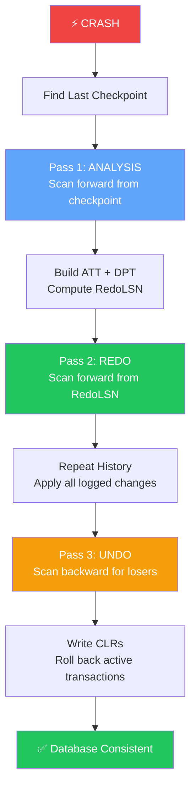

import { Aside } from '@astrojs/starlight/components';

Before ARIES, database recovery was a patchwork of ad hoc techniques — each system reinventing partial solutions for redo, undo, and checkpointing. **ARIES** (Algorithm for Recovery and Isolation Exploiting Semantics) unified these into a single, provably correct framework that became the de facto standard for industrial-strength crash recovery.

This page introduces the algorithm's origins, its three core design principles, why "Repeat History" feels wrong but is right, and how modern systems from DB2 to PostgreSQL inherit ARIES concepts.

## Origin: IBM Almaden, 1992

ARIES was developed at **IBM Almaden Research Center** by C. Mohan, Don Haderle, Bruce Lindsay, Hamid Pirahesh, and Peter Schwarz. Their landmark paper appeared in *ACM Transactions on Database Systems* (TODS) in March 1992:

> Mohan, C., Haderle, D., Lindsay, B., Pirahesh, H., & Schwarz, P. (1992). **ARIES: A Transaction Recovery Method Supporting Fine-Granularity Locking and Partial Rollbacks Using Write-Ahead Logging.** *TODS*, 17(1), 94–162.

The paper addressed a real engineering crisis: IBM's DB2 needed to support **fine-grained locking** (row-level, not just page-level) and **partial rollbacks** (savepoints within a transaction) without sacrificing recovery correctness. Existing recovery methods couldn't handle the combination of:

- **Steal**: uncommitted pages written to disk before commit
- **No-Force**: committed pages left in buffer pool at commit time
- **Fine-grained concurrency**: many transactions modifying overlapping pages

ARIES solved all three simultaneously — something no prior algorithm had achieved cleanly.

<Aside type="note" title="Why the Name Matters">
**A**lgorithm for **R**ecovery and **I**solation **E**xploiting **S**emantics — the "Exploiting Semantics" part is crucial. ARIES doesn't treat all log records identically; it delegates redo/undo to **resource managers** that understand the semantics of each operation (B-tree split, heap insert, index update). This enables **logical undo** — compensating at the operation level, not just byte-reversing physical diffs.
</Aside>

## The Problem ARIES Solved

Pre-ARIES recovery faced a fundamental tension:

```
┌─────────────────────────────────────────────────────────────────┐
│              The Pre-ARIES Recovery Dilemma                      │
├──────────────────────┬──────────────────────────────────────────┤
│  Steal + No-Force    │  Maximum performance (lazy I/O)          │
│  (desired policy)    │  But pages on disk may be inconsistent   │
├──────────────────────┼──────────────────────────────────────────┤
│  Force + No-Steal    │  Simple recovery (pages always match log)│
│  (simple policy)     │  But terrible performance (sync I/O)     │
├──────────────────────┼──────────────────────────────────────────┤
│  ARIES               │  Steal + No-Force WITH correct recovery  │
│  (the breakthrough)  │  via WAL + Repeat History + Logical Undo │
└──────────────────────┴──────────────────────────────────────────┘
```

Without ARIES, systems chose between performance and correctness. ARIES proved you could have both — if you accepted one counterintuitive idea.

## Three Design Principles

ARIES rests on three principles that every modern WAL-based recovery system implements (whether they call it "ARIES" or not):

### 1. Write-Ahead Logging (WAL)

> Log records describing a modification must reach stable storage **before** the modified data page.

This is the golden rule from Chapter 1. ARIES assumes WAL as a precondition — it doesn't reinvent it, it builds recovery on top of it. Every log record is durable before its corresponding page write can be flushed.

### 2. Repeat History (Redo All Relevant Changes)

> During recovery, **re-apply every logged change** to bring the database to the exact state it was in at crash time — including changes from transactions that will later be undone.

This is the counterintuitive part. When you crash, some pages on disk are stale (missing committed changes) and some are ahead (uncommitted changes that were stolen). ARIES doesn't try to figure out which is which during redo. Instead, it **replays the entire relevant history** forward, reconstructing the crash-time database state exactly.

Only *after* redo completes does ARIES undo the losers.

### 3. Logical Undo (Undo via Compensation)

> Undo operations are logged as **Compensation Log Records (CLRs)** that describe how to reverse a change at the semantic level. CLRs are **never undone** — they are redo-only.

Physical undo (writing the inverse bytes) fails for operations like B-tree splits or index rebalancing. Logical undo says: "the undo of an insert is a delete" — and logs that compensation so recovery can survive crashes *during* recovery itself.

<Aside type="tip" title="Memory Hook: WAL-RLU">
Remember ARIES's three principles with **WAL-RLU**:
- **W** — Write-Ahead Logging (log before data)
- **R** — Repeat History (redo everything forward first)
- **L** — Logical Undo (CLRs, never undone)
- **U** — (Implicit) Undo losers after redo completes
</Aside>

## Why "Repeat History" Is Counterintuitive — But Correct

Most engineers' first instinct for recovery is:

```
Naive approach:
1. Find committed transactions → redo their changes
2. Find active transactions → undo their changes
```

This seems logical. Why redo changes you're about to undo?

The answer lies in **Steal + No-Force** ambiguity at crash time:

```
Scenario at crash:
┌──────────┬─────────────┬──────────────┬─────────────────────┐
│ Page     │ On Disk?    │ In Log?      │ Actual State        │
├──────────┼─────────────┼──────────────┼─────────────────────┤
│ P5       │ Stale (T1)  │ T1 uncommitted│ Needs T1's change  │
│ P3       │ Current (T2)│ T2 committed  │ Already has T2     │
│ P8       │ Missing (T1)│ T1 uncommitted│ Needs T1's change  │
│ P10      │ Not on disk │ T1 uncommitted│ Needs T1's change  │
└──────────┴─────────────┴──────────────┴─────────────────────┘
```

You cannot know which pages are stale vs. current by looking at transaction status alone. A committed transaction's page might still be in the buffer pool (No-Force). An uncommitted transaction's page might be on disk (Steal).

**Repeat History sidesteps this entirely:**

1. Redo **all** logged changes → database exactly matches crash-time state
2. Undo **only** the losers → remove uncommitted work

The page-LSN mechanism makes redo idempotent — if a page already has a change, redo skips it. So replaying T1's changes during redo is harmless; undo removes them afterward.

<Aside type="caution" title="The #1 ARIES Misconception">
**"Redo only committed transactions."** — WRONG.

ARIES redoes **all** transactions (winners and losers) for pages in the Dirty Page Table. Transaction commit status is irrelevant during redo. Commit status only matters during the **undo pass**, where losers are rolled back.

Interviewers love this question. Now you know the answer.
</Aside>

## Comparison to Simpler Recovery Approaches

| Approach | Redo Strategy | Undo Strategy | Handles Steal+No-Force? | Crash-During-Recovery? |
|----------|--------------|---------------|------------------------|------------------------|
| **Simple Logging** | Redo committed only | Undo active only | ❌ No — can't determine page state | ❌ Exponential rework |
| **Shadow Paging** | Switch to shadow copy | Discard current copy | ✅ Yes — but no concurrency | ✅ N/A (atomic switch) |
| **ARIES** | Redo all (Repeat History) | Undo losers via CLRs | ✅ Yes | ✅ CLRs prevent re-undo |
| **PostgreSQL (ARIES-style)** | Redo from RedoLSN | Undo via rollback + CLRs | ✅ Yes | ✅ Safe |

### Simple Logging (Pre-ARIES)

```
function simple_recovery(log):
    winners = transactions_with_commit_record(log)
    losers = transactions_without_commit_record(log)
    
    for record in log:
        if record.txn in winners:
            redo(record)      // Only redo winners
    for record in reverse(log):
        if record.txn in losers:
            undo(record)      // Only undo losers
```

**Fatal flaw:** After a Steal, an uncommitted page may be on disk while a committed page may not be. Redoing only winners leaves stale pages un-updated. Undoing only losers misses pages that need redo first.

### Shadow Paging

Copy-on-write: never overwrite a page in place. On commit, atomically switch a root pointer to the new page tree.

- ✅ Recovery is trivial (keep old tree)
- ❌ No fine-grained concurrency (whole-tree copies)
- ❌ Garbage collection of old versions
- ❌ Not compatible with buffer pool stealing

ARIES achieves shadow-paging-level correctness without copy-on-write overhead.

## Systems That Use ARIES Concepts

ARIES wasn't just an academic exercise — its ideas permeate industrial database systems:

| System | ARIES Relationship | Key Adaptation |
|--------|-------------------|----------------|
| **IBM DB2** | Direct ARIES implementation | Original target system; full three-pass recovery |
| **Microsoft SQL Server** | ARIES-based recovery | Similar ATT/DPT/checkpoint model; Hekaton uses different scheme |
| **PostgreSQL** | ARIES-inspired | Redo from RedoLSN; uses `pg_clog` + rollback instead of full CLR chain |
| **MySQL InnoDB** | ARIES-style redo + undo | Mini-transactions, redo log, undo tablespace; MLOG_REC_CLR |
| **Oracle** | Independent design | Similar WAL principles; different checkpoint/recovery structure |
| **SQLite WAL mode** | Simplified WAL | No multi-pass recovery; checkpoint = copy whole db |

<Aside type="note" title="PostgreSQL: ARIES-ish, Not ARIES-pure">
PostgreSQL implements ARIES-style **analysis** and **redo** passes but handles undo differently: active transactions at crash are marked "aborted" in `pg_clog`, and their changes are rolled back lazily on first access (or during recovery via `StartupXLOG`). It doesn't write a full CLR chain like classic ARIES, but the redo pass and page-LSN idempotency are pure ARIES.
</Aside>

## Three-Pass Recovery: The High-Level Picture

ARIES recovery consists of three sequential passes over the WAL:



### Pass 1: Analysis

**Direction:** Forward (checkpoint → end of log)

**Purpose:** Reconstruct the state of the system at crash time.

**Outputs:**
- **Active Transaction Table (ATT)** — which transactions were in-flight
- **Dirty Page Table (DPT)** — which pages were dirty and their first-dirty LSN
- **RedoLSN** — earliest LSN from which redo must begin

### Pass 2: Redo (Repeat History)

**Direction:** Forward (RedoLSN → end of log)

**Purpose:** Bring every dirty page to its crash-time state by re-applying logged changes.

**Key insight:** Redo **all** transactions. Idempotency via page-LSN comparison prevents double-application.

### Pass 3: Undo

**Direction:** Backward (end of log → beginning, following PrevLSN chains)

**Purpose:** Roll back **loser** transactions (those active at crash) by writing CLRs.

**Key insight:** CLRs are redo-only. If recovery crashes mid-undo, restart skips already-compensated records via CLR `UndoNxtLSN` pointers.

```
Recovery Timeline:
═══════════════════════════════════════════════════════════════
Checkpoint          Analysis          Redo              Undo
    │                  │                │                 │
    ▼                  ▼                ▼                 ▼
────┬─────────────────┬────────────────┬─────────────────┬────► LSN
    │◄─── scan ──────►│◄── scan ──────►│◄── scan back ──►│
    │    forward      │    forward      │    (losers)     │
    │                 │                 │                 │
    │  Build ATT/DPT  │  Repeat History │  CLR + END      │
═══════════════════════════════════════════════════════════════
```

<Aside type="tip" title="Memory Hook: A-R-U Forward-Forward-Backward">
**Analysis** scans **forward**. **Redo** scans **forward**. **Undo** scans **backward** (within each loser's PrevLSN chain). Two forward passes, one backward pass. Think: "Analyze the wreck, replay the tape, then rewind the mistakes."
</Aside>

## The ARIES Recovery Invariant

After all three passes complete, the database satisfies:

1. **All committed transactions' effects are durable** — their changes survived redo and were not undone
2. **No uncommitted transaction's effects remain** — losers were fully rolled back via CLRs
3. **The database is internally consistent** — all pages reflect a valid transaction-serializable state
4. **Recovery is idempotent** — crashing during any pass and restarting produces the same final state

```python
# ARIES recovery — high-level pseudocode
def aries_recovery(log):
    checkpoint = find_last_checkpoint(log)
    
    # Pass 1: Analysis
    att, dpt, redo_lsn = analysis_pass(log, start=checkpoint)
    losers = [t for t in att if t.state == 'active']
    
    # Pass 2: Redo (Repeat History)
    redo_pass(log, start=redo_lsn, dpt=dpt)
    
    # Pass 3: Undo (losers only)
    for txn in sorted(losers, key=lambda t: t.last_lsn, reverse=True):
        undo_pass(log, txn, write_clrs=True)
    
    # Write END records for fully rolled-back transactions
    for txn in losers:
        write_end_record(txn)
```

## ARIES and Checkpoints

Checkpoints are ARIES's primary mechanism for bounding recovery time. An ARIES checkpoint records:

- A snapshot of the **ATT** (active transactions and their LastLSN)
- A snapshot of the **DPT** (dirty pages and their RecLSN)
- The checkpoint's own LSN

Analysis starts from the **most recent complete checkpoint**, not from the beginning of the log. This is why checkpoint frequency directly trades off recovery time against runtime overhead — a topic covered in the Checkpoints chapter.

<Aside type="caution" title="Fuzzy vs Sharp Checkpoints">
ARIES uses **fuzzy (non-blocking) checkpoints**: transactions continue running while the checkpoint is taken. The ATT and DPT at checkpoint time are approximate — the analysis pass must scan forward from the checkpoint to reconcile any changes that occurred during checkpointing. This is why analysis is necessary even with a recent checkpoint.
</Aside>

## Historical Impact

The ARIES paper is one of the most cited in database systems literature. Its contributions extended beyond crash recovery:

| ARIES Extension | Paper | Contribution |
|----------------|-------|--------------|
| **ARIES/IM** | Mohan & Levine, 1992 | Index management recovery (B-tree splits) |
| **ARIES/KVL** | Mohan, 1992 | Key-value locking with recovery |
| **ARIES/CSA** | Mohan & Narang, 1994 | Client-server architecture recovery |
| **ARIES/LHS** | Mohan & Narang, 1996 | Locking with high availability |

The core insight — WAL + Repeat History + Logical Undo — remains unchanged across all variants.

## Key Takeaways

1. **ARIES** (1992, IBM Almaden) unified Steal + No-Force recovery with fine-grained locking
2. Three principles: **WAL**, **Repeat History**, **Logical Undo** (mnemonic: WAL-RLU)
3. **Repeat History** redoes ALL transactions forward — commit status is irrelevant during redo
4. **Undo** only processes losers, backward via PrevLSN chains, writing **CLRs**
5. **CLRs are never undone** — they solve the crash-during-recovery problem
6. Modern systems (DB2, SQL Server, PostgreSQL, InnoDB) implement ARIES concepts with varying fidelity

<div class="self-check">
<details>
<summary>Quick Quiz: ARIES Overview</summary>

1. **Who developed ARIES and when?**
   → C. Mohan et al. at IBM Almaden Research Center; published in TODS, March 1992.

2. **What are ARIES's three design principles?**
   → Write-Ahead Logging, Repeat History (redo all), and Logical Undo (CLRs).

3. **Why does ARIES redo changes from transactions that will be undone?**
   → Because Steal + No-Force makes page state ambiguous at crash time. Redo reconstructs the exact crash-time state; undo then removes uncommitted work.

4. **Does ARIES redo only committed transactions?**
   → No. Redo applies all logged changes for pages in the DPT. Transaction commit status only matters during the undo pass.

5. **What problem do CLRs solve?**
   → Crash-during-recovery: without CLRs, undo work would be repeated exponentially on each restart. CLRs are redo-only and enable skipping already-compensated records.

6. **Name three production systems that use ARIES concepts.**
   → IBM DB2 (direct implementation), Microsoft SQL Server, PostgreSQL, MySQL InnoDB (any three).

7. **In which direction does each ARIES pass scan the log?**
   → Analysis: forward. Redo: forward. Undo: backward (within each loser's PrevLSN chain).

</details>
</div>
