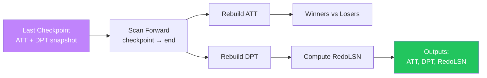

import { Aside } from '@astrojs/starlight/components';

The **Analysis Pass** is ARIES recovery's reconnaissance phase. After a crash, the system has no in-memory state — the buffer pool, lock table, and transaction table are gone. Analysis scans the WAL forward from the last checkpoint to reconstruct exactly what the world looked like at the moment of crash.

This page covers the two critical data structures rebuilt during analysis — the **Active Transaction Table (ATT)** and **Dirty Page Table (DPT)** — and how they determine which transactions won, which lost, and where redo must begin.

## Analysis Pass at a Glance



**Input:** WAL from last complete checkpoint to end-of-log

**Output:**
- Active Transaction Table (ATT)
- Dirty Page Table (DPT)
- RedoLSN (minimum RecLSN across DPT)
- Classification: winners (committed) vs losers (active at crash)

<Aside type="tip" title="Memory Hook: Analysis = Aftermath Investigation">
Think of analysis as a **crime scene investigation**. The checkpoint is the last known-good snapshot. Analysis walks forward through every log record after that point, reconstructing who was doing what and which pages were touched. No changes are made to data pages — analysis is read-only.
</Aside>

## Starting Point: The Last Checkpoint

Analysis does not scan the entire WAL from the beginning. It starts from the **most recent complete checkpoint**, which contains:

```
Checkpoint Record at LSN C:
┌─────────────────────────────────────────────────────────┐
│  Checkpoint LSN: C                                       │
│  ATT snapshot: [(T1, running, lastLSN=3), (T2, running, 2)]│
│  DPT snapshot: [(P5, recLSN=1), (P3, recLSN=2), (P8, 3)]│
│  OldestActiveTxnLSN: 1                                   │
└─────────────────────────────────────────────────────────┘
```

The checkpoint's ATT and DPT are the **initial state** for analysis. Every subsequent log record updates these tables until analysis reaches end-of-log — at which point the tables reflect the crash-time state.

<Aside type="note" title="Why Not Start From LSN 0?">
Checkpoints exist precisely to bound recovery time. If analysis started from the beginning of the log, recovery time would grow linearly with database lifetime. Starting from the last checkpoint limits the scan to WAL generated since that checkpoint — typically seconds to minutes of log, not years.
</Aside>

## The Active Transaction Table (ATT)

The ATT tracks every transaction that was **in-flight** at any point since the checkpoint. After analysis completes, any transaction still in the ATT was **active at crash** — a loser that must be undone.

### ATT Fields

| Field | Type | Meaning |
|-------|------|---------|
| **TransID** | Transaction ID | Unique identifier (T1, T2, ...) |
| **State** | Enum | `running`, `committed`, or `aborted` |
| **LastLSN** | LSN | LSN of this transaction's most recent log record |
| **UndoNxtLSN** | LSN | LSN of the next record to undo (initially = LastLSN) |

```
ATT Entry Structure:
┌──────────┬─────────┬─────────┬─────────────┐
│ TransID  │  State  │ LastLSN │ UndoNxtLSN  │
├──────────┼─────────┼─────────┼─────────────┤
│ T1       │ running │    8    │      8      │
│ T3       │ running │    9    │      9      │
└──────────┴─────────┴─────────┴─────────────┘
```

### ATT Update Rules

Analysis applies these rules for each log record encountered:

```python
def analysis_update_att(att, record):
    match record.type:
        case 'begin':
            att.add(TransID=record.txn, State='running',
                    LastLSN=record.lsn, UndoNxtLSN=record.lsn)
        
        case 'update' | 'clr':
            att[record.txn].LastLSN = record.lsn
            att[record.txn].UndoNxtLSN = record.lsn
        
        case 'commit':
            att.remove(record.txn)   # Winner — no undo needed
        
        case 'abort':
            att.remove(record.txn)   # Already fully rolled back
        
        case 'end':
            att.remove(record.txn)   # Cleanup complete
        
        case 'checkpoint':
            pass  # Checkpoint records handled separately
```

**Key behaviors:**
- **BEGIN** → add new entry to ATT
- **UPDATE / CLR** → update LastLSN and UndoNxtLSN
- **COMMIT** → remove from ATT (transaction is a **winner**)
- **ABORT / END** → remove from ATT (transaction fully resolved)
- **Remaining in ATT at end-of-log** → **losers** (active at crash)

<Aside type="caution" title="CLR Records Update ATT Too">
Compensation Log Records (CLRs) written during a previous recovery attempt update the ATT just like update records — they set LastLSN and UndoNxtLSN. This is how analysis handles **crash during recovery**: CLRs from a prior undo pass are visible in the log and correctly position the undo pass to skip already-compensated work.
</Aside>

## The Dirty Page Table (DPT)

The DPT tracks every page that was **dirty in the buffer pool** at crash time — pages that may not reflect all logged changes on disk.

### DPT Fields

| Field | Type | Meaning |
|-------|------|---------|
| **PageID** | Page identifier | Which data page (P5, P3, ...) |
| **RecLSN** | LSN | LSN of the **first** log record that dirtied this page since it was last clean |

```
DPT Entry Structure:
┌─────────┬─────────┐
│ PageID  │ RecLSN  │
├─────────┼─────────┤
│ P5      │    1    │  ← first dirty at LSN 1
│ P3      │    2    │  ← first dirty at LSN 2
│ P8      │    3    │  ← first dirty at LSN 3
│ P10     │    8    │  ← first dirty at LSN 8 (added after checkpoint)
│ P12     │    9    │  ← first dirty at LSN 9 (added after checkpoint)
└─────────┴─────────┘
```

### DPT Update Rules

```python
def analysis_update_dpt(dpt, record):
    if record.type == 'update':
        for page in record.pages_modified:
            if page not in dpt:
                dpt[page] = RecLSN(record.lsn)  # First modification since clean
            # If page already in DPT: do NOT update RecLSN
            # RecLSN always points to the FIRST log record that dirtied the page
```

**Critical rule:** RecLSN is set **only when a page first appears in the DPT**. Subsequent modifications to the same page do **not** update RecLSN. This is because redo must replay from the *earliest* potentially-missing change — all later changes to the same page will also be encountered during the forward redo scan.

<Aside type="tip" title="Memory Hook: RecLSN = First Dirty Receipt">
RecLSN is the **first receipt** (log record) that made a page dirty since it was last clean. Think of it as the page's "earliest outstanding IO debt." Redo must honor all receipts from that point forward.
</Aside>

## Computing RedoLSN

Once analysis completes, RedoLSN is:

```
RedoLSN = min(RecLSN) across all entries in DPT
```

If the DPT is empty (no dirty pages), RedoLSN = end-of-log and the redo pass is a no-op.

```
Example:
DPT = { P5: RecLSN=1, P3: RecLSN=2, P8: RecLSN=3, P10: RecLSN=8, P12: RecLSN=9 }
RedoLSN = min(1, 2, 3, 8, 9) = 1
```

The redo pass will scan forward from LSN 1, re-applying every update record. Pages whose on-disk copy is already current will be skipped via page-LSN comparison.

## Winners vs Losers

After analysis reaches end-of-log:

| Category | Definition | Recovery Action |
|----------|-----------|-----------------|
| **Winners** | Transactions that **committed** before crash (COMMIT record seen, removed from ATT) | Preserve — redo ensures their changes are on disk |
| **Losers** | Transactions **still in ATT** at end-of-log (no COMMIT/ABORT/END seen) | Undo — roll back all their changes via CLRs |

```
End-of-Analysis Classification:
┌─────────────────────────────────────────────────────────┐
│  ATT at end-of-log:                                      │
│    T1 (running, lastLSN=8, undoNext=8)  → LOSER         │
│    T3 (running, lastLSN=9, undoNext=9)  → LOSER         │
│                                                          │
│  Removed during analysis:                                │
│    T2 (COMMIT at LSN 7)                 → WINNER        │
└─────────────────────────────────────────────────────────┘
```

<Aside type="note" title="Aborted Transactions">
A transaction that issued ABORT (and completed rollback with END) before crash is neither winner nor loser — it's fully resolved and removed from ATT during analysis. Only transactions without a terminal record (COMMIT, ABORT, or END) at end-of-log are losers.
</Aside>

## Worked Example: ATT and DPT Evolution

Let's walk through a complete analysis pass. The scenario:

- **T1** updates P5 (LSN 1), then P8 (LSN 3)
- **T2** updates P3 (LSN 2)
- **Checkpoint** at LSN 4 (captures ATT and DPT)
- **T2** updates P3 again (LSN 5), then **commits** (LSN 7)
- **T3** begins, updates P5 (LSN 6), then P12 (LSN 9)
- **T1** updates P10 (LSN 8)
- **Crash** after LSN 9

### Complete WAL

```
LSN │ Type       │ Transaction │ Description
────┼────────────┼─────────────┼──────────────────────────────────
  1 │ UPDATE     │ T1          │ Write P5 (balance 1000→800)
  2 │ UPDATE     │ T2          │ Write P3 (name Alice→Bob)
  3 │ UPDATE     │ T1          │ Write P8 (qty 10→7)
  4 │ CHECKPOINT │ —           │ ATT: T1,T2 | DPT: P5@1, P3@2, P8@3
  5 │ UPDATE     │ T2          │ Write P3 (name Bob→Charlie)
  6 │ UPDATE     │ T3          │ Write P5 (balance 800→600)
  7 │ COMMIT     │ T2          │ T2 commits
  8 │ UPDATE     │ T1          │ Write P10 (status active→closed)
  9 │ UPDATE     │ T3          │ Write P12 (total 0→500)
    │ ⚡ CRASH   │             │
```

### Step-by-Step ATT/DPT Evolution

**Initial state (from checkpoint at LSN 4):**

```
ATT (after loading checkpoint):
┌──────┬─────────┬─────────┬────────────┐
│ Txn  │  State  │ LastLSN │ UndoNxtLSN │
├──────┼─────────┼─────────┼────────────┤
│ T1   │ running │    3    │     3      │
│ T2   │ running │    2    │     2      │
└──────┴─────────┴─────────┴────────────┘

DPT (after loading checkpoint):
┌──────┬─────────┐
│ Page │ RecLSN  │
├──────┼─────────┤
│ P5   │    1    │
│ P3   │    2    │
│ P8   │    3    │
└──────┴─────────┘

RedoLSN = min(1, 2, 3) = 1
```

**After LSN 5 (T2 updates P3):**

```
ATT:
┌──────┬─────────┬─────────┬────────────┐
│ Txn  │  State  │ LastLSN │ UndoNxtLSN │
├──────┼─────────┼─────────┼────────────┤
│ T1   │ running │    3    │     3      │  ← unchanged
│ T2   │ running │    5    │     5      │  ← LastLSN updated
└──────┴─────────┴─────────┴────────────┘

DPT:
┌──────┬─────────┐
│ Page │ RecLSN  │
├──────┼─────────┤
│ P5   │    1    │  ← unchanged (P3 already in DPT)
│ P3   │    2    │  ← RecLSN NOT updated (first dirty = 2)
│ P8   │    3    │
└──────┴─────────┘
```

**After LSN 6 (T3 updates P5 — new transaction):**

```
ATT:
┌──────┬─────────┬─────────┬────────────┐
│ Txn  │  State  │ LastLSN │ UndoNxtLSN │
├──────┼─────────┼─────────┼────────────┤
│ T1   │ running │    3    │     3      │
│ T2   │ running │    5    │     5      │
│ T3   │ running │    6    │     6      │  ← NEW entry
└──────┴─────────┴─────────┴────────────┘

DPT: unchanged (P5 already in DPT with RecLSN=1)
```

**After LSN 7 (T2 COMMIT):**

```
ATT:
┌──────┬─────────┬─────────┬────────────┐
│ Txn  │  State  │ LastLSN │ UndoNxtLSN │
├──────┼─────────┼─────────┼────────────┤
│ T1   │ running │    3    │     3      │
│ T3   │ running │    6    │     6      │
└──────┴─────────┴─────────┴────────────┘
(T2 REMOVED — winner)

DPT: unchanged
```

**After LSN 8 (T1 updates P10 — new page):**

```
ATT:
┌──────┬─────────┬─────────┬────────────┐
│ Txn  │  State  │ LastLSN │ UndoNxtLSN │
├──────┼─────────┼─────────┼────────────┤
│ T1   │ running │    8    │     8      │  ← LastLSN updated
│ T3   │ running │    6    │     6      │
└──────┴─────────┴─────────┴────────────┘

DPT:
┌──────┬─────────┐
│ Page │ RecLSN  │
├──────┼─────────┤
│ P5   │    1    │
│ P3   │    2    │
│ P8   │    3    │
│ P10  │    8    │  ← NEW entry (first dirty for P10)
└──────┴─────────┘
```

**After LSN 9 (T3 updates P12 — new page):**

```
ATT:
┌──────┬─────────┬─────────┬────────────┐
│ Txn  │  State  │ LastLSN │ UndoNxtLSN │
├──────┼─────────┼─────────┼────────────┤
│ T1   │ running │    8    │     8      │
│ T3   │ running │    9    │     9      │  ← LastLSN updated
└──────┴─────────┴─────────┴────────────┘

DPT:
┌──────┬─────────┐
│ Page │ RecLSN  │
├──────┼─────────┤
│ P5   │    1    │
│ P3   │    2    │
│ P8   │    3    │
│ P10  │    8    │
│ P12  │    9    │  ← NEW entry
└──────┴─────────┘

⚡ CRASH — analysis ends here
```

### Final Analysis Output

```
┌─────────────────────────────────────────────────────────┐
│  ANALYSIS COMPLETE                                       │
├─────────────────────────────────────────────────────────┤
│  Winners:  T2 (committed at LSN 7)                     │
│  Losers:   T1 (lastLSN=8, undoNext=8)                  │
│            T3 (lastLSN=9, undoNext=9)                  │
│  RedoLSN:  1 (min RecLSN across DPT)                   │
│  DPT:      P5@1, P3@2, P8@3, P10@8, P12@9              │
└─────────────────────────────────────────────────────────┘
```

## Complete Analysis Pass Pseudocode

```python
def analysis_pass(log, checkpoint):
    # Initialize from checkpoint snapshot
    att = copy(checkpoint.att)
    dpt = copy(checkpoint.dpt)
    
    for record in log.scan_forward(from=checkpoint.lsn):
        match record.type:
            case 'begin':
                att.add(record.txn, state='running',
                        last_lsn=record.lsn, undo_next=record.lsn)
            
            case 'update':
                att[record.txn].last_lsn = record.lsn
                att[record.txn].undo_next = record.lsn
                for page in record.pages:
                    if page not in dpt:
                        dpt[page] = record.lsn  # First dirty LSN
            
            case 'clr':
                att[record.txn].last_lsn = record.lsn
                att[record.txn].undo_next = record.undo_next_lsn
            
            case 'commit' | 'abort' | 'end':
                att.remove(record.txn)
            
            case 'checkpoint':
                pass  # Already past this checkpoint
    
    redo_lsn = min(dpt.values()) if dpt else log.end_lsn
    losers = list(att.keys())
    
    return att, dpt, redo_lsn, losers
```

## Analysis Pass Properties

| Property | Value |
|----------|-------|
| **Direction** | Forward (checkpoint → end-of-log) |
| **Modifies data pages?** | No — read-only scan of WAL |
| **Modifies WAL?** | No — no new log records |
| **Time complexity** | O(W) where W = WAL records since checkpoint |
| **Space complexity** | O(T + P) where T = active transactions, P = dirty pages |

<Aside type="caution" title="Analysis Does Not Read Data Pages">
Analysis scans only the WAL — it never reads data pages from disk. The ATT and DPT are reconstructed purely from log records and the checkpoint snapshot. This is why analysis is fast even for large databases: it's sequential I/O over the (much smaller) log file, not random I/O over data files.
</Aside>

## Key Takeaways

1. **Analysis** scans forward from the last checkpoint to end-of-log — read-only, no data page access
2. **ATT** tracks in-flight transactions; entries remaining at end-of-log are **losers**
3. **DPT** tracks dirty pages with **RecLSN** = first log record that dirtied each page since clean
4. **RecLSN is never updated** after a page enters the DPT — only set on first addition
5. **RedoLSN = min(RecLSN)** across DPT — earliest point redo must begin
6. **Winners** (committed) are removed from ATT during scan; **losers** remain for the undo pass

<div class="self-check">
<details>
<summary>Quick Quiz: Analysis Pass</summary>

1. **Where does analysis start scanning?**
   → From the last complete checkpoint, forward to end-of-log.

2. **What are the four fields in an ATT entry?**
   → TransID, State, LastLSN, UndoNxtLSN.

3. **When is a page added to the DPT?**
   → On the first UPDATE log record that modifies it since it was last clean (not already in DPT).

4. **Does a second UPDATE to an already-dirty page change its RecLSN?**
   → No. RecLSN always points to the first log record that dirtied the page.

5. **How is RedoLSN computed?**
   → RedoLSN = minimum RecLSN across all entries in the DPT.

6. **How do you distinguish winners from losers after analysis?**
   → Winners were removed from ATT (COMMIT/ABORT/END seen). Losers remain in ATT at end-of-log.

7. **Does analysis modify any data pages?**
   → No. Analysis is a read-only scan of the WAL.

</details>
</div>
