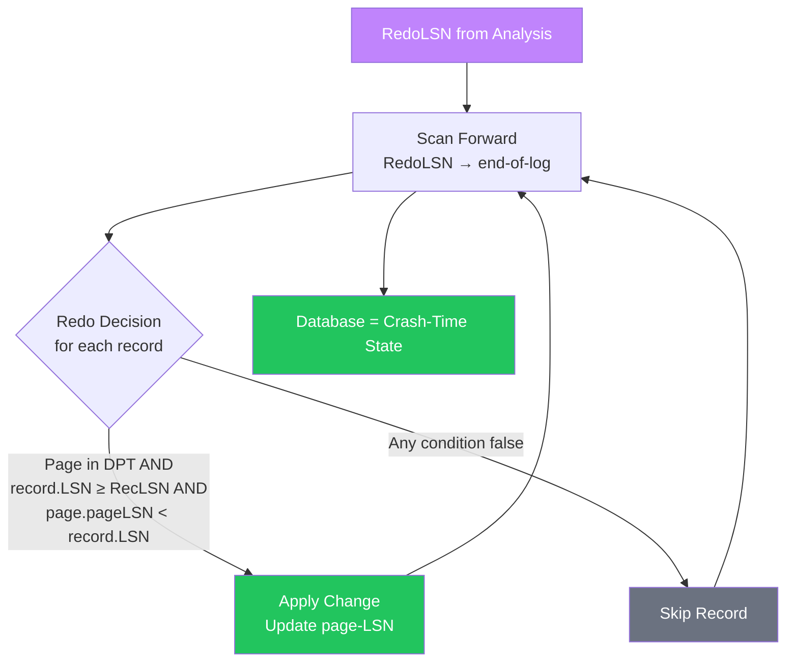
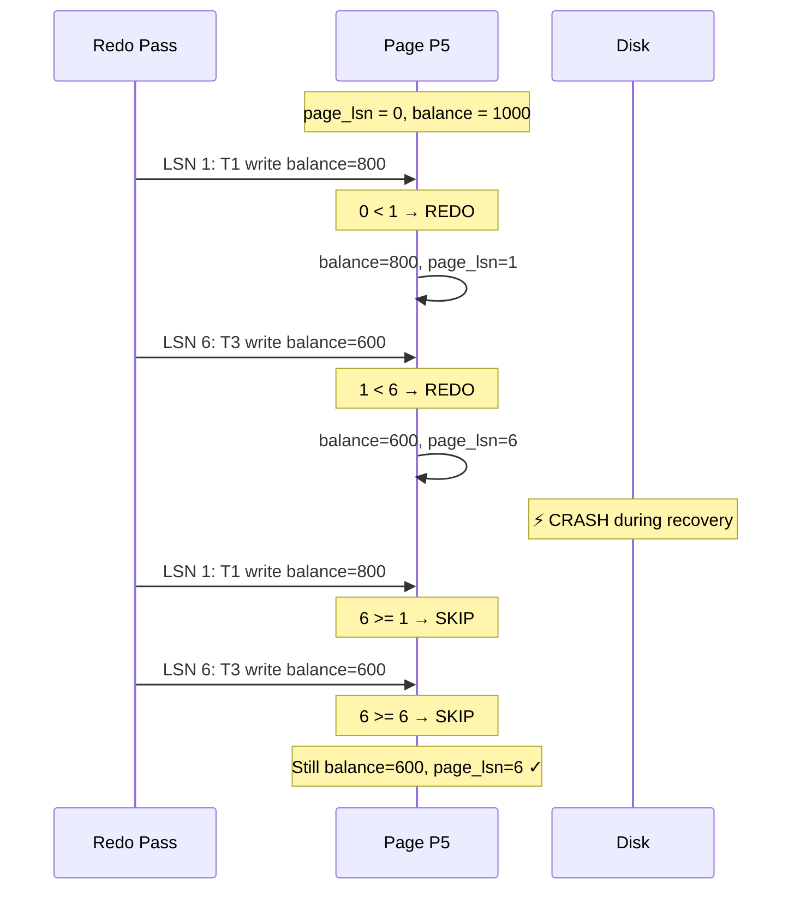

import { Aside } from '@astrojs/starlight/components';

The **Redo Pass** is where ARIES earns its reputation for counterintuitive elegance. After analysis identifies which pages might be stale, redo scans forward from RedoLSN and re-applies **every** logged change — committed or not — to reconstruct the exact database state at crash time.

This page explains the redo decision logic, why all transactions are replayed, how page-LSN enables idempotent redo, and what governs recovery performance.

## Redo Pass at a Glance



**Input:** WAL from RedoLSN to end-of-log, DPT from analysis

**Output:** Database pages reflecting exact crash-time state

**Key property:** No new log records are written during redo.

<Aside type="tip" title="Memory Hook: Redo = Replay the Tape">
After a crash, the database is a **corrupted snapshot** of some past state. Redo is like replaying a security camera recording — you don't ask "was this person allowed to be here?" (that's undo's job). You just reconstruct exactly what happened, frame by frame.
</Aside>

## The Redo Decision

For each log record R encountered during the forward scan, redo applies this three-part test:

```
REDO record R referencing page P IF AND ONLY IF:
  1. P is in the Dirty Page Table (DPT)
  AND
  2. R.lsn >= DPT[P].recLSN
  AND
  3. P.page_lsn < R.lsn
```

If all three conditions hold → **apply** the change and set `P.page_lsn = R.lsn`.

If any condition fails → **skip** the record.

```python
def redo_pass(log, dpt, redo_lsn):
    for record in log.scan_forward(from=redo_lsn):
        if record.type not in ('update', 'clr'):
            continue  # Only redo data-modifying records
        
        for page in record.pages:
            if page not in dpt:
                continue                    # Condition 1: not in DPT → skip
            
            if record.lsn < dpt[page].rec_lsn:
                continue                    # Condition 2: before first dirty → skip
            
            page_obj = fetch_page(page)
            if page_obj.page_lsn >= record.lsn:
                continue                    # Condition 3: already applied → skip
            
            apply_change(record, page_obj)  # REDO the change
            page_obj.page_lsn = record.lsn
            write_page(page_obj)            # No WAL write during redo!
```

### Understanding Each Condition

| Condition | Purpose | What Happens If False |
|-----------|---------|----------------------|
| **P in DPT** | Page was dirty at crash — may be stale on disk | Page was clean; on-disk copy is current → skip |
| **R.lsn ≥ RecLSN** | Record is at or after the page's first-dirty point | Record predates the page's dirty period → skip |
| **page_lsn < R.lsn** | Page doesn't yet have this change | Page already has this (or later) change → skip (idempotent) |

<Aside type="note" title="Condition 2 Is Usually Redundant">
Because redo scans forward from RedoLSN = min(RecLSN), and RecLSN is the minimum across DPT, every record encountered will have LSN ≥ RecLSN for all pages in DPT. Condition 2 is a safety check for edge cases (e.g., CLR records referencing pages added to DPT after the checkpoint).
</Aside>

## Why ALL Transactions Are Redone

This is the most commonly misunderstood aspect of ARIES. During redo:

- ✅ T2's committed changes are redone
- ✅ T1's uncommitted changes are redone
- ✅ T3's uncommitted changes are redone

**Transaction commit status is irrelevant during redo.**

```
┌─────────────────────────────────────────────────────────────┐
│  "But T1 and T3 will be undone — why redo their work?"      │
│                                                              │
│  Because at crash time, we don't know which pages are        │
│  stale. Redo reconstructs the EXACT crash-time state.        │
│  Undo then removes the uncommitted work cleanly.             │
│                                                              │
│  Redo(T1) + Undo(T1) = net zero effect on T1's changes ✓    │
│  Redo(T2) + no Undo    = T2's changes preserved ✓           │
└─────────────────────────────────────────────────────────────┘
```

Consider page P5, modified by both T1 (LSN 1, uncommitted) and T3 (LSN 6, uncommitted):

```
P5 timeline:
  LSN 1: T1 writes balance=800   (uncommitted)
  LSN 6: T3 writes balance=600   (uncommitted)
  CRASH

On disk, P5 might be:
  • balance=1000 (never written — stale)
  • balance=800  (T1 stolen — partial)
  • balance=600  (T3 stolen — most recent)

Redo applies BOTH changes in order → P5 = 600 (crash-time state)
Undo then reverses T3 (→ 800) then T1 (→ 1000) → correct final state
```

If redo skipped T1's change because T1 is a loser, and P5 on disk had balance=1000, the undo pass would have nothing to work with — T3's undo would set balance to 800 (T1's intermediate value), not 1000 (the original).

<Aside type="caution" title="Interview Trap: Redo Scope">
**Q:** "During ARIES redo, do you redo only committed transactions?"
**A:** No. Redo applies all logged changes for pages in the DPT, regardless of transaction commit status. The undo pass handles loser rollback afterward.

This is the single most important redo concept. Memorize it.
</Aside>

## Idempotent Redo via Page-LSN

The page-LSN field on every data page is what makes redo safe to repeat — including after a crash during recovery itself.

```
Idempotency guarantee:
  if page.page_lsn >= record.lsn:
      SKIP  ← change already on page (or superseded by later change)

This means:
  • Redo can be interrupted and restarted without corruption
  • Pages already updated before a re-crash are skipped
  • No special "recovery mode" flag needed on pages
```

### Idempotency in Action

```
Page P3 state during redo (RecLSN=2):

Record LSN 2: T2 writes name=Bob
  page_lsn(0) < 2 → REDO → page_lsn = 2, name = Bob

Record LSN 5: T2 writes name=Charlie
  page_lsn(2) < 5 → REDO → page_lsn = 5, name = Charlie

── If recovery crashes and restarts ──

Record LSN 2: T2 writes name=Bob
  page_lsn(5) >= 2 → SKIP (already superseded)

Record LSN 5: T2 writes name=Charlie
  page_lsn(5) >= 5 → SKIP (already applied)
```



<Aside type="tip" title="Memory Hook: Page-LSN Is the Receipt Stamp">
Every page carries a **receipt stamp** (page-LSN) showing the highest log record applied to it. Redo checks the stamp before applying — if the receipt number is already ≥ the record's LSN, the work is done. No double-charging.
</Aside>

## No Logging During Redo

A critical ARIES property: **the redo pass writes no log records**.

```
During redo:
  ✅ Read log records
  ✅ Read data pages from disk
  ✅ Apply changes to data pages
  ✅ Write data pages to disk
  ❌ Write NO new log records
  ❌ Modify the WAL in any way
```

Why? Because redo is **deterministic** — given the same log and DPT, redo always produces the same result. If recovery crashes during redo, it simply restarts redo from RedoLSN. Idempotency via page-LSN ensures no double-application.

The undo pass, by contrast, **does** write log records (CLRs) because undo actions must be recorded to survive crash-during-recovery.

## Redo Pass Walkthrough: Our Running Example

Using the scenario from the Analysis Pass page:

```
DPT: P5@1, P3@2, P8@3, P10@8, P12@9
RedoLSN = 1
Losers: T1, T3 | Winner: T2
```

| LSN | Txn | Page | In DPT? | page_lsn vs record.lsn | Action |
|-----|-----|------|---------|------------------------|--------|
| 1 | T1 | P5 | ✅ RecLSN=1 | 0 < 1 | **REDO** → balance=800 |
| 2 | T2 | P3 | ✅ RecLSN=2 | 0 < 2 | **REDO** → name=Bob |
| 3 | T1 | P8 | ✅ RecLSN=3 | 0 < 3 | **REDO** → qty=7 |
| 5 | T2 | P3 | ✅ RecLSN=2 | 2 < 5 | **REDO** → name=Charlie |
| 6 | T3 | P5 | ✅ RecLSN=1 | 1 < 6 | **REDO** → balance=600 |
| 8 | T1 | P10 | ✅ RecLSN=8 | 0 < 8 | **REDO** → status=closed |
| 9 | T3 | P12 | ✅ RecLSN=9 | 0 < 9 | **REDO** → total=500 |

Note: LSN 4 (checkpoint) and LSN 7 (commit) are skipped — not update records.

After redo completes:

```
Database state (= crash-time state):
  P5:  balance=600  (T1 then T3 — both uncommitted)
  P3:  name=Charlie (T2 — committed, preserved)
  P8:  qty=7        (T1 — uncommitted)
  P10: status=closed (T1 — uncommitted)
  P12: total=500    (T3 — uncommitted)

ATT losers still need undo: T1, T3
```

## CLR Records During Redo

Compensation Log Records (CLRs) from a **previous recovery attempt** are also processed during redo:

```python
# CLRs are redo-only — they get redone like update records
if record.type == 'clr':
    # Same redo decision applies
    if page in dpt and page.page_lsn < record.lsn:
        apply_compensation(record, page)
        page.page_lsn = record.lsn
    # CLRs are NEVER undone — even if the original transaction was a loser
```

This is why CLRs solve the crash-during-recovery problem: if undo was partially completed before a re-crash, the CLRs from that partial undo are redone (ensuring compensations are on disk), and the undo pass skips already-compensated records via `UndoNxtLSN`.

## Performance: Recovery Time

Recovery time is dominated by the redo pass. Analysis is a sequential WAL scan (fast). Undo touches only loser transactions (usually few). Redo touches **every dirty page since the last checkpoint**.

```
Recovery Time ≈ f(WAL_size_since_checkpoint, num_dirty_pages, random_IO_latency)

Typical breakdown:
  Analysis:  ~5-10% of recovery time (sequential log scan)
  Redo:      ~80-90% of recovery time (random page I/O)
  Undo:      ~5-10% of recovery time (few transactions)
```

### Factors Affecting Recovery Time

| Factor | Impact | Mitigation |
|--------|--------|------------|
| **Checkpoint interval** | Longer interval → more WAL to redo | More frequent checkpoints |
| **Write workload** | More writes → larger DPT → more pages to redo | Incremental checkpointing |
| **Buffer pool size** | Larger pool → more dirty pages at crash | Tune checkpoint targets |
| **Disk random I/O** | Redo reads pages randomly from data files | Recovery prefetch (below) |
| **Full-page writes** | Larger redo records → more I/O | Partial-page logging |

<Aside type="note" title="The Checkpoint Frequency Tradeoff">
More frequent checkpoints → faster recovery but more checkpoint overhead during normal operation. Less frequent checkpoints → less runtime overhead but longer recovery. Production systems typically target 5–15 minutes of recovery time, tuning checkpoint frequency accordingly.
</Aside>

## Optimization: Recovery Prefetch (PostgreSQL 15+)

Random I/O during redo is the primary recovery bottleneck. PostgreSQL 15 introduced **recovery prefetch** to address this:

```
Traditional redo:
  For each log record:
    1. Read page from disk (random I/O — slow!)
    2. Apply change
    3. Write page back

Recovery prefetch:
  1. Scan ahead in WAL, collect upcoming page references
  2. Issue asynchronous prefetch reads (posix_fadvise / readahead)
  3. By the time redo reaches that record, page is in OS cache
  4. Apply change (cache hit — fast!)
```

```python
def redo_with_prefetch(log, dpt, redo_lsn, prefetch_distance=256):
    prefetch_queue = []
    
    for record in log.scan_forward(from=redo_lsn):
        # Prefetch pages from upcoming records
        while len(prefetch_queue) < prefetch_distance:
            next_rec = log.peek_ahead()
            if next_rec:
                for page in next_rec.pages:
                    os.prefetch(page)  # Async readahead
                prefetch_queue.append(next_rec)
        
        # Process current record (page likely already in cache)
        redo_record(record, dpt)
        prefetch_queue.pop(0)
```

On NVMe SSDs with high queue depth, recovery prefetch can reduce redo time by 2–5× for large databases.

<Aside type="tip" title="Memory Hook: Redo Reads, Undo Writes">
**Redo** = read log, read pages, write pages. No log writes.
**Undo** = read log, write pages, **write CLRs to log**.
This asymmetry is why redo dominates recovery time (random page I/O) while undo dominates log growth during recovery.
</Aside>

## Redo vs Undo: Side-by-Side

| Aspect | Redo Pass | Undo Pass |
|--------|-----------|-----------|
| **Direction** | Forward (RedoLSN → end) | Backward (losers' PrevLSN chains) |
| **Scope** | All transactions | Losers only |
| **Writes log?** | No | Yes (CLRs) |
| **Idempotency** | page-LSN comparison | CLR UndoNxtLSN chain |
| **Purpose** | Reconstruct crash-time state | Remove uncommitted work |
| **Performance** | Dominated by random page I/O | Usually small (few losers) |

## Complete Redo Pass Pseudocode

```python
def redo_pass(log, dpt, redo_lsn):
    for record in log.scan_forward(from=redo_lsn):
        if record.type not in ('update', 'clr'):
            continue
        
        for page_id in record.pages_modified:
            # Condition 1: page must be in DPT
            if page_id not in dpt:
                continue
            
            # Condition 2: record must be at or after first-dirty LSN
            if record.lsn < dpt[page_id].rec_lsn:
                continue
            
            # Fetch page (may trigger prefetch)
            page = buffer_pool.get_page(page_id)
            
            # Condition 3: idempotency check
            if page.page_lsn >= record.lsn:
                continue  # Already applied
            
            # Apply the change
            resource_manager.redo(record, page)
            page.page_lsn = record.lsn
            page.mark_dirty()
            # Page will be flushed eventually — no WAL write needed
    
    # After redo: database exactly matches crash-time state
    # Losers' changes are present — undo pass will remove them
```

## Key Takeaways

1. **Redo scans forward** from RedoLSN, applying the three-part redo decision for each record
2. **All transactions are redone** — winners and losers alike; commit status is irrelevant
3. **Idempotency** via `page.page_lsn >= record.lsn → skip` makes redo safe to repeat
4. **No log records** are written during redo — it's a read-log, write-pages operation
5. **Recovery time** is proportional to WAL since last checkpoint; redo dominates (~80-90%)
6. **Recovery prefetch** (PG15+) reduces redo time by async readahead of upcoming pages
7. **CLRs from prior recovery** are redone like update records — ensuring compensations survive re-crash

<div class="self-check">
<details>
<summary>Quick Quiz: Redo Pass</summary>

1. **What are the three conditions for the redo decision?**
   → (1) Page in DPT, (2) record.LSN ≥ RecLSN, (3) page.page_lsn < record.LSN.

2. **Does redo apply changes from uncommitted transactions?**
   → Yes. All transactions' changes are redone for pages in the DPT.

3. **Why is redo idempotent?**
   → The page-LSN on each data page records the highest applied log record. If page_lsn ≥ record.lsn, the change is already present and redo skips it.

4. **Does redo write any log records?**
   → No. Redo only reads the log and writes data pages.

5. **What happens if recovery crashes during redo and restarts?**
   → Redo restarts from RedoLSN. Pages already updated have page_lsn ≥ record.lsn and are skipped. No corruption.

6. **What dominates recovery time?**
   → The redo pass (~80-90%), due to random I/O reading dirty pages from data files.

7. **How does recovery prefetch help?**
   → It scans ahead in the WAL and asynchronously prefetches upcoming pages into OS cache, converting random I/O to cache hits during redo.

</details>
</div>
