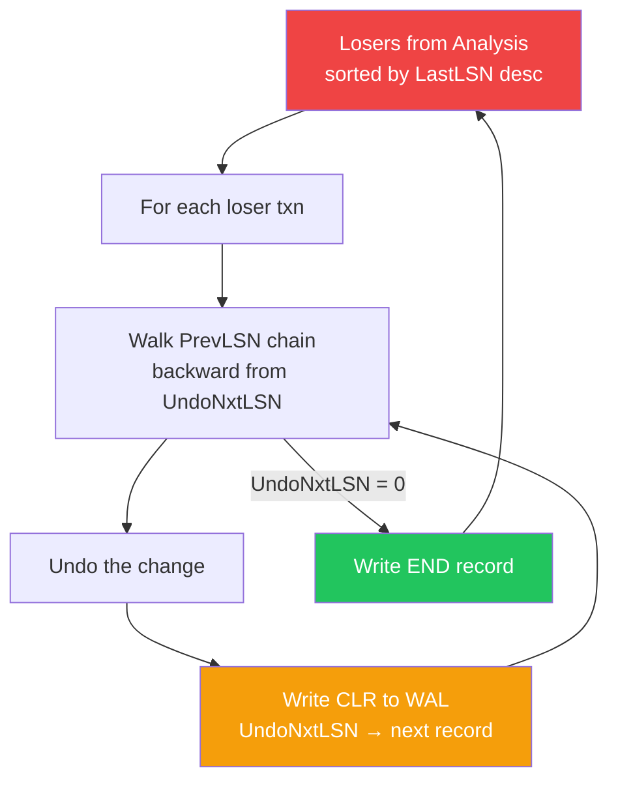
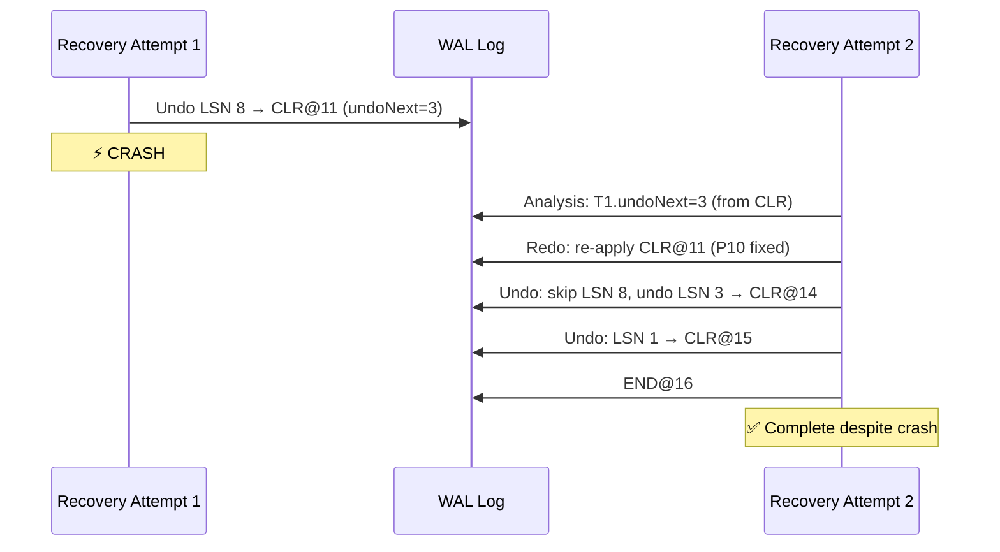

import { Aside } from '@astrojs/starlight/components';

After redo reconstructs the crash-time database state, the **Undo Pass** removes the effects of **loser** transactions — those that were active at crash and never committed. This pass introduces ARIES's most distinctive mechanism: **Compensation Log Records (CLRs)**, which make undo safe even when recovery itself is interrupted by another crash.

## Undo Pass at a Glance



**Input:** Losers from analysis (ATT entries at end-of-log), database in crash-time state (post-redo)

**Output:** Database with all uncommitted changes removed; CLRs and END records appended to WAL

<Aside type="tip" title="Memory Hook: Undo = Rewind the Mistakes">
Redo replayed the entire tape forward. Undo is the **editor** — it walks backward through each loser's changes, writing compensations (CLRs) so the edits themselves are recorded. If the editor crashes mid-cut, the CLRs show exactly where to resume.
</Aside>

## Processing Losers in Reverse LSN Order

Losers are processed in **descending LastLSN order** — the transaction whose most recent change has the highest LSN goes first. Within each transaction, records are walked backward via the **PrevLSN chain**.

```
Losers from our running example:
  T3: lastLSN=9, undoNext=9  → process FIRST (higher LastLSN)
  T1: lastLSN=8, undoNext=8  → process SECOND

Processing order:
  1. Undo T3 (LSN 9 → LSN 6 → done)
  2. Undo T1 (LSN 8 → LSN 3 → LSN 1 → done)
```

Why reverse LastLSN order? **Locking compatibility.** Undoing a transaction may require acquiring locks on pages. Processing in LastLSN order (most recent activity first) minimizes lock contention with concurrent recovery operations and matches the order in which transactions would naturally release resources.

## The PrevLSN Chain

Each log record stores a **PrevLSN** pointer — the LSN of the previous log record written by the same transaction. This forms a backward-linked list per transaction:

```
T1's PrevLSN chain:
  LSN 8 (UPDATE P10) → prevLSN=3
  LSN 3 (UPDATE P8)  → prevLSN=1
  LSN 1 (UPDATE P5)  → prevLSN=0 (beginning)

Walking backward from undoNext=8:
  8 → 3 → 1 → 0 (done)
```

```python
def undo_transaction(txn, log):
    current_lsn = txn.undo_next_lsn
    
    while current_lsn != 0:
        record = log.get_record(current_lsn)
        
        # Apply the undo (reverse the change)
        undo_change(record)
        
        # Write a CLR — do NOT remove the original record
        clr = write_clr(
            txn=txn.id,
            undone_lsn=current_lsn,
            undo_next_lsn=record.prev_lsn  # Next record to undo
        )
        
        current_lsn = record.prev_lsn
```

<Aside type="note" title="PrevLSN vs xl_prev">
Don't confuse **PrevLSN** (transaction-local backward link for undo) with **xl_prev** (global previous record in the log). PrevLSN lets undo walk a single transaction's history without scanning the entire log. xl_prev links all records in chronological order.
</Aside>

## Compensation Log Records (CLRs)

A **CLR** is a special log record written during undo that describes the **compensation** for a previously logged change. It is the mechanism that makes ARIES recovery safe against crash-during-recovery.

### CLR Structure

```
CLR Record:
┌─────────────────────────────────────────────────────────┐
│  Type:         CLR (Compensation Log Record)             │
│  TransID:      Which transaction is being undone         │
│  LSN:          New LSN assigned to this CLR              │
│  PrevLSN:      Previous record by this transaction       │
│  UndoneLSN:    LSN of the record being compensated       │
│  UndoNxtLSN:   LSN of the NEXT record to undo            │
│                ( = PrevLSN of the undone record)         │
│  PageID:       Which page is being compensated           │
│  Payload:      The compensation action (logical undo)    │
└─────────────────────────────────────────────────────────┘
```

The critical field is **UndoNxtLSN**: it tells a subsequent recovery attempt where to resume undo for this transaction.

### Example CLR Sequence for T1

```
Undo T1 (undoNext=8):

Step 1: Undo LSN 8 (UPDATE P10, status=closed→active)
  → Write CLR at LSN 11: UndoNxtLSN=3

Step 2: Undo LSN 3 (UPDATE P8, qty=7→10)
  → Write CLR at LSN 14: UndoNxtLSN=1

Step 3: Undo LSN 1 (UPDATE P5, balance=800→1000)
  → Write CLR at LSN 15: UndoNxtLSN=0

Step 4: UndoNxtLSN=0 → T1 fully undone
  → Write END record at LSN 16
```

```
WAL after T1 undo:
LSN │ Type   │ Txn │ Description
────┼────────┼─────┼────────────────────────────────────
  1 │ UPDATE │ T1  │ Write P5 (balance 1000→800)
  ...
  8 │ UPDATE │ T1  │ Write P10 (status active→closed)
  ...
 11 │ CLR    │ T1  │ Undo LSN 8: P10 status=closed→active, undoNext=3
 14 │ CLR    │ T1  │ Undo LSN 3: P8 qty=7→10, undoNext=1
 15 │ CLR    │ T1  │ Undo LSN 1: P5 balance=800→1000, undoNext=0
 16 │ END    │ T1  │ T1 fully rolled back
```

## Why CLRs Are NEVER Undone

This is a fundamental ARIES invariant:

> **CLRs are redo-only records. They are never undone, even if the transaction that generated them was a loser.**

```
CLR lifecycle:
  Normal operation:  UPDATE → COMMIT/ABORT
  Recovery undo:     UPDATE → CLR → CLR → ... → END
  Re-recovery redo:  UPDATE → CLR → CLR → ... → END
                       ↑       ↑      ↑
                       redone  redone redone (never undone!)
```

Why?

1. **CLRs represent completed undo work.** Undoing a CLR would re-apply the original (bad) change — exactly what we're trying to prevent.

2. **CLRs enable crash-during-recovery recovery.** If undo was partially completed and recovery crashes, the CLRs on disk record exactly how far undo progressed. Restart skips already-compensated records.

3. **CLRs are logically forward-going.** A CLR says "I have compensated for record X." This is a forward assertion, not a change that needs reversal.

```python
def undo_pass(log, losers):
    for txn in sorted(losers, key=lambda t: t.last_lsn, reverse=True):
        lsn = txn.undo_next_lsn
        
        while lsn != 0:
            record = log.get(lsn)
            
            if record.type == 'clr':
                # CLRs are NEVER undone — skip to next via UndoNxtLSN
                lsn = record.undo_next_lsn
                continue
            
            # Undo the change on the data page
            apply_undo(record)
            
            # Write compensation to WAL
            clr_lsn = log.append(CompensationLogRecord(
                txn=txn.id,
                undone_lsn=lsn,
                undo_next_lsn=record.prev_lsn,
                page=record.page,
                compensation=logical_undo(record)
            ))
            
            lsn = record.prev_lsn
        
        log.append(EndRecord(txn=txn.id))
```

<Aside type="caution" title="The CLR Invariant">
If you ever see code that undoes CLRs, it's a bug. CLRs are the one record type in ARIES that is unconditionally redo-only. This invariant is what makes recovery idempotent across multiple crash-recovery cycles.
</Aside>

## The Crash-During-Recovery Problem

Without CLRs, recovery after a crash-during-recovery would repeat all undo work from scratch — and if the system keeps crashing, undo work grows exponentially.

### Without CLRs (Broken)

```
Crash 1: Undo T1 records at LSN 8, 3, 1
  ⚡ Crash during undo (after undoing LSN 8 only)

Crash 2: Restart recovery
  Redo: Re-applies LSN 8 (T1's change to P10) ← undo lost!
  Undo: Starts over from LSN 8 again
  ⚡ Crash during undo (after undoing LSN 8 only)

Crash 3: Same thing again... exponential rework!
```

Each restart redoes the change that was already undone, then tries to undo it again. If crashes keep happening during undo, **no progress is ever made**.

### With CLRs (Correct)

```
Crash 1: Undo T1 LSN 8 → Write CLR at LSN 11 (undoNext=3)
  ⚡ Crash during undo

Crash 2: Restart recovery
  Analysis: T1 still in ATT, undoNext=3 (from CLR at LSN 11)
  Redo: Re-applies CLR at LSN 11 (compensates LSN 8) ← progress preserved!
  Undo: Resumes from undoNext=3 (skips already-compensated LSN 8)
        Undo LSN 3 → CLR at LSN 14
        Undo LSN 1 → CLR at LSN 15
        END at LSN 16
  ✅ T1 fully rolled back despite crash during recovery
```



<Aside type="tip" title="Memory Hook: CLRs Are Undo Receipts">
Each CLR is a **receipt proving undo happened**. "I undid LSN 8; next to undo is LSN 3." If the system crashes, it reads the receipts and picks up where it left off. No rework, no exponential blowup.
</Aside>

## CLR UndoNxtLSN Threading

The UndoNxtLSN field creates a **thread** through the WAL that tracks undo progress:

```
T1 undo progress thread:

  undoNext=8 ──→ Undo LSN 8 ──→ CLR@11 (undoNext=3)
                                    │
  undoNext=3 ──→ Undo LSN 3 ──→ CLR@14 (undoNext=1)
                                    │
  undoNext=1 ──→ Undo LSN 1 ──→ CLR@15 (undoNext=0)
                                    │
  undoNext=0 ──→ DONE ──→ END@16
```

During analysis of a subsequent recovery, when a CLR is encountered:

```python
# Analysis processes CLR records:
if record.type == 'clr':
    att[record.txn].last_lsn = record.lsn
    att[record.txn].undo_next_lsn = record.undo_next_lsn  # Resume point!
```

This updates the ATT so the undo pass knows exactly where to resume — skipping all records at or above the UndoNxtLSN that were already compensated.

## Logical Undo via CLRs

ARIES uses **logical undo** — the compensation action is defined at the operation semantics level, not as a byte-level inverse.

```
Physical undo (naive):     Write the exact inverse bytes
Logical undo (ARIES):      Perform the semantic inverse operation

Examples:
  Original:  INSERT tuple (key=42, val='hello')
  CLR:       DELETE tuple (key=42)              ← logical

  Original:  B-tree page split (page 5 → pages 5, 17)
  CLR:       B-tree page merge (pages 5, 17 → page 5)  ← logical

  Original:  UPDATE balance 1000→800 on page 5
  CLR:       UPDATE balance 800→1000 on page 5   ← can be physical or logical
```

Logical undo is essential for **complex operations** where a byte-level inverse doesn't exist or would be enormous:

| Operation | Physical Undo | Logical Undo (CLR) |
|-----------|--------------|-------------------|
| Heap INSERT | Delete bytes at offset | DELETE operation |
| B-tree SPLIT | ??? (no inverse) | MERGE operation |
| Index bulk load | Reverse entire load | Delete all inserted keys |
| UPDATE scalar | Write old value | UPDATE with old value |

Resource managers (rmgr) implement the logical undo for their operation types — the same module that handles redo also handles undo compensation.

<Aside type="note" title="PostgreSQL's Approach">
PostgreSQL doesn't write full ARIES-style CLRs for every undo during recovery. Instead, it marks aborted transactions in `pg_clog` and performs **lazy rollback** — undoing changes when pages are first accessed after recovery. However, PostgreSQL does write CLRs for **subtransaction aborts** and uses similar redo-only semantics for them.
</Aside>

## END Records

After a loser's undo chain is fully processed (UndoNxtLSN reaches 0), ARIES writes an **END record**:

```
END Record:
┌─────────────────────────────────────────────────────────┐
│  Type:     END                                           │
│  TransID:  Transaction fully rolled back                 │
│  LSN:      New LSN for this END record                   │
│  PrevLSN:  Previous record by this transaction           │
└─────────────────────────────────────────────────────────┘
```

END records serve two purposes:
1. **Cleanup marker** — the transaction is fully resolved; no further undo needed
2. **Analysis shortcut** — if END is seen during a future analysis pass, the transaction is removed from ATT immediately

## Complete Undo Walkthrough: T3

Using our running example, T3 (loser, lastLSN=9, undoNext=9):

```
T3's log records:
  LSN 6: UPDATE P5 (balance 800→600), prevLSN=0
  LSN 9: UPDATE P12 (total 0→500), prevLSN=6

Undo walk (backward from undoNext=9):

Step 1: Undo LSN 9
  Action:  P12 total = 500 → 0
  CLR@10:  undoNext=6 (point to LSN 6, T3's prevLSN)

Step 2: Undo LSN 6
  Action:  P5 balance = 600 → 800
  CLR@12:  undoNext=0 (no more records)

Step 3: undoNext=0 → done
  END@13:  T3 fully rolled back
```

## Complete Undo Walkthrough: T1

T1 (loser, lastLSN=8, undoNext=8):

```
T1's log records:
  LSN 1: UPDATE P5 (balance 1000→800), prevLSN=0
  LSN 3: UPDATE P8 (qty 10→7), prevLSN=1
  LSN 8: UPDATE P10 (status active→closed), prevLSN=3

Undo walk (backward from undoNext=8):

Step 1: Undo LSN 8
  Action:  P10 status = closed → active
  CLR@11:  undoNext=3

Step 2: Undo LSN 3
  Action:  P8 qty = 7 → 10
  CLR@14:  undoNext=1

Step 3: Undo LSN 1
  Action:  P5 balance = 800 → 1000
  CLR@15:  undoNext=0

Step 4: undoNext=0 → done
  END@16:  T1 fully rolled back
```

### Final Database State After Undo

```
Page │ After Redo (crash-time) │ After Undo (consistent)
─────┼─────────────────────────┼─────────────────────────
P5   │ balance=600 (T3)        │ balance=1000 (original)
P3   │ name=Charlie (T2)       │ name=Charlie (T2) ✓ preserved
P8   │ qty=7 (T1)              │ qty=10 (original)
P10  │ status=closed (T1)      │ status=active (original)
P12  │ total=500 (T3)          │ total=0 (original)

T2 (winner): all changes preserved ✓
T1 (loser):  fully rolled back ✓
T3 (loser):  fully rolled back ✓
```

## Crash-During-Recovery Scenario

Let's trace what happens if the system crashes after undoing T3 but before undoing T1:

```
Recovery Attempt 1:
  Analysis → Redo → Undo T3 (CLRs@10, @12, END@13) → Undo T1 LSN 8 → CLR@11
  ⚡ CRASH (T1 partially undone)

WAL now contains:
  ... original records (LSN 1-9) ...
  10: CLR T3 undo LSN 9 (undoNext=6)
  11: CLR T1 undo LSN 8 (undoNext=3)    ← crash happened after this
  12: CLR T3 undo LSN 6 (undoNext=0)
  13: END T3

Recovery Attempt 2:
  Analysis:
    ATT: T1 (undoNext=3, from CLR@11)    ← T3 gone (END@13 seen)
    DPT: unchanged
  
  Redo:
    Re-applies CLR@11 (P10 status=closed→active) ← idempotent
    Re-applies CLR@12 (P5 balance=600→800) if needed
  
  Undo:
    T1: resume from undoNext=3 (skip LSN 8 — already compensated!)
      Undo LSN 3 → CLR@14
      Undo LSN 1 → CLR@15
      END@16
  
  ✅ Complete — no rework of T3, no re-undo of T1 LSN 8
```

<Aside type="caution" title="CLRs Must Be Redone">
When recovery restarts after crash-during-recovery, the redo pass **must re-apply CLRs** to ensure compensations are on disk. This is why CLRs appear in the DPT's scope — they modify pages just like update records. If a CLR's compensation were lost (page not yet written), redo re-applies it.
</Aside>

## Complete Undo Pass Pseudocode

```python
def undo_pass(log, losers):
    # Process losers in descending LastLSN order
    for txn in sorted(losers, key=lambda t: t.last_lsn, reverse=True):
        lsn = txn.undo_next_lsn
        
        while lsn != 0:
            record = log.get_record(lsn)
            
            if record.type == 'clr':
                # Never undo CLRs — follow their UndoNxtLSN
                lsn = record.undo_next_lsn
                continue
            
            # Apply logical undo to the data page
            page = buffer_pool.get_page(record.page)
            resource_manager.undo(record, page)
            
            # Write CLR — this IS logged (unlike redo)
            clr = CompensationLogRecord(
                txn=txn.id,
                prev_lsn=txn.last_lsn,
                undone_lsn=lsn,
                undo_next_lsn=record.prev_lsn,
                page=record.page,
                compensation=resource_manager.compensate(record)
            )
            log.append(clr)
            flush_wal(clr.lsn)  # CLR must be durable
            
            lsn = record.prev_lsn
        
        # Transaction fully rolled back
        log.append(EndRecord(txn=txn.id))
        flush_wal()
```

## Key Takeaways

1. **Undo processes losers** in descending LastLSN order, walking each transaction's PrevLSN chain backward
2. **CLRs** are written for every undo action, recording `UndoNxtLSN` to enable resume after crash-during-recovery
3. **CLRs are NEVER undone** — they are redo-only records, unconditionally
4. **Without CLRs**, repeated crashes during recovery cause exponential rework
5. **Logical undo** compensates at the operation semantics level, not byte-level inversion
6. **END records** mark fully rolled-back transactions, removing them from future analysis
7. **Undo writes to the WAL** (CLRs + END), unlike redo which is log-read-only

<div class="self-check">
<details>
<summary>Quick Quiz: Undo Pass & CLRs</summary>

1. **In what order are loser transactions processed?**
   → Descending LastLSN order (most recent activity first).

2. **What is a CLR and when is it written?**
   → A Compensation Log Record, written during undo for each record being compensated. It describes the logical inverse of the original change.

3. **Are CLRs ever undone?**
   → No. CLRs are redo-only records, never undone under any circumstances.

4. **What does CLR UndoNxtLSN point to?**
   → The PrevLSN of the record being compensated — i.e., the next record to undo in the backward walk.

5. **What problem do CLRs solve?**
   → Crash-during-recovery: without CLRs, undo work repeats from scratch on each restart, potentially forever if crashes keep occurring during undo.

6. **What is the difference between physical and logical undo?**
   → Physical undo reverses exact bytes; logical undo performs the semantic inverse operation (e.g., DELETE compensates INSERT, MERGE compensates SPLIT).

7. **Does undo write log records?**
   → Yes. Undo writes CLRs (one per compensated record) and an END record when rollback is complete. Redo does not write log records.

</details>
</div>
