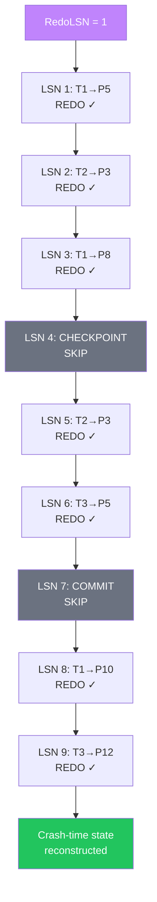
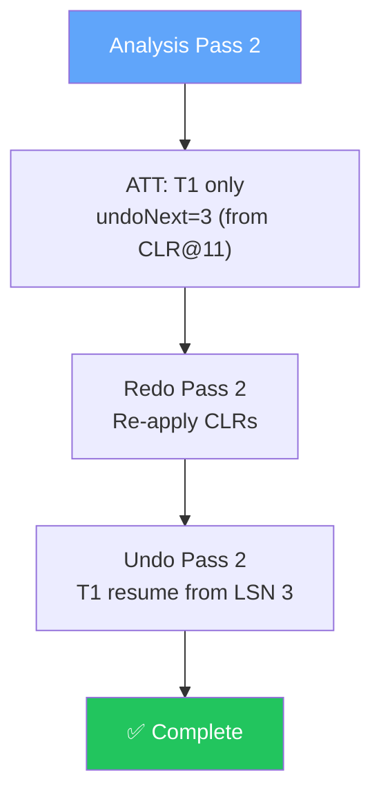

import { Aside } from '@astrojs/starlight/components';
import AriesRecoverySimulator from '../../../components/AriesRecoverySimulator';

This page walks through a complete ARIES recovery scenario from start to finish. Three transactions interact with five pages, a checkpoint captures mid-flight state, and a crash triggers the full three-pass recovery. We then examine what happens when recovery itself is interrupted — the scenario CLRs were designed for.

Use the interactive simulator below to step through each phase, or follow the detailed tables and diagrams on this page.

## Scenario Setup

Three transactions operate on a simple banking/inventory database:

| Transaction | Purpose | Pages Touched |
|-------------|---------|---------------|
| **T1** | Transfer funds + update inventory | P5 (balance), P8 (qty), P10 (status) |
| **T2** | Rename customer | P3 (name) |
| **T3** | Second transfer + add total | P5 (balance), P12 (total) |

A **checkpoint** at LSN 4 captures the ATT and DPT. After the checkpoint, T2 commits, but T1 and T3 are still active when the crash occurs.

<Aside type="tip" title="Memory Hook: T2 Wins, T1 and T3 Lose">
In this scenario, **T2 is the winner** (committed). **T1 and T3 are losers** (active at crash). Remember: winners' changes survive; losers' changes are redone then undone.
</Aside>

## The Complete WAL

```
LSN │ Type       │ Txn │ Page │ Description
────┼────────────┼─────┼──────┼──────────────────────────────────────────
  1 │ UPDATE     │ T1  │ P5   │ balance: 1000 → 800
  2 │ UPDATE     │ T2  │ P3   │ name: Alice → Bob
  3 │ UPDATE     │ T1  │ P8   │ qty: 10 → 7
  4 │ CHECKPOINT │ —   │ —    │ ATT: {T1, T2} | DPT: {P5@1, P3@2, P8@3}
  5 │ UPDATE     │ T2  │ P3   │ name: Bob → Charlie
  6 │ UPDATE     │ T3  │ P5   │ balance: 800 → 600
  7 │ COMMIT     │ T2  │ —    │ T2 commits ✓
  8 │ UPDATE     │ T1  │ P10  │ status: active → closed
  9 │ UPDATE     │ T3  │ P12  │ total: 0 → 500
    │ ⚡ CRASH   │     │      │
────┴────────────┴─────┴──────┴──────────────────────────────────────────
```

### Initial Page State (Before Any Transactions)

```
┌──────┬──────────────────┬───────────┐
│ Page │ Field            │ Value     │
├──────┼──────────────────┼───────────┤
│ P3   │ name             │ Alice     │
│ P5   │ balance          │ 1000      │
│ P8   │ qty              │ 10        │
│ P10  │ status           │ active    │
│ P12  │ total            │ 0         │
└──────┴──────────────────┴───────────┘
```

## Phase 1: Analysis Pass

Analysis starts from the checkpoint at LSN 4 and scans forward to LSN 9.


### ATT Evolution During Analysis

```
After checkpoint (LSN 4):
┌──────┬─────────┬─────────┬────────────┐
│ Txn  │  State  │ LastLSN │ UndoNxtLSN │
├──────┼─────────┼─────────┼────────────┤
│ T1   │ running │    3    │     3      │
│ T2   │ running │    2    │     2      │
└──────┴─────────┴─────────┴────────────┘

After LSN 5 (T2 updates P3):
┌──────┬─────────┬─────────┬────────────┐
│ T1   │ running │    3    │     3      │
│ T2   │ running │    5    │     5      │  ← LastLSN updated
└──────┴─────────┴─────────┴────────────┘

After LSN 6 (T3 begins, updates P5):
┌──────┬─────────┬─────────┬────────────┐
│ T1   │ running │    3    │     3      │
│ T2   │ running │    5    │     5      │
│ T3   │ running │    6    │     6      │  ← NEW
└──────┴─────────┴─────────┴────────────┘

After LSN 7 (T2 COMMIT):
┌──────┬─────────┬─────────┬────────────┐
│ T1   │ running │    3    │     3      │
│ T3   │ running │    6    │     6      │
└──────┴─────────┴─────────┴────────────┘
(T2 REMOVED — winner)

After LSN 8 (T1 updates P10):
┌──────┬─────────┬─────────┬────────────┐
│ T1   │ running │    8    │     8      │  ← LastLSN updated
│ T3   │ running │    6    │     6      │
└──────┴─────────┴─────────┴────────────┘

After LSN 9 (T3 updates P12):
┌──────┬─────────┬─────────┬────────────┐
│ T1   │ running │    8    │     8      │
│ T3   │ running │    9    │     9      │  ← LastLSN updated
└──────┴─────────┴─────────┴────────────┘
```

### DPT Evolution During Analysis

```
After checkpoint (LSN 4):
┌──────┬─────────┐
│ Page │ RecLSN  │
├──────┼─────────┤
│ P5   │    1    │
│ P3   │    2    │
│ P8   │    3    │
└──────┴─────────┘

After LSN 5: unchanged (P3 already in DPT, RecLSN stays 2)
After LSN 6: unchanged (P5 already in DPT, RecLSN stays 1)
After LSN 7: unchanged (commit doesn't affect DPT)
After LSN 8: P10 added with RecLSN=8
After LSN 9: P12 added with RecLSN=9

Final DPT:
┌──────┬─────────┐
│ Page │ RecLSN  │
├──────┼─────────┤
│ P5   │    1    │
│ P3   │    2    │
│ P8   │    3    │
│ P10  │    8    │
│ P12  │    9    │
└──────┴─────────┘

RedoLSN = min(1, 2, 3, 8, 9) = 1
```

### Analysis Summary

```
┌─────────────────────────────────────────────────────────┐
│  ANALYSIS COMPLETE                                       │
├─────────────────────────────────────────────────────────┤
│  Winners:  T2 (committed at LSN 7)                     │
│  Losers:   T1 (lastLSN=8, undoNext=8)                   │
│            T3 (lastLSN=9, undoNext=9)                   │
│  RedoLSN:  1                                             │
│  DPT:      P5@1, P3@2, P8@3, P10@8, P12@9               │
└─────────────────────────────────────────────────────────┘
```

<Aside type="note" title="Self-Check: Analysis">
Before moving to redo, verify you can answer: Why is T2 not in the final ATT? Why does P3's RecLSN stay at 2 after LSN 5? Why is T3 in the ATT after LSN 6 but not after LSN 7?
</Aside>

## Phase 2: Redo Pass (Repeat History)

Redo scans forward from RedoLSN=1, applying the three-part redo decision for each update record.



### Redo Decision Table

| LSN | Txn | Page | In DPT? | page_lsn | record.lsn | Decision | Result |
|-----|-----|------|---------|----------|------------|----------|--------|
| 1 | T1 | P5 | ✅ @1 | 0 | 1 | 0 < 1 | **REDO** balance=800 |
| 2 | T2 | P3 | ✅ @2 | 0 | 2 | 0 < 2 | **REDO** name=Bob |
| 3 | T1 | P8 | ✅ @3 | 0 | 3 | 0 < 3 | **REDO** qty=7 |
| 5 | T2 | P3 | ✅ @2 | 2 | 5 | 2 < 5 | **REDO** name=Charlie |
| 6 | T3 | P5 | ✅ @1 | 1 | 6 | 1 < 6 | **REDO** balance=600 |
| 8 | T1 | P10 | ✅ @8 | 0 | 8 | 0 < 8 | **REDO** status=closed |
| 9 | T3 | P12 | ✅ @9 | 0 | 9 | 0 < 9 | **REDO** total=500 |

Notice that **T1 and T3's changes are redone** even though they are losers. T2's committed changes are also redone. All seven update records are applied.

### Database State After Redo

```
┌──────┬──────────────────┬───────────┬───────────┬──────────────┐
│ Page │ Field            │ Original  │ After Redo│ Owner        │
├──────┼──────────────────┼───────────┼───────────┼──────────────┤
│ P3   │ name             │ Alice     │ Charlie   │ T2 (winner)  │
│ P5   │ balance          │ 1000      │ 600       │ T3 (loser)   │
│ P8   │ qty              │ 10        │ 7         │ T1 (loser)   │
│ P10  │ status           │ active    │ closed    │ T1 (loser)   │
│ P12  │ total            │ 0         │ 500       │ T3 (loser)   │
└──────┴──────────────────┴───────────┴───────────┴──────────────┘

Database = exact crash-time state. Losers' changes are present.
Undo pass will remove T1 and T3's changes next.
```

<Aside type="caution" title="Common Mistake">
Students often ask: "Why redo T1's changes to P5 if T3 overwrote them at LSN 6?" Because redo applies changes in LSN order. LSN 1 sets balance=800, then LSN 6 sets balance=600. Both must be applied to reach the crash-time value of 600. Undo then reverses both (T3 first, then T1).
</Aside>

## Phase 3: Undo Pass

Losers processed in descending LastLSN order: **T3 first** (lastLSN=9), then **T1** (lastLSN=8).

### Undo T3 (undoNext=9)

```
T3's PrevLSN chain: 9 → 6 → 0

Step 1: Undo LSN 9 (UPDATE P12, total 500→0)
  → Write CLR@10: UndoNxtLSN=6

Step 2: Undo LSN 6 (UPDATE P5, balance 600→800)
  → Write CLR@12: UndoNxtLSN=0

Step 3: UndoNxtLSN=0 → T3 complete
  → Write END@13
```

### Undo T1 (undoNext=8)

```
T1's PrevLSN chain: 8 → 3 → 1 → 0

Step 1: Undo LSN 8 (UPDATE P10, status closed→active)
  → Write CLR@11: UndoNxtLSN=3

Step 2: Undo LSN 3 (UPDATE P8, qty 7→10)
  → Write CLR@14: UndoNxtLSN=1

Step 3: Undo LSN 1 (UPDATE P5, balance 800→1000)
  → Write CLR@15: UndoNxtLSN=0

Step 4: UndoNxtLSN=0 → T1 complete
  → Write END@16
```

### Complete WAL After Recovery

```
LSN │ Type       │ Txn │ Description
────┼────────────┼─────┼──────────────────────────────────────────
  1 │ UPDATE     │ T1  │ Write P5 (balance 1000→800)
  2 │ UPDATE     │ T2  │ Write P3 (name Alice→Bob)
  3 │ UPDATE     │ T1  │ Write P8 (qty 10→7)
  4 │ CHECKPOINT │ —   │ ATT: T1,T2 | DPT: P5@1, P3@2, P8@3
  5 │ UPDATE     │ T2  │ Write P3 (name Bob→Charlie)
  6 │ UPDATE     │ T3  │ Write P5 (balance 800→600)
  7 │ COMMIT     │ T2  │ T2 commits
  8 │ UPDATE     │ T1  │ Write P10 (status active→closed)
  9 │ UPDATE     │ T3  │ Write P12 (total 0→500)
    │ ⚡ CRASH   │     │
────┼────────────┼─────┼──────────────────────────────────────────
 10 │ CLR        │ T3  │ Undo LSN 9: P12 total=500→0, undoNext=6
 11 │ CLR        │ T1  │ Undo LSN 8: P10 status=closed→active, undoNext=3
 12 │ CLR        │ T3  │ Undo LSN 6: P5 balance=600→800, undoNext=0
 13 │ END        │ T3  │ T3 fully rolled back
 14 │ CLR        │ T1  │ Undo LSN 3: P8 qty=7→10, undoNext=1
 15 │ CLR        │ T1  │ Undo LSN 1: P5 balance=800→1000, undoNext=0
 16 │ END        │ T1  │ T1 fully rolled back
────┴────────────┴─────┴──────────────────────────────────────────
```

### Final Database State

```
┌──────┬──────────────────┬───────────┬──────────────┐
│ Page │ Field            │ Value     │ Status       │
├──────┼──────────────────┼───────────┼──────────────┤
│ P3   │ name             │ Charlie   │ T2 preserved │
│ P5   │ balance          │ 1000      │ Restored     │
│ P8   │ qty              │ 10        │ Restored     │
│ P10  │ status           │ active    │ Restored     │
│ P12  │ total            │ 0         │ Restored     │
└──────┴──────────────────┴───────────┴──────────────┘

✅ Database is consistent:
   T2's committed changes preserved
   T1's uncommitted changes rolled back
   T3's uncommitted changes rolled back
```

## Interactive Simulator

Step through the complete recovery using the interactive simulator. Click **Step →** to advance one operation at a time, or **Auto-run** to watch the full sequence.

<div class="simulator-container">
<h3>Interactive: ARIES Three-Pass Recovery</h3>
<AriesRecoverySimulator client:visible />
</div>

<Aside type="tip" title="Simulator Tips">
1. Watch the ATT shrink as T2 commits (removed at LSN 7)
2. During redo, notice ALL update records are replayed — including T1 and T3
3. During undo, watch CLRs appear in the log with undoNext threading
4. Compare the ATT/DPT tables with the ASCII tables above at each step
</Aside>

## Crash During Recovery: CLR Safety Demonstrated

Now let's examine the scenario that makes CLRs essential. Suppose the system crashes **during undo**, after T3 is fully rolled back but after only partially undoing T1.

### Crash Point

```
Recovery Attempt 1 progress:
  ✅ Analysis complete
  ✅ Redo complete
  ✅ T3 fully undone (CLRs@10, @12, END@13)
  ✅ T1 LSN 8 undone (CLR@11, undoNext=3)
  ⚡ CRASH before undoing T1 LSN 3

WAL at crash point:
  1-9:  original records
  10:   CLR T3 undo LSN 9 (undoNext=6)
  11:   CLR T1 undo LSN 8 (undoNext=3)  ← last record written
  12:   CLR T3 undo LSN 6 (undoNext=0)
  13:   END T3
```

### Recovery Attempt 2



**Analysis Pass 2:**

```
Scan LSN 10: CLR T3 → update T3 in ATT (but T3 already gone from END@13)
Scan LSN 11: CLR T1 → ATT[T1].undoNext = 3  ← resume point!
Scan LSN 12: CLR T3 → (T3 already ended)
Scan LSN 13: END T3 → remove T3 from ATT

Final ATT: T1 (undoNext=3)  ← NOT 8! CLR@11 moved the pointer
Losers: T1 only
RedoLSN: 1 (unchanged)
```

**Redo Pass 2:**

```
Re-applies all records including CLRs:
  CLR@11: P10 status=closed→active (already done, idempotent via page-LSN)
  CLR@12: P5 balance=600→800 (T3's undo, idempotent)
  ... all original records also re-applied ...
```

**Undo Pass 2:**

```
T1: resume from undoNext=3 (SKIP LSN 8 — already compensated by CLR@11!)

  Undo LSN 3: P8 qty=7→10 → CLR@17 (undoNext=1)
  Undo LSN 1: P5 balance=800→1000 → CLR@18 (undoNext=0)
  END@19: T1 complete

✅ Recovery complete — no rework of T3, no re-undo of T1 LSN 8
```

### Without CLRs: The Exponential Problem

```
Without CLRs, Recovery Attempt 2 would:
  Redo: Re-apply LSN 8 (T1's change to P10) ← undoes the partial undo!
  Undo: Start over from LSN 8
  ⚡ Crash again...
  Redo: Re-apply LSN 8 again...
  (infinite loop if crashes keep happening during undo)
```

With CLRs, each recovery attempt makes **monotonic progress**. The UndoNxtLSN pointer can only move backward (toward 0), never forward. Each CLR is permanent evidence of completed work.

<Aside type="caution" title="Why This Matters in Production">
Real databases crash during recovery more often than you'd think — OOM kills during large recovery, power failures at data centers, kernel panics on memory pressure. CLRs aren't academic trivia; they're what makes recovery **eventually complete** regardless of how many times the system crashes during the process.
</Aside>

## CLR UndoNxtLSN Threading Visualized

```
T1 undo progress across two recovery attempts:

Attempt 1:
  undoNext=8 ──→ Undo LSN 8 ──→ CLR@11 (undoNext=3)
  ⚡ CRASH

Attempt 2:
  Analysis reads CLR@11 → undoNext=3
  Redo re-applies CLR@11 (P10 fixed)
  undoNext=3 ──→ Undo LSN 3 ──→ CLR@17 (undoNext=1)
  undoNext=1 ──→ Undo LSN 1 ──→ CLR@18 (undoNext=0)
  undoNext=0 ──→ END@19
  ✅ Done

Progress made despite crash: LSN 8 compensation preserved via CLR@11
```

## End-to-End Recovery Timeline

```
Time ──────────────────────────────────────────────────────────►

Normal Operation:
  T1 writes ── T2 writes ── T1 writes ── CHECKPOINT ── T2 writes ──
  T3 writes ── T2 COMMIT ── T1 writes ── T3 writes ── ⚡ CRASH

Recovery:
  ┌──────────┐  ┌──────────────────────┐  ┌─────────────────────┐
  │ ANALYSIS │  │ REDO (Repeat History)│  │ UNDO (CLR + END)    │
  │ forward  │  │ forward from RedoLSN │  │ backward for losers │
  │ read log │  │ read log, write pages│  │ write CLRs to log   │
  └──────────┘  └──────────────────────┘  └─────────────────────┘
       │                    │                        │
       ▼                    ▼                        ▼
  ATT, DPT,            Crash-time              Consistent
  RedoLSN,             state                   database
  winners/losers       reconstructed

Total WAL scanned: 2 forward passes + 1 backward pass (losers only)
Total log writes: CLRs + END records only (during undo)
```

## Key Takeaways

1. **Analysis** rebuilds ATT/DPT from checkpoint; T2 removed (winner), T1/T3 remain (losers)
2. **Redo** applies all 7 update records forward — winners and losers alike
3. **Undo** rolls back T3 then T1, writing 5 CLRs and 2 END records
4. **CLRs thread UndoNxtLSN** to enable resume after crash-during-recovery
5. **Crash during recovery** is safe: CLRs preserve progress, redo re-applies compensations
6. **Final state**: T2's changes preserved, T1 and T3 fully rolled back

<div class="self-check">
<details>
<summary>Quick Quiz: Complete ARIES Worked Example</summary>

1. **Which transactions are winners and losers in this scenario?**
   → T2 is the winner (committed at LSN 7). T1 and T3 are losers (active at crash).

2. **What is RedoLSN and why?**
   → RedoLSN = 1, the minimum RecLSN across DPT entries (P5@1, P3@2, P8@3, P8@3, P10@8, P12@9).

3. **How many update records does redo apply?**
   → 7 (LSN 1, 2, 3, 5, 6, 8, 9). All transactions, all dirty pages.

4. **In what order are losers undone, and why?**
   → T3 first (lastLSN=9), then T1 (lastLSN=8). Descending LastLSN order.

5. **How many CLRs are written during undo?**
   → 5 (two for T3 at LSN 10 and 12; three for T1 at LSN 11, 14, and 15).

6. **If recovery crashes after CLR@11, where does undo resume for T1?**
   → From undoNext=3 (read from CLR@11 during analysis). LSN 8 is skipped.

7. **What is the final value of P5 and who determined it?**
   → balance=1000 (original). T3's change (600) and T1's change (800) were both undone. T2 never modified P5.

8. **Why is P3's final value "Charlie" and not "Alice"?**
   → T2 committed at LSN 7. T2's changes were redone and never undone. P3 reflects T2's final write at LSN 5.

</details>
</div>
