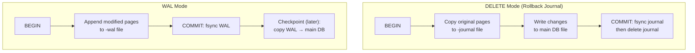
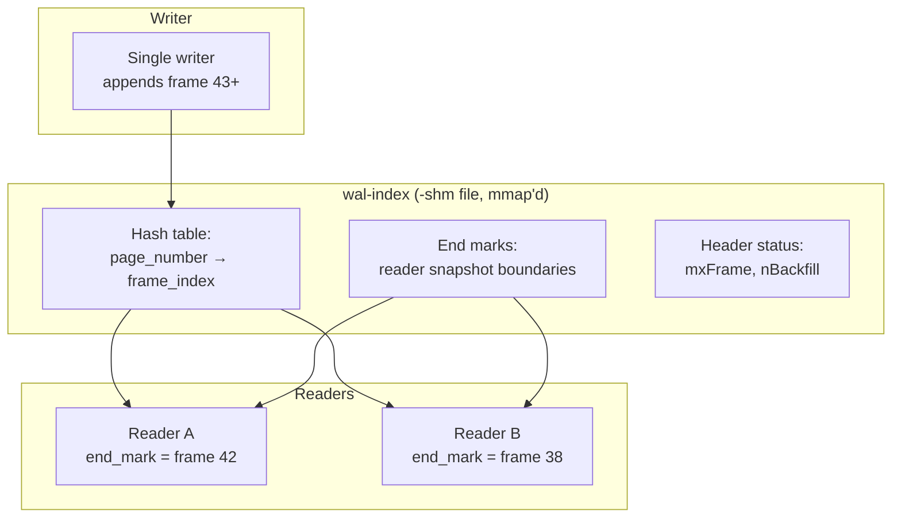
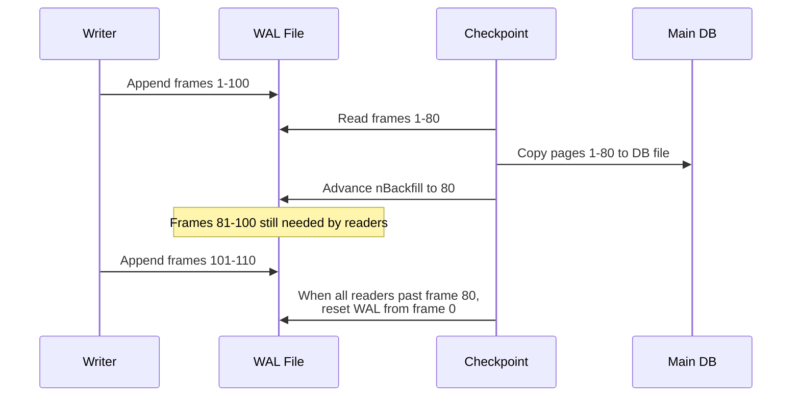
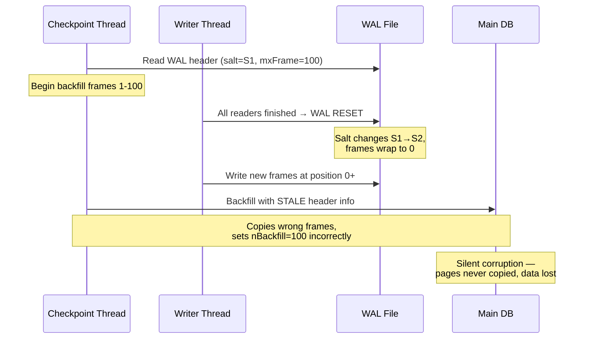

import { Aside } from '@astrojs/starlight/components';
import WalFormatExplorer from '../../../components/WalFormatExplorer';

SQLite is the most widely deployed database engine on Earth — embedded in phones, browsers, and servers. Its WAL implementation is unusually **page-physical**: instead of logging operation diffs, it stores **complete database pages** in the WAL file. This design choice enables a clever reader/writer concurrency model built on a shared-memory hash index, but it also produced one of the longest-lived data-corruption bugs in database history. This page covers SQLite WAL from first principles through production pitfalls.

## Two Durability Modes: DELETE Journal vs WAL

SQLite's default (historically) was **rollback journal mode** (also called **DELETE mode** because the journal file is deleted on commit). WAL mode, introduced in SQLite 3.7.0 (2010), inverts the write pattern entirely.



| Aspect | DELETE (Rollback Journal) | WAL Mode |
|--------|--------------------------|----------|
| **Write target on commit** | Main database file | WAL file (`-wal`) |
| **Reader/writer concurrency** | Writers block readers | Readers and writers concurrent |
| **Commit cost** | Copy pages out + write DB + fsync | Append to WAL + fsync |
| **Recovery after crash** | Replay or rollback journal | Read WAL frames, checkpoint |
| **Extra files** | `-journal` (temporary) | `-wal`, `-shm` (persistent) |
| **Disk I/O pattern** | Random writes to DB | Sequential append to WAL |

In DELETE mode, a transaction **copies unchanged pages to the journal before modifying the database file**. On commit, the journal is fsync'd (making rollback possible), then the journal is deleted. On crash, SQLite either rolls back (journal exists) or continues (journal absent).

In WAL mode, transactions **never modify the main database file directly** during normal operation. Modified pages are appended as **frames** to the WAL file. Readers see a consistent snapshot by overlaying WAL frames on the database file.

<Aside type="tip" title="Memory Hook: DELETE = Undo Tape, WAL = Overlay Film">
**DELETE mode** keeps an **undo tape** (journal) of original pages — you write to the main file and can rewind. **WAL mode** keeps an **overlay film** (WAL frames) on top of an unchanged negative (database file) — readers project the film onto the negative.
</Aside>

### Activating WAL Mode

WAL mode is persistent — once enabled, it survives connection close and reopen:

```sql
-- Enable WAL mode (returns the new journal mode)
PRAGMA journal_mode=WAL;
-- Result: wal

-- Verify
PRAGMA journal_mode;
-- wal

-- WAL mode persists across connections and reboots
-- The setting is stored in the database header
```

Other useful pragmas:

```sql
-- Auto-checkpoint threshold (default: 1000 pages)
PRAGMA wal_autocheckpoint = 1000;

-- Synchronous level (NORMAL is typical for WAL)
PRAGMA synchronous = NORMAL;

-- Checkpoint manually
PRAGMA wal_checkpoint(PASSIVE);   -- non-blocking attempt
PRAGMA wal_checkpoint(FULL);      -- block until complete
PRAGMA wal_checkpoint(RESTART); -- FULL + reset WAL if possible
PRAGMA wal_checkpoint(TRUNCATE); -- RESTART + truncate WAL file to zero
```

<Aside type="note" title="Persistence of WAL Mode">
`PRAGMA journal_mode=WAL` writes the mode into byte 18 of the database header (offset 0x12). Every subsequent open reads this value. You cannot accidentally "fall back" to DELETE mode unless you explicitly set `PRAGMA journal_mode=DELETE`.
</Aside>

## WAL File Structure

The WAL file (`database.db-wal`) has a fixed layout documented in [SQLite's WAL documentation](https://www.sqlite.org/wal.html):

```
WAL File Layout:
┌──────────────────────────────────────────────────────────────┐
│ WAL Header (32 bytes)                                        │
├──────────────────────────────────────────────────────────────┤
│ Frame 0: Frame Header (24B) + Page Data (page_size bytes)   │
├──────────────────────────────────────────────────────────────┤
│ Frame 1: Frame Header (24B) + Page Data                     │
├──────────────────────────────────────────────────────────────┤
│ Frame 2: ...                                                 │
└──────────────────────────────────────────────────────────────┘
```

### WAL Header (32 bytes)

| Offset | Size | Field | Purpose |
|--------|------|-------|---------|
| 0 | 4 | Magic | `0x377f0682` (big-endian) or `0x377f0683` (little-endian) |
| 4 | 4 | File format | Currently `3007000` |
| 8 | 4 | Page size | Database page size (512–65536, power of 2) |
| 12 | 4 | Checkpoint sequence | Incremented on each checkpoint |
| 16 | 4 | Salt-1 | Random value, changes on WAL reset |
| 20 | 4 | Salt-2 | Random value, changes on WAL reset |
| 24 | 4 | Checksum-1 | Cumulative checksum over header |
| 28 | 4 | Checksum-2 | Cumulative checksum over header |

The **salt values** are critical for concurrency — they change every time the WAL is reset (wrapped). Checkpoints verify salt hasn't changed mid-operation (this is the 2026 bug fix).

### Frame Header (24 bytes) + Page Data

Each frame stores one **complete database page** — physical logging, not diffs:

| Offset | Size | Field | Purpose |
|--------|------|-------|---------|
| 0 | 4 | Page number | Which DB page this frame replaces |
| 4 | 4 | Commit size | DB size in pages after commit (0 if not commit frame) |
| 8 | 4 | Salt-1 | Copied from WAL header |
| 12 | 4 | Salt-2 | Copied from WAL header |
| 16 | 4 | Checksum-1 | Running checksum |
| 20 | 4 | Checksum-2 | Running checksum |
| 24 | page_size | Page data | Full page image |

```sql
-- Example: inspect WAL info programmatically
SELECT * FROM pragma_wal_checkpoint('database.db');
-- busy, log, checkpointed

-- Frame count in WAL (approximate)
-- log = total frames, checkpointed = frames copied to DB
```

<Aside type="caution" title="Physical Logging Trade-off">
SQLite WAL stores **entire pages**, not operation diffs. A single-byte UPDATE still logs a full page (typically 4KB). This simplifies recovery (copy frame → page) but increases WAL volume compared to physiological logging in PostgreSQL or InnoDB.
</Aside>

## The wal-index: Shared-Memory Hash Table

The `-shm` file is a **memory-mapped shared index** (wal-index) that enables fast concurrent reads. It is **not** part of the durable WAL — it can be rebuilt from the WAL file on open.



### wal-index Structure

The wal-index occupies exactly **32768 bytes** per hash region (must fit in one VFS shm lock page):

| Region | Purpose |
|--------|---------|
| **Header** (136 bytes) | `iVersion`, `iChange`, `isInit`, `iMaxFrame`, checkpoint state |
| **Hash table** (49146 bytes) | Maps page numbers → most recent frame index |
| **Page count array** | Tracks which pages have WAL frames |

When a reader opens a transaction, it records an **end mark** — the highest WAL frame index it will consult. New WAL frames appended after the end mark are invisible to that reader. This gives **snapshot isolation** without locking the entire database.

<Aside type="tip" title="Memory Hook: End Marks Are Bookmark Ribbons">
Think of **end marks** as bookmark ribbons stuck in the WAL at frame N. The reader only sees frames ≤ N, even while the writer appends frames N+1, N+2, ... behind the ribbon.
</Aside>

### Single-Writer Model

SQLite WAL enforces **exactly one writer** at a time via the `SQLITE_SHM_WRITE` lock:

```
Lock hierarchy (simplified):
1. SHARED lock on DB file     → any number of readers
2. RESERVED lock on DB file   → writer preparing (readers continue)
3. EXCLUSIVE lock on DB file  → writer committing WAL frame
4. wal-index write lock       → coordinate checkpoint vs append
```

Multiple readers proceed concurrently. Writers queue — only one writes at a time. This is simpler than PostgreSQL's multi-writer MVCC but limits write throughput on multi-core systems.

## Checkpointing

A **checkpoint** copies WAL frames back into the main database file and advances the **backfill pointer** (`nBackfill` in wal-index). After checkpoint, frames before the backfill pointer can be reused.



### Checkpoint Modes

| Mode | API | Behavior |
|------|-----|----------|
| **PASSIVE** | `SQLITE_CHECKPOINT_PASSIVE` | Try to checkpoint without blocking. Returns if readers/writers busy. |
| **FULL** | `SQLITE_CHECKPOINT_FULL` | Block until checkpoint completes. Readers can continue but not advance end marks past checkpoint. |
| **RESTART** | `SQLITE_CHECKPOINT_RESTART` | FULL + reset WAL if all readers finished. |
| **TRUNCATE** | `SQLITE_CHECKPOINT_TRUNCATE` | RESTART + truncate `-wal` file to zero bytes. |
| **NOOP** | `PRAGMA wal_checkpoint=NOOP` | Report status only (SQLite 3.51.0+) |

```c
/* C API: sqlite3_wal_checkpoint_v2 */
int sqlite3_wal_checkpoint_v2(
    sqlite3 *db,
    const char *zDb,
    int eMode,           /* PASSIVE, FULL, RESTART, TRUNCATE, NOOP */
    int *pnLog,          /* OUT: total frames in WAL */
    int *pnCkpt          /* OUT: frames checkpointed */
);
```

### Auto-Checkpoint at 1000 Pages

By default, SQLite triggers a **PASSIVE checkpoint** after every **1000 WAL frames** (pages):

```sql
PRAGMA wal_autocheckpoint;  -- returns 1000

-- Lower for smaller WAL, higher for fewer checkpoint interruptions
PRAGMA wal_autocheckpoint = 500;
```

Each frame is one page (default 4KB), so 1000 frames ≈ 4MB of WAL before auto-checkpoint. Heavy write workloads may need tuning — too frequent checkpoints add I/O; too infrequent checkpoints grow the WAL and slow reads (more hash lookups).

<Aside type="note" title="Checkpoint vs WAL Reset">
**Checkpoint** copies frames to the DB file. **WAL reset** (wrap) reuses the WAL file from frame 0 after all readers have moved past the checkpointed frames. Reset increments the salt values in the WAL header — this is where the 2026 bug lived.
</Aside>

## Read-Only WAL Databases

Since SQLite **3.22.0** (2018-01-22), read-only connections can read WAL-mode databases without creating write locks:

```sql
-- Open read-only
sqlite3_open_v2("app.db", &db, SQLITE_OPEN_READONLY, NULL);

-- Reader sees consistent snapshot via wal-index
-- No -shm creation required if WAL is small enough
-- (uses wal-index rebuilt from WAL header on open)
```

This matters for:
- **Read replicas** on shared filesystems (NFS, EFS)
- **Backup tools** reading live databases
- **Analytics queries** against production DBs

The reader still needs access to both `database.db` and `database.db-wal` files.

## The WAL-Reset Bug (March 2026)

In March 2026, SQLite disclosed a **16-year-old data race** affecting WAL mode — the **WAL-Reset bug**. It was present from SQLite 3.7.0 (July 2010) through 3.51.2 (January 2026), fixed in **3.51.3** (March 13, 2026), with backports to 3.44.6 and 3.50.7.

Full details: [SQLite WAL-Reset Bug](https://www.sqlite.org/wal.html#walresetbug)

### The Race Condition



**Trigger conditions** (all required):
1. WAL mode enabled
2. **Two or more connections** in separate threads or processes
3. A **checkpoint** and a **WAL reset** (from concurrent write) overlap at a precise instant

**Symptoms:**
- `nBackfill` reports more pages copied than exist in WAL
- Silent data loss — committed pages never reach the main DB file
- `PRAGMA integrity_check` fails (often on index references to missing pages)
- No error returned to the application

### The Fix

After reading the WAL header, the checkpoint now **re-verifies the salt** before completing backfill:

```c
/* Simplified fix logic (wal.c) */
if (memcmp(pLive->aSalt, pWal->hdr.aSalt, sizeof(pWal->hdr.aSalt)) != 0) {
    /* WAL was reset since we started — abandon this checkpoint */
    return SQLITE_BUSY;
}
```

If salt changed mid-checkpoint, the operation aborts and retries. Canonical verified the fix with a [TLA+ model](https://ubuntu.com/blog/hunting-a-16-year-old-sqlite-bug-with-tla-is-dqlite-affected) of SQLite's locking protocol.

<Aside type="caution" title="Production Impact">
[Tailscale reported](https://tailscale.com/blog/sqlite-wal-reset-bug) six months of intermittent corruption from this bug in production (2025). The bug is **rare** but **silent** — upgrade to SQLite ≥ 3.51.3 immediately if you use WAL mode with multiple connections. No CVE was assigned; track via [SQLite release notes](https://www.sqlite.org/changes.html).
</Aside>

## File Artifacts: `-wal` and `-shm`

| File | Durable? | Purpose |
|------|----------|---------|
| `database.db` | Yes | Main database file (pages checkpointed here) |
| `database.db-wal` | Yes | Write-ahead log (frames with page copies) |
| `database.db-shm` | No | wal-index (rebuilt on open if missing/corrupt) |

```bash
# Typical WAL-mode database directory
ls -la app.db*
# app.db       — main database
# app.db-wal   — WAL file (grows with writes, shrinks on TRUNCATE checkpoint)
# app.db-shm   — shared memory index (32768 bytes × N regions)
```

**Backup considerations:**
- Copy all three files together for a consistent snapshot, OR
- Use `sqlite3_backup` API, OR
- Run `PRAGMA wal_checkpoint(TRUNCATE)` then copy just `app.db`

<Aside type="tip" title="Self-Check">
Before deploying SQLite WAL in production, ask:
1. Are you on SQLite ≥ 3.51.3?
2. Do multiple processes/threads share one database file?
3. Is your backup strategy WAL-aware (all three files)?
4. Have you tuned `wal_autocheckpoint` for your write volume?
</Aside>

## Explore the Format Interactively

<div class="simulator-container">
<h3>Interactive: SQLite WAL Frame Layout</h3>
<WalFormatExplorer client:visible />
</div>

Select **SQLite** in the explorer to inspect the 24-byte frame header and page data fields field-by-field.

## SQLite WAL vs Other Systems

| Feature | SQLite WAL | PostgreSQL WAL | InnoDB Redo |
|---------|-----------|----------------|-------------|
| **Log unit** | Full page copy | Operation record + optional FPI | mtr redo record |
| **Concurrency** | 1 writer, N readers | Multi-writer MVCC | 1 writer (row locks) |
| **Index structure** | wal-index (mmap hash) | WAL buffer + shared buffers | Circular redo log |
| **Checkpoint** | Copy WAL → DB file | Flush dirty buffers + WAL record | Advance checkpoint LSN |
| **Log lifetime** | Until checkpoint + reset | Archived indefinitely (PITR) | Circular overwrite |
| **Typical page size** | 4KB | 8KB | 16KB (InnoDB default) |

## Key Takeaways

1. **WAL mode** appends complete page copies to `-wal` instead of writing the main DB file — enabling concurrent readers via end marks
2. **Activate** with `PRAGMA journal_mode=WAL` — the setting persists in the DB header
3. **wal-index** (`-shm`) is a mmap'd hash table mapping page numbers to WAL frames — rebuilt if lost
4. **Single writer** — SQLite WAL does not support concurrent writers on one database
5. **Checkpointing** copies WAL frames to the DB file; modes PASSIVE/FULL/RESTART/TRUNCATE control blocking behavior
6. **Auto-checkpoint** fires every 1000 frames by default
7. **WAL-Reset bug** (2010–2026) was a checkpoint/reset race causing silent corruption — fixed in 3.51.3
8. **Read-only WAL** access works since 3.22.0 for backup and analytics workloads

<div class="self-check">
<details>
<summary>Quick Quiz: SQLite WAL Mode</summary>

1. **What is the fundamental difference between DELETE mode and WAL mode write targets?**
   → DELETE mode writes changes to the main database file (with a rollback journal for undo). WAL mode appends modified pages to the `-wal` file and checkpoints them later.

2. **Why does SQLite store complete pages in WAL frames instead of operation diffs?**
   → Physical logging enables simple recovery (copy frame over DB page) and lets readers overlay WAL frames without interpreting operation types.

3. **What is the purpose of reader "end marks" in the wal-index?**
   → End marks define the highest WAL frame a reader will consult, providing snapshot isolation — the reader ignores frames appended after its end mark was set.

4. **What happens at the default auto-checkpoint threshold of 1000?**
   → After 1000 WAL frames are written, SQLite attempts a PASSIVE checkpoint to copy frames back to the main database file.

5. **Describe the WAL-Reset bug race condition.**
   → A checkpoint reads the WAL header, then a concurrent writer resets the WAL (changing salt values and wrapping frames). The checkpoint continues with stale header info, backfilling wrong pages and silently losing data.

6. **Which three files constitute a WAL-mode database, and which is not durable?**
   → `database.db`, `database.db-wal`, and `database.db-shm`. The `-shm` file is not durable — it can be rebuilt from the WAL on open.

7. **How do you perform a blocking checkpoint that also truncates the WAL file?**
   → `PRAGMA wal_checkpoint(TRUNCATE);` or `sqlite3_wal_checkpoint_v2()` with `SQLITE_CHECKPOINT_TRUNCATE`.

</details>
</div>
