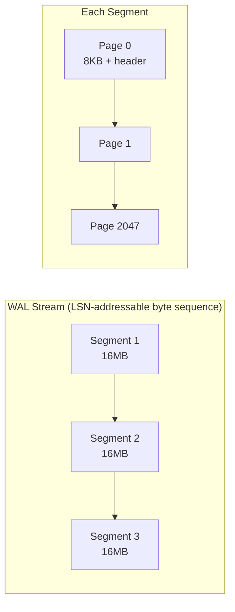
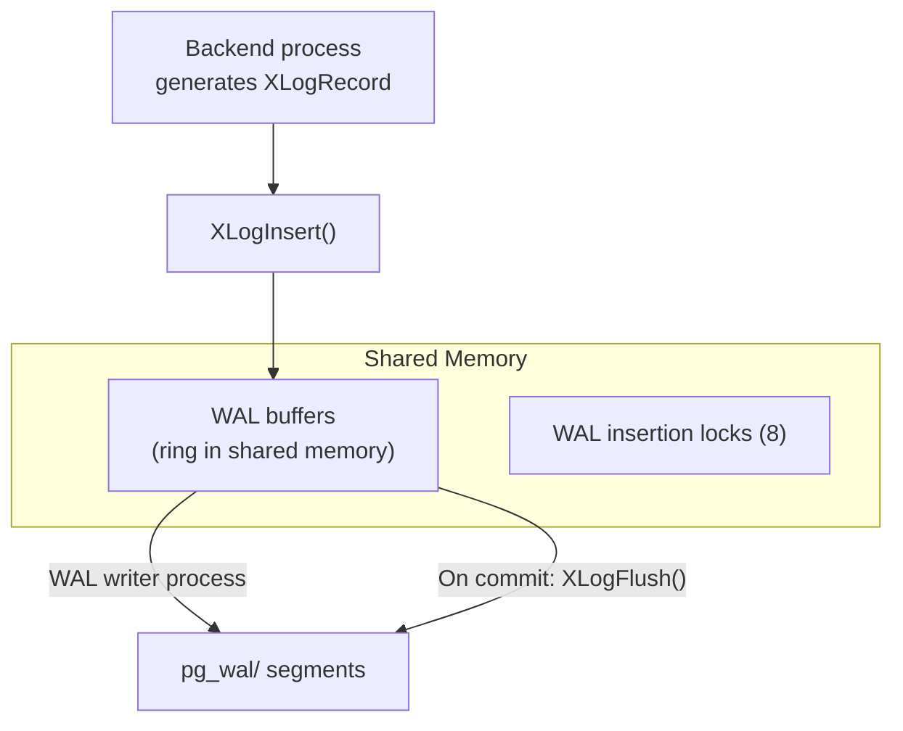
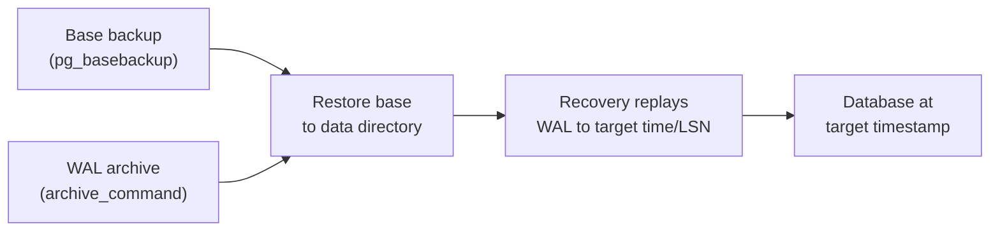
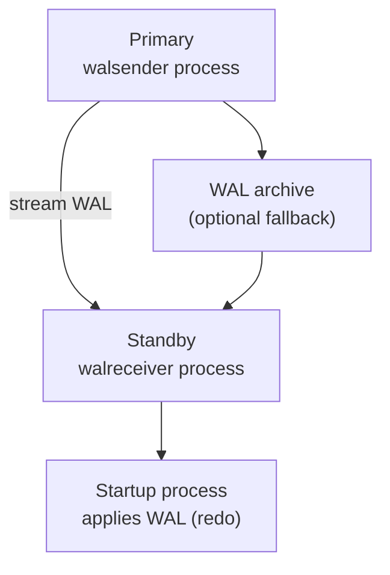

import { Aside } from '@astrojs/starlight/components';

PostgreSQL's Write-Ahead Log is the backbone of durability, crash recovery, point-in-time recovery (PITR), and streaming replication. Unlike SQLite's page-physical WAL, PostgreSQL uses **physiological logging** — operation records dispatched by **resource managers**, optionally accompanied by **Full-Page Images** (FPIs). This page walks through the on-disk layout, in-memory buffering, configuration, inspection tools, and production workflows.

## WAL on Disk: Segments and Pages

PostgreSQL stores WAL in the `pg_wal/` directory (formerly `pg_xlog/` pre-10.0) as a sequence of **fixed-size segment files**:

```
pg_wal/
├── 000000010000000000000001    ← Timeline 1, Log 0, Segment 1 (16MB)
├── 000000010000000000000002
├── 000000010000000000000003
├── archive_status/
│   ├── 000000010000000000000001.done
│   └── 000000010000000000000002.ready
└── summaries/                  ← PG17+ WAL summarization
```

### Segment Filename Encoding

```
Filename: TTTTTTTTLLLLLLLLSSSSSSSS  (24 hex digits)

TTTTTTTT = Timeline ID (8 hex)
LLLLLLLL = Log file / high 32 bits of LSN (8 hex)
SSSSSSSS = Segment within log file (8 hex)

Example: 000000010000000000000001
  Timeline = 1
  Log      = 0
  Segment  = 1
```

Each segment is **16MB by default** (`wal_segment_size`, range 1MB–1GB, must be set at initdb):

```
Segment (16MB = 2048 × 8KB pages):
┌──────────┬──────────┬──────────┬─────┬──────────┐
│ Page 0   │ Page 1   │ Page 2   │ ... │ Page 2047│
│ (8KB)    │ (8KB)    │ (8KB)    │     │ (8KB)    │
└──────────┴──────────┴──────────┴─────┴──────────┘
```



<Aside type="tip" title="Memory Hook: PG WAL Is a Numbered Film Reel">
Think of WAL as a **film reel** chopped into **16MB reels** (segments), each reel containing **2048 frames** (8KB pages). The **LSN** is the exact frame-and-byte position on the infinite reel — your bookmark in the movie.
</Aside>

### XLogPageHeaderData

Every 8KB WAL page begins with a 24-byte header:

```c
/* src/include/access/xlog_internal.h */
typedef struct XLogPageHeaderData {
    uint16      xlp_magic;      /* 0xD10D — magic number */
    uint16      xlp_info;       /* flag bits (continuation, long/short) */
    TimeLineID  xlp_tli;        /* timeline this page belongs to */
    XLogRecPtr  xlp_pageaddr;   /* LSN of this page's start */
    uint32      xlp_rem_len;    /* continuation bytes from previous page */
} XLogPageHeaderData;
```

When a record spans two pages, `xlp_rem_len` on the second page tracks how many bytes belong to the record started on the previous page.

## WAL Buffers: Shared Memory Ring

Before reaching disk, WAL records pass through **WAL buffers** — a shared-memory ring buffer:



| Component | Role |
|-----------|------|
| **WAL buffers** | Ring buffer (`wal_buffers`, default -1 = auto, ~shared_buffers/32) |
| **WAL writer** | Background process flushes filled buffers to disk proactively |
| **XLogFlush()** | Called on commit — ensures WAL is durable up to a given LSN |
| **WAL insertion locks** | 8 lightweight locks striping concurrent inserts |

### WAL Insertion Locks

PostgreSQL uses **8 WAL insertion locks** to allow concurrent backends to insert records without serializing every write:

```c
/* Conceptual: each backend hashes its XID to one of 8 locks */
lock_idx = MyProc->pgprocno % NUM_XLOGINSERT_LOCKS;  /* 8 locks */
LWLockAcquire(WALInsertLocks[lock_idx].lock, LW_EXCLUSIVE);
/* ... copy record into WAL buffer ... */
LWLockRelease(WALInsertLocks[lock_idx].lock);
```

This reduces contention compared to a single global WAL lock, while still maintaining LSN ordering through atomic reservation of space in the WAL buffer.

<Aside type="note" title="WAL Writer vs Backend Flush">
Backends call `XLogFlush()` on commit for their own durability. The **walwriter** process proactively flushes dirty WAL buffers to reduce commit latency — but the commit path always waits for its own LSN to be durable regardless.
</Aside>

## XLogRecord Structure

Each WAL record begins with a fixed **24-byte header**:

```c
/* src/include/access/xlogrecord.h */
typedef struct XLogRecord {
    uint32      xl_tot_len;     /* total record length */
    TransactionId xl_xid;       /* transaction that produced this record */
    XLogRecPtr  xl_prev;        /* LSN of previous record (chain link) */
    uint8       xl_info;        /* rmgr-specific flags + opcode bits */
    RmgrId      xl_rmid;        /* resource manager ID */
    /* 2 bytes padding to 4-byte alignment */
    pg_crc32c   xl_crc;         /* CRC-32C over entire record */
} XLogRecord;
```

| Field | Size | Purpose |
|-------|------|---------|
| `xl_tot_len` | 4B | Total length including header, block refs, and data |
| `xl_xid` | 4B | Transaction ID (0 for non-transactional records) |
| `xl_prev` | 8B | Previous record LSN (global chain) |
| `xl_info` | 1B | Low nibble = rmgr opcode; high nibble = global flags |
| `xl_rmid` | 1B | Resource manager ID |
| `xl_crc` | 4B | CRC-32C checksum (computed last) |

After the header come **block references** (optional, per modified buffer) and **main data** (rmgr-specific payload):

```
XLogRecord layout:
┌──────────────┬─────────────────┬──────────────────┐
│ Header (24B) │ BlockRef[] (var)│ Main data (var)  │
└──────────────┴─────────────────┴──────────────────┘
                    │
                    └── Each BlockRef may include a Full-Page Image (FPI)
```

## Resource Managers

Resource managers (rmgrs) own categories of WAL operations and implement **redo** handlers:

| rmgr ID | Name | Example Records |
|---------|------|-----------------|
| 0 | XLOG | Checkpoint, timeline switch |
| 1 | Transaction | COMMIT, ABORT, PREPARE |
| 2 | Storage | CREATE/DROP relation file |
| 8 | Heap | INSERT, UPDATE, DELETE, HOT prune |
| 9 | Heap2 | VACUUM, FREEZE |
| 10 | Btree | Page split, insert, delete |
| 11 | Hash | Hash index operations |
| 17 | LogicalMessage | Logical decoding messages |

```c
/* Each rmgr registers redo/ desc/ identify callbacks */
void heap_redo(XLogReaderState *record);
void btree_redo(XLogReaderState *record);
void xact_redo(XLogReaderState *record);
```

During recovery, PostgreSQL reads each record, looks up `xl_rmid`, and dispatches to the appropriate redo function. The `xl_info` low nibble tells the rmgr which operation variant to replay.

<Aside type="caution" title="Full-Page Images After Checkpoint">
After a checkpoint, the first modification to any page includes a **Full-Page Image** (FPI) — a compressed snapshot of the entire 8KB page. This protects against **torn page writes** (partial page flushed to disk during crash). FPIs significantly increase WAL volume — `wal_compression` mitigates this.
</Aside>

## LSN: The pg_lsn Type

PostgreSQL's LSN is a **64-bit byte offset** into the WAL stream, exposed as the `pg_lsn` type:

```sql
-- LSN display format: segment/offset (hex)
SELECT pg_current_wal_lsn();
-- 0/1A2B3C4D

-- LSN arithmetic
SELECT pg_wal_lsn_diff('0/2000000', '0/1000000');
-- 16777216 (bytes)

-- Compare LSNs
SELECT '0/1A2B3C4D'::pg_lsn < '0/2000000'::pg_lsn;
-- true
```

Internally: `LSN = (log_file_number << 32) | segment_offset`

Every data page stores a **page LSN** in its header — the LSN of the last WAL record modifying that page. The buffer manager enforces the WAL rule:

```c
/* bufmgr.c — before flushing a dirty buffer */
if (XLogNeedsFlush(bufHdr->lsn))
    XLogFlush(bufHdr->lsn);
smgrwrite(reln, forknum, blocknum, buf);
```

## Configuration

### Essential WAL Parameters

```ini
# postgresql.conf — WAL configuration examples

# Durability level
wal_level = replica          # minimal | replica | logical
                             # replica: enables archiving + physical replication
                             # logical: additionally enables logical decoding

# Checkpoint tuning
max_wal_size = 1GB           # Soft limit — triggers checkpoint
min_wal_size = 80MB          # WAL recycling target after checkpoint
checkpoint_timeout = 5min    # Time-based checkpoint trigger
checkpoint_completion_target = 0.9  # Spread checkpoint I/O over 90% of interval

# WAL compression (PG 9.5+, pglz/lz4/zstd in PG 15+)
wal_compression = lz4        # Compress FPIs in WAL records

# Archiving (PITR)
archive_mode = on
archive_command = 'cp %p /wal_archive/%f'
                             # %p = WAL file path, %f = filename

# Replication
max_wal_senders = 10         # Concurrent replication connections
wal_keep_size = 1GB          # Minimum WAL retained for replicas

# Buffer sizing
wal_buffers = 64MB           # -1 = auto (~shared_buffers/32)
```

| Parameter | Default | Impact |
|-----------|---------|--------|
| `wal_level` | `replica` | `minimal` disables archiving/replication; `logical` adds decoding |
| `max_wal_size` | 1GB | Larger = fewer checkpoints, more WAL disk usage between checkpoints |
| `checkpoint_timeout` | 5min | Maximum time between checkpoints |
| `wal_compression` | off | Reduces FPI WAL volume 30–50% with lz4/zstd |
| `wal_buffers` | -1 (auto) | Larger buffers reduce WAL write syscalls |

<Aside type="tip" title="Memory Hook: max_wal_size Is the Bladder">
**max_wal_size** is PostgreSQL's **bladder** — when WAL volume since last checkpoint exceeds this, a checkpoint is triggered. **checkpoint_timeout** is the **alarm clock** — whichever comes first wins.
</Aside>

## Inspecting WAL: pg_waldump

`pg_waldump` decodes WAL records for debugging and forensic analysis:

```bash
# Dump all records from a segment
pg_waldump 000000010000000000000001

# Filter by resource manager
pg_waldump -r Heap 000000010000000000000001

# Filter by transaction ID
pg_waldump -x 12345 000000010000000000000001

# Show record statistics
pg_waldump -s pg_wal/

# Follow WAL in real-time (like tail -f)
pg_waldump -f -p /var/lib/postgresql/data/pg_wal/
```

Example output:

```
rmgr: Heap        len (rec/tot):     72/    72, tx: 742, lsn: 0/01000028, prev 0/01000000
     INSERT off 142 flags 0x00, blkref #0: rel 1663/16384/16385 blk 42
rmgr: Transaction len (rec/tot):     34/    34, tx: 742, lsn: 0/01000070, prev 0/01000028
     COMMIT 2026-09-12 14:30:00.123 UTC
```

## Monitoring: pg_stat_wal

PostgreSQL 14+ exposes WAL statistics via `pg_stat_wal`:

```sql
-- Global WAL statistics
SELECT * FROM pg_stat_wal;

-- Key columns:
-- wal_records     — total WAL records generated
-- wal_fpi         — full-page images written
-- wal_bytes       — total WAL generated (bytes)
-- wal_buffers_full — times WAL buffers filled (backends had to flush)
-- wal_write       — WAL bytes written to disk
-- wal_sync        — number of WAL fsyncs
-- wal_write_time  — time spent writing WAL (if track_wal_io_timing=on)
-- wal_sync_time   — time spent fsyncing WAL
```

```sql
-- WAL generation rate (run twice, compare)
SELECT
    wal_bytes,
    wal_records,
    wal_fpi,
    wal_buffers_full,
    stats_reset
FROM pg_stat_wal;

-- Per-table WAL generation (PG 13+, requires track_io_timing)
SELECT
    relname,
    n_tup_ins,
    n_tup_upd,
    n_tup_del
FROM pg_stat_user_tables
ORDER BY n_tup_upd + n_tup_ins + n_tup_del DESC
LIMIT 10;
```

<Aside type="note" title="wal_buffers_full Warning Sign">
A rising `wal_buffers_full` counter means backends are blocked waiting for WAL buffer space — increase `wal_buffers` or investigate WAL writer throughput.
</Aside>

## Point-in-Time Recovery (PITR)

PITR combines a **base backup** with **archived WAL** to restore to any moment:



### Setup

```bash
# 1. Enable archiving in postgresql.conf
archive_mode = on
archive_command = 'test ! -f /wal_archive/%f && cp %p /wal_archive/%f'

# 2. Take base backup
pg_basebackup -D /backup/base -Ft -z -P

# 3. On restore: create recovery signal
touch /var/lib/postgresql/data/recovery.signal

# 4. Configure recovery in postgresql.conf
restore_command = 'cp /wal_archive/%f %p'
recovery_target_time = '2026-09-12 15:00:00 UTC'
# OR: recovery_target_lsn = '0/3000000'
# OR: recovery_target_name = 'before_bad_migration'
```

```ini
# recovery parameters (postgresql.conf or postgresql.auto.conf)
restore_command = 'cp /wal_archive/%f %p'
recovery_target_time = '2026-09-12 15:00:00 UTC'
recovery_target_action = 'promote'   # promote when target reached
```

## WAL-Based Replication

### Streaming Replication



```sql
-- On primary: create replication slot (prevents WAL recycling)
SELECT pg_create_physical_replication_slot('replica1');

-- Check replication status
SELECT pid, usename, application_name, state, sent_lsn, write_lsn, flush_lsn, replay_lsn
FROM pg_stat_replication;
```

Primary configuration:

```ini
wal_level = replica
max_wal_senders = 10
wal_keep_size = 1GB

# Synchronous replication (optional)
synchronous_commit = on
synchronous_standby_names = 'replica1'
```

Standby configuration:

```ini
primary_conninfo = 'host=primary port=5432 user=replicator'
primary_slot_name = 'replica1'
hot_standby = on
```

### WAL Summarization (PG 17+)

PostgreSQL 17 introduced **WAL summarization** for incremental backup:

```ini
# postgresql.conf
summarize_wal = on
wal_summary_keep_time = '7d'
```

```bash
# Incremental backup using WAL summaries
pg_basebackup --incremental -i /backup/prior/manifest
```

Summaries track which relation blocks changed between LSN ranges — enabling block-level incremental backups without scanning the entire WAL stream.

<Aside type="tip" title="Self-Check">
Before running PostgreSQL in production, verify:
1. `wal_level` matches your replication/archiving needs
2. `archive_command` succeeds (check `pg_stat_archiver`)
3. Replication lag is monitored (`pg_stat_replication.replay_lag`)
4. `max_wal_size` is sized for your write throughput
5. You have tested PITR restore at least once
</Aside>

## PostgreSQL vs Other WAL Systems

| Feature | PostgreSQL | SQLite WAL | InnoDB Redo |
|---------|-----------|------------|-------------|
| **Log granularity** | Operation + optional FPI | Full page copy | mtr redo record |
| **Segment size** | 16MB (configurable) | Unbounded single file | Circular files (4MB–4GB) |
| **Multi-writer** | Yes (MVCC) | No (single writer) | Yes (row-level locking) |
| **Archival** | First-class (PITR) | None built-in | None (circular) |
| **Replication** | Streaming + logical | None built-in | MySQL binlog (separate) |
| **Checksum** | CRC-32C per record | Cumulative per frame | CRC-32C per 512B block |
| **Log lifetime** | Long (archived) | Until checkpoint | Circular overwrite |

## Key Takeaways

1. **WAL segments** are 16MB files in `pg_wal/`, each containing 2048 × 8KB pages with XLogPageHeaderData
2. **WAL buffers** are a shared-memory ring; 8 insertion locks stripe concurrent writes
3. **XLogRecord** header (24B) contains `xl_tot_len`, `xl_xid`, `xl_prev`, `xl_info`, `xl_rmid`, `xl_crc`
4. **Resource managers** dispatch redo by operation category (Heap, Btree, Transaction, etc.)
5. **Full-Page Images** after checkpoint protect against torn pages — enable `wal_compression` to reduce volume
6. **LSN** (`pg_lsn`) is a 64-bit byte offset — the universal position marker in the WAL stream
7. **pg_waldump** decodes WAL records; **pg_stat_wal** monitors generation and I/O
8. **PITR** = base backup + archived WAL + `recovery_target_time`
9. **Streaming replication** uses walsender/walreceiver; PG 17+ adds WAL summarization for incremental backup

<div class="self-check">
<details>
<summary>Quick Quiz: PostgreSQL WAL</summary>

1. **How is a WAL segment filename structured?**
   → 24 hex digits: 8 for timeline, 8 for log file number, 8 for segment number within the log file.

2. **What are the 8 WAL insertion locks for?**
   → They stripe concurrent WAL inserts across 8 locks, reducing contention while maintaining LSN ordering through atomic space reservation.

3. **When does PostgreSQL write a Full-Page Image?**
   → After a checkpoint, the first modification to any given page includes an FPI — a compressed snapshot protecting against torn page writes.

4. **What does `wal_level = logical` enable beyond `replica`?**
   → Logical decoding — extracting row-level change streams for logical replication and change-data-capture tools.

5. **How do you restore to a specific point in time?**
   → Restore a base backup, configure `restore_command` to fetch archived WAL, set `recovery_target_time`, and start with `recovery.signal` present.

6. **What does a rising `wal_buffers_full` counter indicate?**
   → WAL buffers are too small for the write rate — backends block waiting for space. Increase `wal_buffers` or investigate WAL writer performance.

7. **What is WAL summarization in PG 17+?**
   → Metadata tracking which relation blocks changed between LSN ranges, enabling block-level incremental backups via `pg_basebackup --incremental`.

</details>
</div>
