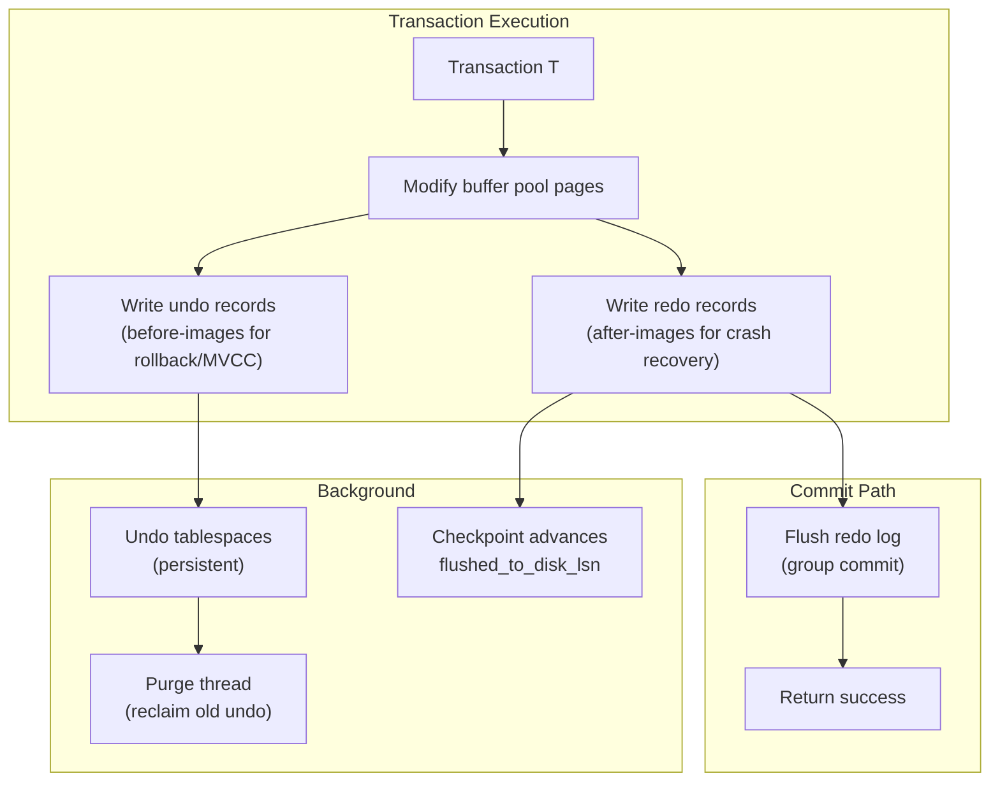
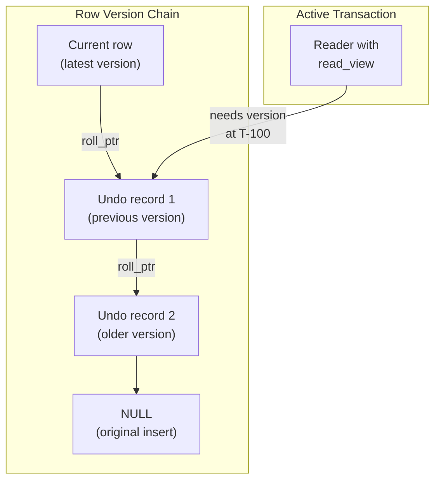
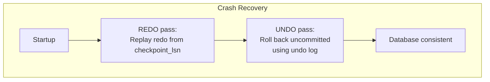
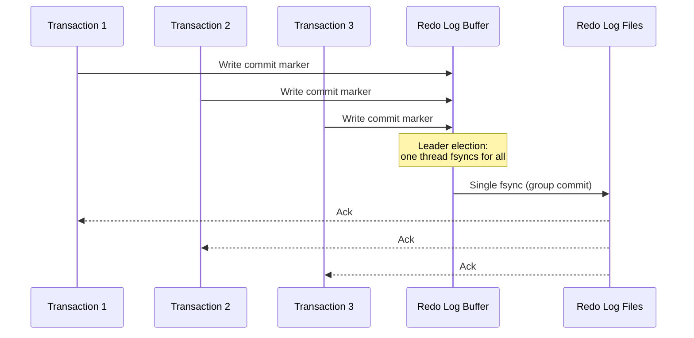

import { Aside } from '@astrojs/starlight/components';

InnoDB's key innovation among production storage engines is the **separation of redo and undo logs**. PostgreSQL combines both concerns into a single WAL stream; InnoDB splits them deliberately. The **redo log** is a physical WAL for crash recovery; the **undo log** is a logical log for transaction rollback and MVCC snapshot reads. Together, they implement **Steal + No-Force** with a circular redo log and a purge-driven undo lifecycle.

## The Dual-Log Architecture



| Log | Purpose | Logging Style | Lifetime |
|-----|---------|---------------|----------|
| **Redo log** | Crash recovery (durability) | Physical (page-level changes) | Circular — overwritten after checkpoint |
| **Undo log** | Rollback + MVCC reads | Logical (reverse operations) | Kept until no transaction needs it, then purged |

<Aside type="tip" title="Memory Hook: Redo = Forward Film, Undo = Rewind Button">
**Redo** is the **forward film** — replay it after a crash to reconstruct committed work. **Undo** is the **rewind button** — roll back uncommitted changes and show older versions to other transactions.
</Aside>

## Redo Log: Physical WAL for Crash Recovery

The InnoDB redo log is a **write-ahead log** stored in circular files (`#ib_redoN` in MySQL 8.0+, or `ib_logfileN` in earlier versions):

```
Redo Log Directory (MySQL 8.0+):
├── #ib_redo0          ← Circular redo log file
├── #ib_redo1
└── ...

Each file contains 512-byte blocks:
┌──────────────┬──────────────┬──────────────┬─────┐
│ Block 0      │ Block 1      │ Block 2      │ ... │
│ 12B hdr      │ 12B hdr      │ 12B hdr      │     │
│ ≤496B data   │ ≤496B data   │ ≤496B data   │     │
│ 4B checksum  │ 4B checksum  │ 4B checksum  │     │
└──────────────┴──────────────┴──────────────┴─────┘
```

### Redo Log Block Format (512 bytes)

```c
/* Conceptual InnoDB redo log block layout */
struct log_block {
    uint32  hdr_no;              /* Block number (4B) */
    uint16  data_len;            /* Bytes of log data in block (2B) */
    uint16  first_rec_group;     /* Offset of first mtr boundary (2B) */
    uint32  checkpoint_no;       /* Checkpoint number (4B) */
    /* Total header: 12 bytes */
    byte    data[496];           /* Redo records (up to 496B) */
    uint32  checksum;            /* CRC-32C of entire block (4B) */
};
```

| Field | Size | Purpose |
|-------|------|---------|
| `hdr_no` | 4B | Block sequence number in circular log |
| `data_len` | 2B | Valid log data bytes in this block |
| `first_rec_group` | 2B | Offset of first mtr start (recovery entry point) |
| `checkpoint_no` | 4B | Checkpoint epoch when block was written |
| `data` | 496B | Redo records from mini-transactions |
| `checksum` | 4B | CRC-32C over entire 512B block |

### Mini-Transactions (mtr)

The **mini-transaction (mtr)** is InnoDB's atomic logging unit — a group of page modifications that must be replayed together:


```c
/* Typical mtr usage pattern */
mtr_t mtr;
mtr_start(&mtr);
/* ... modify pages (insert, btree split, etc.) ... */
mlog_rec_insert(...);   /* generates redo record */
mtr_commit(&mtr);        /* atomic: all records flushed together */
```

Rules of mtr:
- All redo records in one mtr are **contiguous** in the log
- Recovery starts replay at mtr boundaries (tracked by `first_rec_group`)
- Page latches are held for the mtr duration — short critical sections

<Aside type="note" title="mtr vs SQL Transaction">
An **mtr** is a low-level physical operation group (often sub-transaction). One SQL transaction may generate many mtrs. The mtr boundary is about page latch scope, not user-visible transaction boundaries.
</Aside>

### Redo Record Types

InnoDB redo records identify a **space_id + page_no** and carry a type-specific payload:

| Type | Purpose |
|------|---------|
| `MLOG_REC_INSERT` | Insert record on index page |
| `MLOG_REC_UPDATE_IN_PLACE` | In-place update |
| `MLOG_REC_DELETE` | Delete record |
| `MLOG_PAGE_CREATE` | Allocate new page |
| `MLOG_FILE_CREATE` | Create tablespace file |
| `MLOG_REC_CLONE` | Clone operation marker |

Each record: `[type:1B][space_id:4B][page_no:4B][payload:var]`

### LSN Tracking

InnoDB tracks three critical LSN values:


| LSN | Meaning |
|-----|---------|
| `write_lsn` | Highest LSN written to the in-memory log buffer |
| `flushed_to_disk_lsn` | Highest LSN fsync'd to redo log files |
| `checkpoint_lsn` | Oldest LSN that recovery might need — everything before can be overwritten |

```sql
-- Inspect LSN values
SHOW ENGINE INNODB STATUS\G
-- Log sequence number (write_lsn)
-- Log flushed up to   (flushed_to_disk_lsn)

-- Or via performance_schema
SELECT *
FROM performance_schema.innodb_redo_log_files;
```

The WAL rule enforcement:

```c
/* Before flushing a dirty page to tablespace */
if (page_newest_modification > flushed_to_disk_lsn) {
    log_write_up_to(page_newest_modification);  /* flush redo first */
}
fil_write(page);  /* now safe */
```

## Undo Log: Logical Rollback + MVCC

The undo log stores **before-images** — enough information to reverse a change or reconstruct an older row version:



### Undo Tablespaces and Rollback Segments

```
Undo Storage (MySQL 8.0+):
├── Undo tablespace 1 (innodb_undo_directory)
│   ├── Rollback segment 0
│   │   ├── Undo page 0 (insert undo)
│   │   └── Undo page 1 (update undo)
│   └── Rollback segment 1
├── Undo tablespace 2
└── ... (up to 127 undo tablespaces)
```

| Component | Purpose |
|-----------|---------|
| **Undo tablespace** | Dedicated tablespace for undo data (separate from system tablespace since 8.0) |
| **Rollback segment (rseg)** | Manages a pool of undo pages for one set of transactions |
| **Insert undo** | Records insert operations — deleted on rollback or commit (no MVCC needed) |
| **Update undo** | Records update/delete before-images — kept for MVCC until purge |

### How Undo Enables MVCC

When Transaction A reads a row modified by uncommitted Transaction B:

```
1. Reader opens read_view (list of active transaction IDs)
2. Reader finds row with trx_id = B (still active in read_view)
3. Reader follows roll_ptr to undo record → reconstructs previous version
4. Repeat until finding a version visible to read_view (committed before snapshot)
```

On **rollback**, undo records are applied in reverse order to restore original state.

On **commit**, update undo records are **not** immediately deleted — they remain until the **purge thread** determines no active transaction needs them.

### Purge Thread


<Aside type="caution" title="Long Transactions Block Purge">
A long-running transaction (or replication lag on a replica) prevents purge from reclaiming undo records. This causes **undo tablespace bloat** and slows down all queries (longer version chains to traverse). Monitor `history_list_length` in `SHOW ENGINE INNODB STATUS`.
</Aside>

## Redo + Undo Together: Steal + No-Force

InnoDB's dual-log design directly implements the Steal + No-Force policy matrix:

| Policy | Redo Role | Undo Role |
|--------|-----------|-----------|
| **Steal** (write uncommitted pages) | Redo log ensures committed changes survive even if page was written early | Undo log reverses uncommitted changes found on disk during recovery |
| **No-Force** (defer page writes) | Redo log has all committed changes — replay brings pages current | Undo log not needed for committed data at recovery time |
| **No-Steal** | N/A (InnoDB steals) | — |
| **Force** | N/A (InnoDB no-forces) | — |



Recovery sequence:
1. **Redo phase**: Scan redo log from `checkpoint_lsn` to end, apply all records idempotently (page LSN check)
2. **Undo phase**: Find transactions that were active at crash (no commit record), walk their undo chains backward

## Group Commit in InnoDB

InnoDB batches multiple transaction commits into a single redo log fsync — **group commit**:



```sql
-- Group commit effectiveness
SHOW GLOBAL STATUS LIKE 'Innodb_log_write_requests';
SHOW GLOBAL STATUS LIKE 'Innodb_os_log_fsyncs';
-- Ratio close to 1:1 means group commit is working well
-- High requests / low fsyncs = good batching
```

With `innodb_flush_log_at_trx_commit = 1` (default, fully durable), group commit is the primary mechanism preventing fsync-per-transaction overhead.

## Key Configuration Parameters

```ini
# my.cnf / my.ini — InnoDB log configuration

# Redo log file size (MySQL 8.0+: total redo capacity)
innodb_redo_log_capacity = 1G     # Total redo log size (replaces innodb_log_file_size × files)
# Pre-8.0.30:
# innodb_log_file_size = 256M
# innodb_log_files_in_group = 2

# Durability control
innodb_flush_log_at_trx_commit = 1  # 1=fsync each commit (default, safest)
                                    # 2=write OS buffer, fsync every 1s
                                    # 0=write OS buffer, fsync by OS

# Undo management
innodb_undo_tablespaces = 2         # Number of undo tablespaces
innodb_max_undo_log_size = 1G       # Auto-truncate threshold
innodb_purge_threads = 4            # Parallel purge workers

# Checkpoint / flushing
innodb_log_checkpoint_fuzzy_now = 0 # Manual fuzzy checkpoint (debug)
innodb_max_dirty_pages_pct = 90     # Flush dirty pages when 90% of buffer pool dirty
```

| Parameter | Default | Trade-off |
|-----------|---------|-----------|
| `innodb_redo_log_capacity` | 100MB (8.0.30+) | Larger = fewer checkpoints, longer recovery |
| `innodb_flush_log_at_trx_commit` | 1 | 2 or 0 faster but may lose ~1s of commits on crash |
| `innodb_undo_tablespaces` | 2 | More tablespaces = better concurrent undo allocation |
| `innodb_purge_threads` | 4 | More threads = faster undo reclamation (up to a point) |

<Aside type="tip" title="Memory Hook: flush_log_at_trx_commit = 1, 2, 0">
**1** = "**One** fsync per commit" (safest). **2** = "**Two** layers, OS fsyncs later" (fast, small window). **0** = "**Zero** guarantees from InnoDB" (fastest, trust the OS).
</Aside>

## Contrast with PostgreSQL's Single-Log Approach

| Aspect | InnoDB (Dual Log) | PostgreSQL (Single WAL) |
|--------|-------------------|------------------------|
| **Crash recovery** | Redo log (physical replay) | WAL redo pass |
| **Rollback** | Undo log (separate) | WAL undo via transaction status + logical reversal |
| **MVCC** | Undo log version chains | Tuple headers (xmin/xmax) + clog, no separate undo store |
| **Log format** | Redo = physical; Undo = logical | Physiological (operation + optional FPI) |
| **Log lifetime** | Redo circular; Undo purged | WAL archived indefinitely |
| **Commit fsync** | Redo log only | WAL only |
| **Replication log** | MySQL binlog (separate, logical) | WAL itself (physical + logical decoding) |
| **Block size** | 512B redo blocks | 8KB WAL pages |
| **Atomic unit** | Mini-transaction (mtr) | XLogRecord |

PostgreSQL's unified WAL simplifies the architecture — one log stream serves recovery, replication, and PITR. InnoDB's separation allows the redo log to stay small and circular (physical replay is compact) while undo log grows independently with long-running transactions.

The trade-off: InnoDB requires **two recovery passes** (redo then undo) and a separate **binlog** for replication, while PostgreSQL's WAL serves all three purposes.

<Aside type="note" title="MySQL Binlog Is Not the Redo Log">
MySQL's **binary log (binlog)** is a separate logical change log for replication and point-in-time recovery. It is **not** used for crash recovery — that's the redo log's job. With `sync_binlog=1` and `innodb_flush_log_at_trx_commit=1`, MySQL performs **two fsyncs** per commit (redo + binlog), mitigated by **XA two-phase commit** between InnoDB and binlog.
</Aside>

## Key Takeaways

1. **InnoDB splits logging**: redo (physical, crash recovery) and undo (logical, rollback + MVCC)
2. **Redo log** uses 512-byte blocks with 12B header, mtr-grouped records, and 4B CRC checksum
3. **Mini-transactions (mtr)** are the atomic logging unit — page latches held for mtr duration
4. **Three LSNs**: `write_lsn`, `flushed_to_disk_lsn`, `checkpoint_lsn` track redo progress
5. **Undo log** stores before-images in undo tablespaces with rollback segments
6. **Purge thread** reclaims undo records once no transaction needs old versions
7. **Steal + No-Force**: redo ensures committed data survives; undo cleans up uncommitted data
8. **Group commit** batches multiple transaction fsyncs into one redo log write
9. **vs PostgreSQL**: dual-log + separate binlog vs unified WAL for recovery + replication + PITR

<div class="self-check">
<details>
<summary>Quick Quiz: InnoDB Redo & Undo</summary>

1. **Why does InnoDB separate redo and undo logs instead of using a single WAL like PostgreSQL?**
   → Redo (physical, circular, compact) handles crash recovery. Undo (logical, persistent, growing) handles rollback and MVCC version chains. Different lifecycles and formats optimize each concern independently.

2. **What is a mini-transaction (mtr)?**
   → An atomic group of page modifications and their redo records, protected by page latches. Recovery replays at mtr boundaries using `first_rec_group` offsets in redo log blocks.

3. **What are the three LSN values InnoDB tracks?**
   → `write_lsn` (newest in buffer), `flushed_to_disk_lsn` (newest durable), `checkpoint_lsn` (oldest still needed — defines circular log reuse point).

4. **How does the undo log enable MVCC?**
   → Each row has a `roll_ptr` to an undo record chain. Readers follow the chain backward through undo records to reconstruct older versions visible to their read view.

5. **What happens to undo records after a transaction commits?**
   → Insert undo is discarded immediately. Update undo is kept on a history list until the purge thread determines no active transaction needs the old version.

6. **How does group commit reduce fsync overhead?**
   → Multiple transactions write commit markers to the log buffer; one "leader" thread performs a single fsync, and all batched transactions are acknowledged together.

7. **What is the difference between InnoDB redo log and MySQL binlog?**
   → Redo log is physical, circular, and used for crash recovery. Binlog is logical, append-only, and used for replication and PITR. Both may be fsync'd on commit (XA coordination).

</details>
</div>
