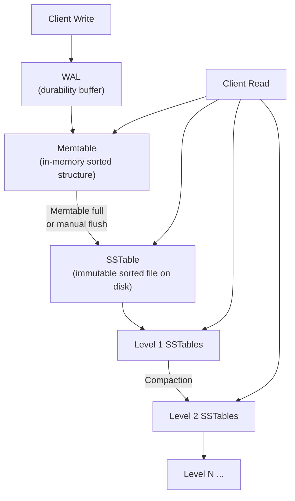
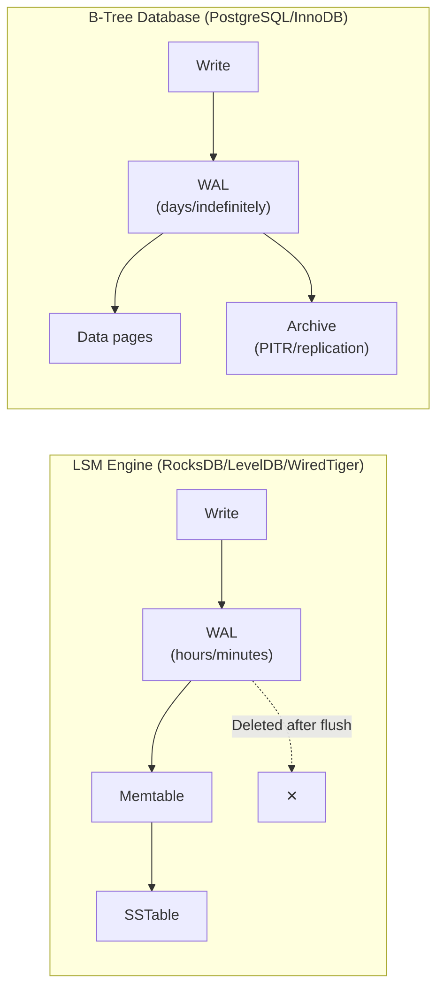
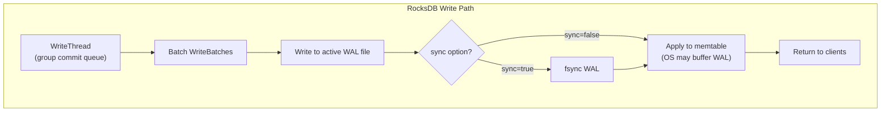
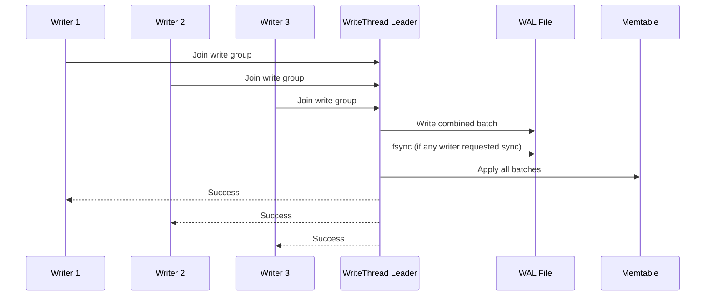
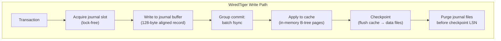
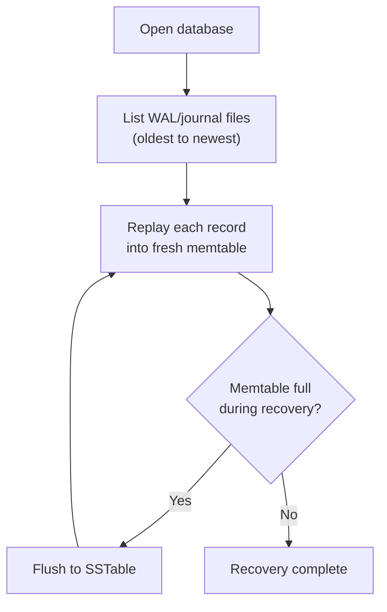
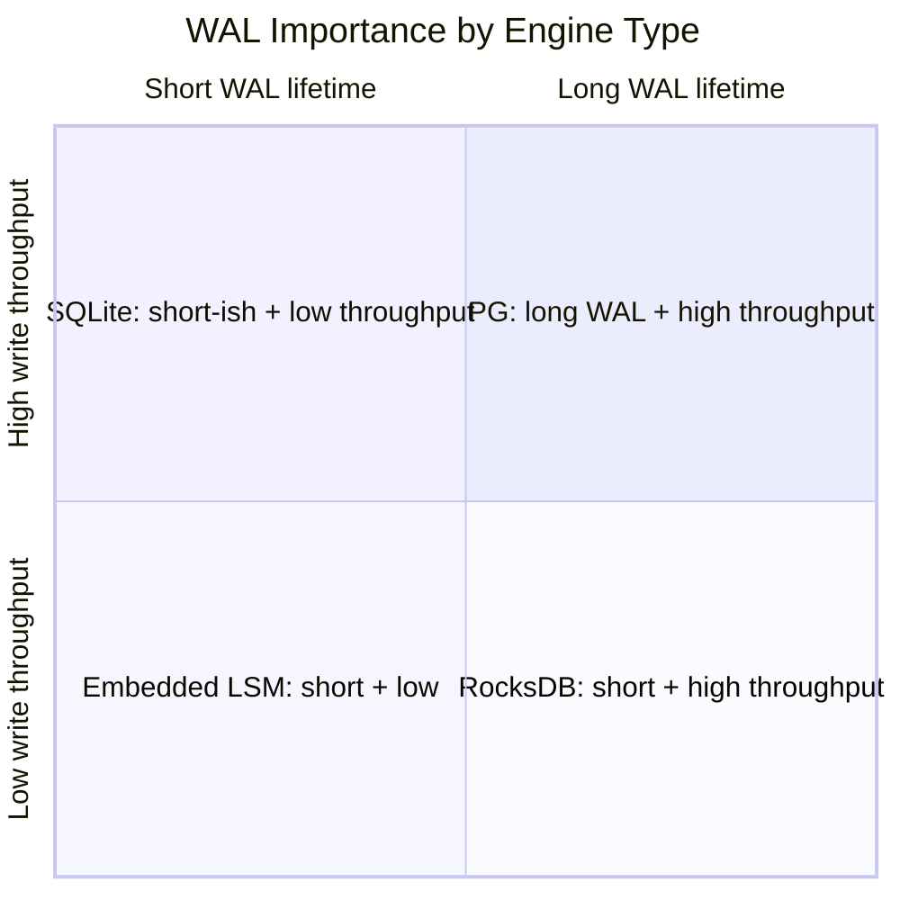

import { Aside } from '@astrojs/starlight/components';

In B-tree databases like PostgreSQL and InnoDB, the WAL is a **long-lived, archival log** — it grows until checkpointed and may be retained indefinitely for replication and PITR. In **LSM-tree engines** (RocksDB, LevelDB, WiredTiger), the WAL plays a fundamentally different role: a **short-lived durability buffer** deleted after the memtable flushes to an SSTable. Understanding this distinction is essential for tuning write performance and reasoning about crash recovery in log-structured storage.

## LSM Architecture: Where WAL Fits



The write path:

```
Write → WAL (fsync for durability) → Memtable (skip list / B-tree)
                                         ↓ (flush)
                                    SSTable (sorted, immutable)
                                         ↓ (compaction)
                                    Merged SSTables at next level
```

| Stage | Durability | Mutability | On Disk? |
|-------|-----------|------------|----------|
| **WAL** | Durable (fsync'd) | Append-only | Yes (temporary) |
| **Memtable** | Not durable alone | Mutable (sorted inserts) | No (RAM) |
| **SSTable** | Durable | Immutable | Yes (permanent) |
| **Compaction** | Durable | Creates new SSTables | Yes |

<Aside type="tip" title="Memory Hook: WAL Is the Shipping Label">
In LSM engines, the WAL is a **shipping label** on a package (WriteBatch) heading to the warehouse (memtable). Once the package is shelved (flushed to SSTable), the label is discarded. In B-tree databases, the label is kept in a permanent filing cabinet (archive).
</Aside>

## WAL Lifetime: Temporary vs Long-Lived



| Property | LSM WAL | B-Tree WAL |
|----------|---------|------------|
| **Lifetime** | Until memtable flush | Until checkpoint + optionally archived forever |
| **Purpose** | Protect in-memory memtable | Protect on-disk data pages |
| **Deleted when** | Memtable becomes SSTable | Checkpoint recycles (or archive retains) |
| **Recovery replays into** | Memtable (rebuild sorted structure) | Data pages (apply to existing files) |
| **Typical size** | MB range | GB–TB range |
| **Replication source** | Usually separate (Raft, custom) | WAL itself |

<Aside type="note" title="Why LSM WAL Is Ephemeral">
Once data is flushed to an SSTable, it is independently durable on disk. The WAL only protects the **unflushed portion** in the memtable. After flush, replaying the WAL would duplicate data already in the SSTable — so it is deleted.
</Aside>

## LevelDB WAL Format

LevelDB (and RocksDB, which inherited its format) uses **32KB blocks** with a lightweight record header:

```
WAL File:
┌─────────────────────────────────────────────────────────┐
│ Block 0 (32KB)  │ Block 1 (32KB)  │ Block 2 (32KB) │ ...│
└─────────────────────────────────────────────────────────┘

Each block contains one or more records:
┌──────────────────────────────────────────────────────┐
│ [CRC:4B][Len:2B][Type:1B][Data:var] │ next record ...│
│ ... padding (zeros to 32KB boundary)                  │
└──────────────────────────────────────────────────────┘
```

### Record Types

```c
/* db/log_format.h */
enum RecordType {
    kFullType   = 1,  /* Complete record in this block */
    kFirstType  = 2,  /* First fragment of multi-block record */
    kMiddleType = 3,  /* Middle fragment */
    kLastType   = 4,  /* Final fragment */
};
/* Record header: checksum(4) + length(2) + type(1) = 7 bytes */
```

| Type | Meaning |
|------|---------|
| **FULL** | Entire record fits in remaining block space |
| **FIRST** | Start of a record spanning multiple blocks |
| **MIDDLE** | Continuation fragment |
| **LAST** | Final fragment of a multi-block record |

If fewer than 7 bytes remain in a block, the rest is zero-padded and the record continues in the next block.

### WriteBatch: The Logical Unit

LevelDB groups key-value operations into a **WriteBatch** — the payload inside each WAL record:

```c
/* WriteBatch format (simplified) */
/* Sequence (8B) | Count (4B) | [Type (1B) | Key (var) | Value (var)] ... */

/* Record types within WriteBatch: */
enum ValueType {
    kTypeDeletion = 0x0,
    kTypeValue    = 0x1,
};
```

On recovery, LevelDB reads the WAL sequentially, parses each WriteBatch, and re-applies operations to a fresh memtable.

```cpp
// LevelDB write path (simplified)
Status DBImpl::Write(const WriteOptions& options, WriteBatch* updates) {
    Writer w(&options, updates, &done);
    // Queue writer, leader batches multiple WriteBatches
    // Leader writes to WAL, optionally syncs, then applies to memtable
    return w.status;
}
```

## RocksDB WAL

RocksDB extends LevelDB's WAL with production features while keeping the same 32KB block format:



### Sync Options

```cpp
// RocksDB WriteOptions
WriteOptions write_options;

write_options.sync = false;  // Default: write WAL but don't fsync
                             // Durability if OS crashes: maybe
                             // Durability if process crashes: yes (OS buffer)

write_options.sync = true;   // fsync WAL before returning
                             // Full durability guarantee

write_options.disableWAL = false;  // Set true to skip WAL entirely
                                   // (only safe if disableWAL + manual flush)
```

| Option | WAL Written | fsync | Durability |
|--------|------------|-------|------------|
| `sync=false` (default) | Yes | No | Survives process crash; may lose on OS crash |
| `sync=true` | Yes | Yes | Full durability |
| `disableWAL=true` | No | No | Only memtable — lost on any crash |
| `manual_wal_flush` | Yes | On demand | Explicit flush via `FlushWAL()` |

```cpp
// Manual WAL flush (sync=false but want periodic durability)
db->FlushWAL(false);  // flush OS buffer, no fsync
db->FlushWAL(true);   // flush + fsync
```

### WAL Recycling

RocksDB can **recycle WAL files** instead of creating new ones:

```ini
# rocksdb options
recycle_log_file_num = 4   # Keep 4 old WAL files for reuse
```

When the active WAL exceeds `max_total_wal_size` or the memtable flushes, the WAL file is archived. With recycling, old WAL files are truncated and reused — reducing file creation overhead and filesystem metadata churn.

### Group Commit via WriteThread

RocksDB's **WriteThread** implements group commit:



```cpp
// WriteThread states (simplified)
// GROUP_LEADER: writes WAL + applies to memtable for entire group
// GROUP_FOLLOWER: waits for leader to complete
// The leader batches all pending WriteBatches into one WAL write
```

### Pipelined Write

RocksDB also supports **pipelined writes** — while the leader fsyncs WAL, followers can prepare their batches:

```ini
# Enable pipelined write (reduces latency for sync writes)
enable_pipelined_write = true
```

This overlaps WAL fsync latency with batch preparation for the next group.

<Aside type="caution" title="sync=false Is Not Free Durability">
With `sync=false`, WAL data is in the OS page cache. A **process crash** is safe (OS flushes eventually), but an **OS crash / power loss** may lose the last few seconds of writes. For financial or critical data, use `sync=true` or periodic `FlushWAL(true)`.
</Aside>

## WiredTiger Journal

WiredTiger (used in MongoDB) takes a different approach to WAL — called the **journal** or **write-ahead log** — with innovations from a [VLDB 2012 paper](https://dl.acm.org/doi/10.1145/2157654.2157655) on lock-free group commit:



### Lock-Free Slot-Based Group Commit

WiredTiger pre-allocates **journal slots** — each writer claims a slot without acquiring a mutex:

```
Journal Slot Array (in shared memory):
┌────────┬────────┬────────┬────────┬─────┐
│ Slot 0 │ Slot 1 │ Slot 2 │ Slot 3 │ ... │
│ [used] │ [free] │ [used] │ [free] │     │
└────────┴────────┴────────┴────────┴─────┘

Writer: CAS slot[i] from FREE → USED (lock-free)
Writer: fill slot with record data
Writer: signal group commit thread
Group commit thread: fsync all filled slots in one batch
```

This avoids the mutex contention that limits group commit throughput in traditional designs.

### Journal File Format

```
Journal Directory (WiredTiger.wt / journal/):
├── WiredTigerLog.0000000001    ← Pre-allocated log file
├── WiredTigerLog.0000000002
└── ...

Each log file contains 128-byte aligned records:
┌──────────────────────────────────────────────────────┐
│ Record Header (48B)  │ Operation Data (variable)     │
│ + padding to 128B alignment                          │
├──────────────────────────────────────────────────────┤
│ Next record (128B aligned)                           │
└──────────────────────────────────────────────────────┘
```

| Property | Value |
|----------|-------|
| **Record alignment** | 128 bytes |
| **File pre-allocation** | Log files pre-allocated to avoid allocation during writes |
| **Default flush interval** | 100ms (configurable) |
| **Deletion trigger** | After checkpoint — same as LSM pattern |

```python
# WiredTiger configuration (Python API)
import wiredtiger

conn = wiredtiger.wiredtiger_open(
    "data/",
    "create,"
    "log=(enabled=true,archive=true),"       # Enable journal
    "checkpoint=(wait=60),"                   # Checkpoint every 60s
    "transaction_sync=(enabled=true,method=fsync)"  # Durability mode
)
```

### WiredTiger vs RocksDB WAL

| Feature | WiredTiger Journal | RocksDB WAL |
|---------|-------------------|-------------|
| **Group commit** | Lock-free slot-based | WriteThread mutex-based |
| **Record alignment** | 128 bytes | 7-byte header + variable (32KB blocks) |
| **File management** | Pre-allocated log files | Created on demand, recyclable |
| **Default sync** | 100ms flush interval | sync=false (OS buffer) |
| **Recovery target** | Cache (in-memory pages) | Memtable (sorted structure) |
| **Deletion** | After checkpoint | After memtable flush |

<Aside type="tip" title="Memory Hook: WiredTiger Slots Are Parking Spaces">
WiredTiger's journal **slots** are **parking spaces** in a lot. Writers park (CAS a slot), load their goods (record data), and a truck (group commit) picks up all parked cars in one trip (fsync). No valet mutex needed.
</Aside>

## Recovery in LSM Engines

All three engines follow the same recovery pattern:



```cpp
// RocksDB recovery (conceptual)
1. Open MANIFEST (metadata: SSTable inventory, sequence numbers)
2. Find WAL files newer than last flushed sequence
3. Replay WAL records into memtable(s)
4. If memtable exceeds size during replay → flush to SSTable
5. Delete replayed WAL files
6. Resume normal operation
```

Key difference from B-tree recovery: LSM recovery **rebuilds the memtable** (an in-memory sorted structure), not on-disk data pages. The memtable is then flushed to create new SSTables.

## Cross-Engine Comparison

| Feature | LevelDB | RocksDB | WiredTiger |
|---------|---------|---------|------------|
| **Block/record size** | 32KB blocks, 7B header | Same as LevelDB | 128B aligned records |
| **Logical unit** | WriteBatch | WriteBatch | WT operation record |
| **Group commit** | Writer queue + leader | WriteThread + pipelined | Lock-free slots |
| **Sync default** | `sync=false` | `sync=false` | 100ms interval |
| **WAL recycling** | No | Yes (`recycle_log_file_num`) | Pre-allocated files |
| **Fragmentation** | FULL/FIRST/MIDDLE/LAST | Same | N/A (128B aligned) |
| **Recovery target** | Memtable | Memtable (+ column family memtables) | Cache pages |
| **WAL deletion** | After memtable flush | After memtable flush | After checkpoint |
| **Checksum** | CRC-32C per record | CRC-32C per record | Checksum per record |

## Configuration Examples

### RocksDB Production Tuning

```cpp
#include "rocksdb/options.h"

rocksdb::Options options;
options.create_if_missing = true;

// WAL settings
options.max_total_wal_size = 64 * 1024 * 1024;  // 64MB max WAL
options.wal_ttl_seconds = 600;                    // Delete WAL older than 10min
options.wal_size_limit_mb = 0;                    // No size-based WAL deletion
options.recycle_log_file_num = 4;                 // Recycle 4 WAL files

// Memtable (triggers WAL deletion on flush)
options.write_buffer_size = 64 * 1024 * 1024;     // 64MB memtable
options.max_write_buffer_number = 3;               // 3 memtables (1 active + 2 flushing)
options.min_write_buffer_number_to_merge = 1;

// Group commit
options.enable_pipelined_write = true;
options.allow_concurrent_memtable_write = true;

// Durability
rocksdb::WriteOptions write_opts;
write_opts.sync = true;  // Full durability for critical writes
```

### LevelDB Basic Usage

```cpp
#include "leveldb/db.h"

leveldb::DB* db;
leveldb::Options options;
options.create_if_missing = true;

leveldb::Status status = leveldb::DB::Open(options, "/tmp/leveldb", &db);

leveldb::WriteOptions write_opts;
write_opts.sync = true;

leveldb::WriteBatch batch;
batch.Put("key1", "value1");
batch.Put("key2", "value2");
batch.Delete("key3");

db->Write(write_opts, &batch);
```

## When WAL Matters in LSM vs B-Tree



| Scenario | LSM Engine | B-Tree Engine |
|----------|-----------|---------------|
| **Power loss during write** | Replay WAL → memtable → flush | Replay WAL → data pages |
| **Tuning write throughput** | Memtable size, sync=false, group commit | wal_buffers, checkpoint interval |
| **Backup** | Snapshot + SSTable files | Base backup + WAL archive |
| **Replication** | Raft/consensus log (separate) | WAL streaming |
| **Disk space concern** | WAL auto-deleted (small) | WAL grows until checkpoint/archive |

<Aside type="tip" title="Self-Check">
Before deploying an LSM engine in production, ask:
1. Is `sync=true` required for your durability SLA, or is `sync=false` + periodic flush acceptable?
2. Is memtable size tuned so WAL files don't grow too large between flushes?
3. Do you understand that WAL deletion means you cannot do PITR from WAL alone (need SSTable snapshots)?
4. For RocksDB: is `recycle_log_file_num` set to reduce file creation overhead?
5. For WiredTiger: is the checkpoint interval aligned with your recovery time objective?
</Aside>

## Key Takeaways

1. **LSM WAL is ephemeral** — deleted after memtable flush, unlike B-tree WAL which is archived for PITR
2. **Write path**: Write → WAL → Memtable → SSTable → Compaction
3. **LevelDB/RocksDB** share a 32KB block format with FULL/FIRST/MIDDLE/LAST fragmentation
4. **WriteBatch** is the atomic logical unit containing put/delete operations
5. **RocksDB group commit** via WriteThread batches multiple writes into one WAL fsync
6. **WiredTiger** uses lock-free slot-based group commit with 128-byte aligned records
7. **Recovery** replays WAL into a fresh memtable (not data pages)
8. **sync=false** (default) survives process crash but not OS crash — tune for your durability needs
9. **WAL recycling** (RocksDB) and pre-allocation (WiredTiger) reduce filesystem overhead

<div class="self-check">
<details>
<summary>Quick Quiz: WAL in LSM Engines</summary>

1. **Why is the WAL deleted after memtable flush in LSM engines?**
   → Once data is flushed to an SSTable, it is independently durable on disk. The WAL only protects the unflushed in-memory memtable — keeping it would duplicate data already in SSTables.

2. **What are LevelDB's FULL/FIRST/MIDDLE/LAST record types?**
   → FULL = complete record in one block. FIRST/MIDDLE/LAST = fragmentation types for records spanning multiple 32KB blocks.

3. **What is the difference between RocksDB sync=false and sync=true?**
   → sync=false writes WAL to OS buffer without fsync (survives process crash). sync=true fsyncs WAL before returning (survives OS crash/power loss).

4. **How does WiredTiger's lock-free group commit work?**
   → Writers CAS-claim pre-allocated journal slots without a mutex, fill them with record data, and a group commit thread fsyncs all filled slots in one batch.

5. **What does RocksDB WAL recycling do?**
   → Instead of creating new WAL files, truncates and reuses old ones (`recycle_log_file_num`), reducing file creation overhead.

6. **How does LSM recovery differ from B-tree recovery?**
   → LSM replays WAL into a fresh in-memory memtable (then optionally flushes to SSTable). B-tree replays WAL directly onto on-disk data pages.

7. **Why can't you do PITR from LSM WAL alone?**
   → WAL files are deleted after memtable flush. Point-in-time recovery requires SSTable snapshots plus any remaining WAL — not a continuous archive like PostgreSQL.

</details>
</div>
