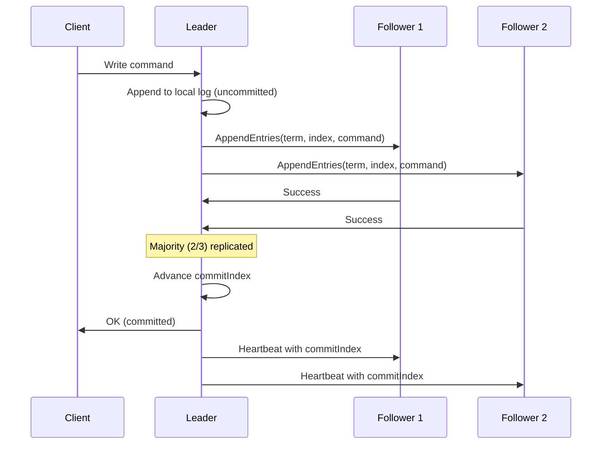
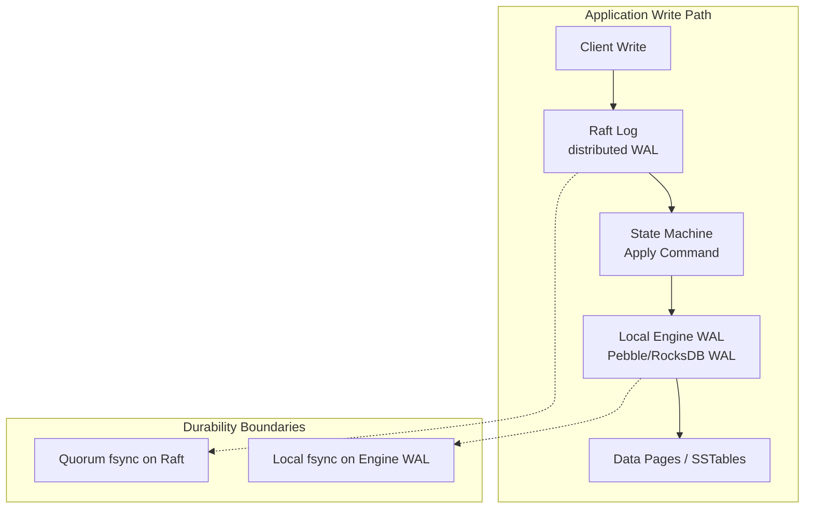

import { Aside } from '@astrojs/starlight/components';
import ReplicationFlowDemo from '../../../components/ReplicationFlowDemo';

When you scale a database beyond a single machine, durability no longer means "fsync my local disk." It means **replicating an ordered log to a quorum of nodes** so that no single failure can destroy committed work. Raft — the most widely taught consensus protocol — implements exactly this: a **distributed Write-Ahead Log** where the leader appends commands and followers replicate them before any client sees success.

## Raft Log: An Ordered Append-Only Command Sequence

At its core, the Raft log is an **append-only, totally ordered sequence of commands**. Each entry is immutable once committed. State machines on every replica apply the same entries in the same order, guaranteeing identical results.

```
Raft Log on each replica (conceptual):

Index:  1        2        3        4        5
        ┌────────┬────────┬────────┬────────┬────────┐
Term 1  │ SET x=1│ SET y=2│        │        │        │
        ├────────┼────────┼────────┼────────┼────────┤
Term 2  │        │        │ DEL x  │ SET z=3│ COMMIT │
        └────────┴────────┴────────┴────────┴────────┘
                              ▲
                         commitIndex = 4
                         (majority has entry 4)
```

Each log entry contains three fields:

| Field | Meaning |
|-------|---------|
| **Term** | Leader election epoch; monotonically increases on each election |
| **Index** | Position in the log (1-based in Raft papers, 0-based in some implementations) |
| **Command** | Opaque byte blob — the state machine applies it after commit |

<Aside type="tip" title="Memory Hook: Raft Log = Shared Film Reel">
Think of the Raft log as a **film reel in a cinema chain**. Every theater (replica) must show the same frames in the same order. The **leader** is the projectionist who adds new frames; **followers** copy the reel before the audience (clients) is told the scene is permanent.
</Aside>

## Leader-Based Replication

Raft uses **strong leader replication**: all client writes go to the current leader, which appends to its local log and replicates to followers via `AppendEntries` RPCs.



Key properties:

- **Only the leader accepts new entries** — followers are read-only for writes (though they may serve stale reads depending on implementation).
- **Followers never overwrite committed entries** — conflicting uncommitted entries from a deposed leader are truncated.
- **Leader completeness**: if an entry is committed in a given term, it appears in the logs of all future leaders.

## Commitment via Majority Quorum

An entry is **committed** when the leader knows a majority of replicas have stored it at the same index in the same term. The leader then advances `commitIndex` and applies the entry to its state machine. Future heartbeats propagate `commitIndex` to followers.

```
Cluster of 5 nodes — need 3 for quorum:

Leader log:     [1][2][3][4][5]
Follower A:     [1][2][3][4][5]  ✓
Follower B:     [1][2][3][4][ ]  ✓  (has 1-4)
Follower C:     [1][2][3][ ]     ✗  (partitioned)

Entry 4 committed? YES — leader + A + B = 3/5 majority
Entry 5 committed? NO  — only leader + A = 2/5
```

<Aside type="note" title="Commit ≠ Client Response">
In production systems (CockroachDB, etcd, TiKV), the client typically waits until the leader has **fsync'd locally AND received quorum acks** before returning success. The exact durability boundary depends on `sync` settings on each replica's local WAL.
</Aside>

## Log Matching Property

Raft maintains consistency through the **Log Matching Property**:

1. If two logs contain an entry with the same index and term, they are identical in all preceding entries.
2. If two logs contain an entry with the same index and term, their entries at that index are identical.

This is enforced by `AppendEntries` consistency checks: each RPC carries `prevLogIndex` and `prevLogTerm`. If the follower's log doesn't match at that point, it rejects and the leader decrements `nextIndex` (backtracking) until a match is found.

```
Leader wants to append entry 6:

AppendEntries(prevIndex=5, prevTerm=2, entry=[SET a=10])
                    │
Follower log ends at index 4 with term 1 → REJECT
                    │
Leader retries: prevIndex=4, prevTerm=1 → MATCH → append succeeds
```

## Safety Guarantees

Raft provides these guarantees relevant to WAL semantics:

| Guarantee | Implication for WAL |
|-----------|---------------------|
| **Election Safety** | At most one leader per term |
| **Leader Completeness** | Committed entries survive leader changes |
| **Log Matching** | Replicas converge to identical prefix |
| **State Machine Safety** | Same commands applied in same order → same state |

Combined, these mean: **once a write is committed to the Raft log, it survives any single-node failure and any sequence of leader elections** (assuming a majority remains available).

## Two WAL Layers: Raft Log + Local Storage Engine WAL

Distributed databases don't replace local WAL with Raft — they **stack two WAL layers**:



### CockroachDB

- **Raft per range** (512MB default): each range is an independent Raft group replicating key-value operations.
- **Pebble WAL** underneath: once Raft applies a batch, Pebble writes its own WAL before memtable flush.
- **Non-blocking Raft sync**: CockroachDB can pipeline Raft replication without blocking the client on every local fsync — quorum on the Raft log is the primary durability boundary.

### TiKV / TiDB

- **Multi-Raft**: thousands of Raft groups, one per Region (~96MB).
- **Separate `raftdb` and `kvdb`**: Raft logs live in `raftdb`; applied data goes to `kvdb` (RocksDB).
- **Raft Engine**: a specialized append-only log store optimized for Raft workloads, replacing RocksDB for the Raft log in newer versions — lower write amplification than generic LSM WAL.

<Aside type="caution" title="Two fsyncs, Two Failure Modes">
A committed Raft entry can still be lost if the local engine WAL fails before fsync — the node would re-apply from Raft on restart. Conversely, a local WAL fsync without Raft quorum means the write isn't globally durable. Production tuning balances both layers.
</Aside>

## Interactive Demo: Replication Flow

The demo below illustrates how WAL records flow from a primary through streaming replication to standbys and CDC consumers — the same pipeline Raft-based systems use at the transport layer.

<ReplicationFlowDemo client:visible />

## Raft vs Local WAL: Comparison

| Aspect | Local WAL (PostgreSQL) | Raft Log (Distributed) |
|--------|------------------------|------------------------|
| **Scope** | Single node | Cluster-wide |
| **Ordering** | LSN monotonic | Index + term |
| **Durability** | Local fsync | Quorum replication |
| **Recovery** | Redo from local WAL | Replay from Raft log |
| **Throughput limit** | Disk IOPS | Network + slowest replica |
| **Failure model** | Single crash | f < n/2 node failures |

## Key Takeaways

1. **Raft log = distributed WAL**: append-only, ordered, leader-replicated command sequence
2. **Commitment requires quorum** — a majority must persist the entry before it is applied
3. **Log Matching Property** ensures replicas converge without overwriting committed history
4. **Production systems stack two WAL layers**: Raft for replication, local engine WAL for storage durability
5. **CockroachDB and TiKV** exemplify Multi-Raft + local LSM WAL architectures

<div class="self-check">
<details>
<summary>Quick Quiz: Raft Consensus Log</summary>

1. **What three fields does a Raft log entry contain?**
   → Term (election epoch), index (position), and command (opaque state machine input).

2. **When is a Raft log entry committed?**
   → When the leader knows a majority of replicas have stored it at the same index in the same term.

3. **What happens if a follower's log conflicts with the leader's?**
   → The follower rejects AppendEntries; the leader backtracks nextIndex until a matching prefix is found, then overwrites conflicting uncommitted entries.

4. **Why do CockroachDB and TiKV have two WAL layers?**
   → Raft log provides distributed durability and ordering; the local engine WAL (Pebble/RocksDB) provides crash recovery for the storage engine's data pages and SSTables.

5. **What is the Log Matching Property?**
   → If two logs share an entry at the same index and term, they are identical in all preceding entries — enabling safe log convergence.

6. **How does Raft's commit differ from a local WAL fsync?**
   → Local fsync durables one node; Raft commit durables across a quorum — surviving node failures without data loss.

</details>
</div>
