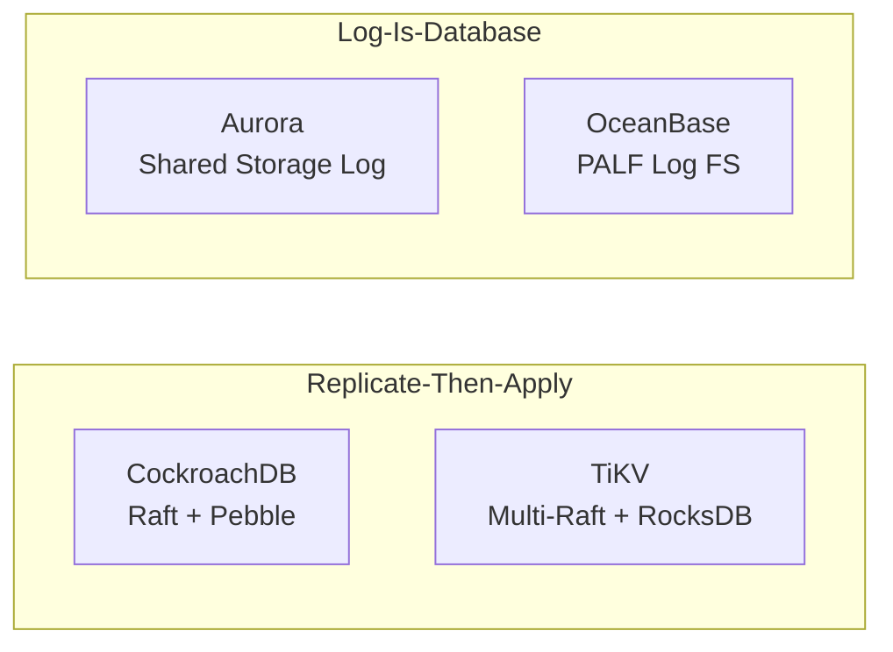
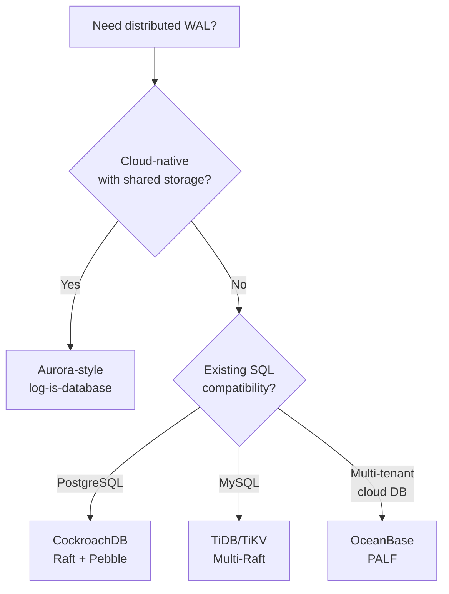

import { Aside } from '@astrojs/starlight/components';

Every distributed database solves the same problem: **how do you make writes durable and consistent across many machines?** The answers diverge dramatically — from Raft-per-shard replication to Aurora's radical "log is the database" design. This page compares four production architectures and how each uses WAL (or WAL-like) mechanisms.

## Architecture Overview



## CockroachDB: Raft per Range + Pebble WAL

CockroachDB shards data into **ranges** (default ~512MB), each an independent **Raft consensus group**. Writes flow through two WAL layers.

```
Write path:
Client → SQL → KV batch → Raft (range) → Apply → Pebble WAL → Memtable → SSTable
                              │
                         Quorum fsync
                         (distributed WAL)
```

**Key WAL characteristics:**

- **Raft log per range**: Each range replicates commands independently. A cluster may run thousands of concurrent Raft groups (Multi-Raft).
- **Pebble WAL**: Cockroach's fork of LevelDB/RocksDB writes a local WAL before memtable flush — standard LSM durability.
- **Non-blocking Raft sync**: The client can receive acknowledgment once quorum persists the Raft entry, without waiting for every replica's local Pebble fsync. Each replica applies asynchronously but durably via its own WAL.
- **Sideloaded SSTables**: Large entries (bulk imports, AddSSTable) bypass the Raft log payload — the command references an SSTable file already on disk, avoiding multi-megabyte log records.

```sql
-- CockroachDB exposes Raft status per range
SELECT range_id, replicas, voting_replicas
FROM crdb_internal.ranges_no_leases
WHERE start_key = '\x01';
```

<Aside type="tip" title="Memory Hook: CockroachDB = Many Small Raft Logs">
Imagine a library where every shelf (range) keeps its own ledger. A write to one shelf only needs that shelf's librarians (Raft group) to agree — not the entire building.
</Aside>

## TiDB / TiKV: Multi-Raft with Separate raftdb and kvdb

TiKV is the distributed KV layer behind TiDB. It uses **Multi-Raft** — one Raft group per **Region** (~96MB by default).

```
TiKV node:
┌─────────────────────────────────────────────┐
│  Raftstore (Multi-Raft scheduler)           │
│  ┌─────────┐ ┌─────────┐ ┌─────────┐       │
│  │Region 1 │ │Region 2 │ │Region N │       │
│  │ Raft    │ │ Raft    │ │ Raft    │       │
│  └────┬────┘ └────┬────┘ └────┬────┘       │
│       │           │           │             │
│  ┌────▼───────────▼───────────▼────┐       │
│  │ raftdb (Raft log storage)       │       │
│  │ → Raft Engine (optimized WAL)     │       │
│  └──────────────────────────────────┘       │
│  ┌──────────────────────────────────┐       │
│  │ kvdb (applied data, RocksDB)     │       │
│  │ → RocksDB WAL + SSTables         │       │
│  └──────────────────────────────────┘       │
└─────────────────────────────────────────────┘
```

**Key WAL characteristics:**

- **Separate `raftdb` and `kvdb`**: Raft logs and application data live in different RocksDB instances — isolating write amplification and compaction pressure.
- **Raft Engine**: A purpose-built append-only log store (replacing RocksDB for raftdb in TiKV 6.x+) with sequential I/O patterns, lower sync latency, and better recovery than generic LSM WAL.
- **Apply then persist**: After Raft commit, the state machine applies to `kvdb`, which writes its own WAL record before memtable insert.

## Amazon Aurora: "The Log Is the Database"

Aurora's architecture is the most radical departure from traditional WAL. **Compute nodes write only redo log records to shared storage** — no local data page writes ever occur.

```
Traditional DB:          Aurora:
┌──────────┐             ┌──────────┐
│ Compute  │             │ Compute  │──┐
│ + Data   │             │ (no data │  │ redo records only
│   Pages  │             │  pages)  │  │
└────┬─────┘             └──────────┘  │
     │ local WAL                        ▼
     ▼                          ┌──────────────┐
  Local Disk                    │ Shared Storage│
                                │ (6 copies,    │
                                │  4/6 quorum)  │
                                └──────┬───────┘
                                       │
                                Page materialization
                                on storage nodes
```

**Key WAL characteristics:**

- **Log is the database**: The shared storage layer *is* the durability mechanism. Compute nodes are stateless regarding data pages.
- **4/6 write quorum**: Each log record is written to 6 storage nodes; 4 acknowledgments suffice. Survives AZ failure + 1 node failure.
- **No local data page writes**: Compute never writes 8KB pages to local disk — only compact redo log records (~2KB average) to shared storage.
- **Page materialization on storage nodes**: Storage nodes assemble 10GB segments from the log stream and materialize pages on read (or background). Checkpoints happen at the storage layer, not compute.
- **Recovery in seconds**: No replay through a local WAL — new compute attaches to the shared log tail instantly.

<Aside type="note" title="Aurora's WAL Is the Product">
In Aurora, what PostgreSQL calls WAL *is* the primary storage substrate. The "data files" are a cache/materialization of the log — inverting the traditional relationship where WAL supports data files.
</Aside>

## OceanBase PALF: Paxos-Backed Append-Only Log Filesystem

OceanBase uses **PALF (Paxos-based Append-only Log FileSystem)** — a distributed log layer built on Multi-Paxos, designed as a general-purpose append-only filesystem for database logs.

```
PALF architecture:
┌─────────────────────────────────────────┐
│  OceanBase Server (OBS)                 │
│  ┌─────────┐  ┌─────────┐              │
│  │ Tablet 1│  │ Tablet 2│  ...         │
│  └────┬────┘  └────┬────┘              │
│       │            │                    │
│  ┌────▼────────────▼────┐              │
│  │ PALF Log Stream       │              │
│  │ (Paxos replication)   │              │
│  └──────────┬───────────┘              │
│             │                           │
│  ┌──────────▼───────────┐              │
│  │ Local Log Storage     │              │
│  │ (append-only files)   │              │
│  └──────────────────────┘              │
└─────────────────────────────────────────┘
```

**Key WAL characteristics:**

- **Paxos-backed**: Uses Multi-Paxos (not Raft) for log replication — functionally equivalent quorum semantics.
- **Append-only log filesystem**: PALF presents a file-like interface optimized for sequential append — the universal WAL access pattern.
- **Integrated with LSM storage**: Applied log entries feed OceanBase's LSM-tree storage engine (similar layering to TiKV).
- **Tenant isolation**: Multiple tenants share physical nodes but have isolated log streams.

## Architecture Comparison

| Feature | CockroachDB | TiKV/TiDB | Aurora | OceanBase PALF |
|---------|-------------|-----------|--------|----------------|
| **Consensus** | Raft (per range) | Raft (per region) | Quorum writes (4/6) | Multi-Paxos |
| **Log granularity** | KV commands | KV commands | PostgreSQL redo records | Log stream entries |
| **Local engine WAL** | Pebble WAL | RocksDB WAL + Raft Engine | None (no local pages) | Local append-only files |
| **Large entry handling** | Sideloaded SSTables | Split/compact | N/A (redo only) | Log stream chunking |
| **Compute state** | Stateful (ranges) | Stateful (regions) | Stateless (log only) | Stateful (tablets) |
| **Recovery model** | Raft replay + Pebble redo | Raft replay + RocksDB redo | Attach to shared log | Paxos replay + local redo |
| **Storage separation** | Co-located | Co-located | Shared remote storage | Co-located + PALF |
| **Typical sync path** | Quorum Raft ack | Quorum Raft ack | 4/6 storage ack | Paxos quorum ack |

## Choosing an Architecture



<Aside type="caution" title="No Free Lunch">
Aurora's shared storage eliminates local WAL complexity but creates dependency on proprietary storage infrastructure. Raft-based systems (CockroachDB, TiKV) run on commodity hardware anywhere but pay replication latency on every write.
</Aside>

## Key Takeaways

1. **CockroachDB** stacks Raft-per-range (distributed WAL) on Pebble WAL (local WAL), with sideloaded SSTables for bulk operations
2. **TiKV** separates raftdb from kvdb and uses Raft Engine for optimized log storage
3. **Aurora** inverts the model — the shared redo log *is* the database; compute writes no local data pages
4. **OceanBase PALF** provides a Paxos-backed append-only log filesystem as the foundation layer
5. All four achieve durability through **quorum persistence of an ordered log** — the universal distributed WAL pattern

<div class="self-check">
<details>
<summary>Quick Quiz: Distributed Databases</summary>

1. **Why does CockroachDB sideload SSTables instead of putting them in the Raft log?**
   → Large SSTable files would bloat Raft log entries and slow replication; sideloading references pre-built files on disk.

2. **What is Aurora's "log is the database" design?**
   → Compute nodes write only redo records to shared storage (4/6 quorum); data pages are materialized on storage nodes, never written locally by compute.

3. **Why does TiKV separate raftdb from kvdb?**
   → Isolates Raft log I/O (append-heavy, sequential) from application data I/O (random, compaction-heavy), reducing write amplification interference.

4. **What consensus protocol does OceanBase PALF use?**
   → Multi-Paxos — functionally equivalent to Raft for quorum-based log replication.

5. **What is non-blocking Raft sync in CockroachDB?**
   → The client receives acknowledgment after quorum Raft persistence without waiting for every replica's local Pebble WAL fsync.

6. **How many storage copies does Aurora require for a write quorum?**
   → 4 out of 6 storage node copies must acknowledge each log record.

</details>
</div>
