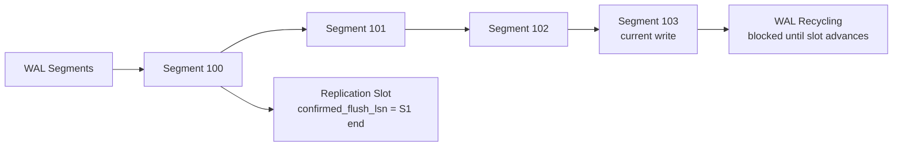
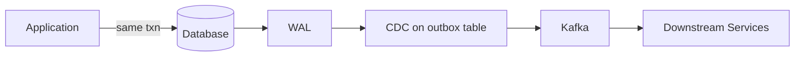

import { Aside } from '@astrojs/starlight/components';

Change Data Capture (CDC) turns your database's WAL from a crash-recovery mechanism into a **real-time event stream**. Instead of polling tables or dual-writing to a message queue, CDC reads the authoritative log of what actually happened — giving you exactly-once-ish delivery of every committed change.

## Why CDC Reads the WAL

Application-level event publishing has a fundamental problem: **the database commit and the event publish are not atomic**. CDC solves this by reading changes *after* they are durably committed in the WAL — no dual-write, no lost events.

```
Without CDC (dual-write problem):
  BEGIN → UPDATE accounts → publish to Kafka → COMMIT
                                    ↑
                              Crash here = event
                              published but DB rolled back

With CDC (WAL-based):
  BEGIN → UPDATE accounts → COMMIT → WAL record durable
                                          ↓
                                    Logical decoding
                                          ↓
                                    Kafka/event bus
```

<Aside type="tip" title="Memory Hook: CDC = WAL's Public API">
The WAL is the database's private diary. CDC is the **reading service** that translates diary entries (physical log records) into human-readable events (row-level changes) for downstream consumers.
</Aside>

## PostgreSQL Logical Decoding

PostgreSQL supports CDC through **logical decoding** — interpreting WAL records as logical (row-level) changes rather than physical page modifications.

### Prerequisites

```sql
-- Requires logical WAL level
ALTER SYSTEM SET wal_level = 'logical';
-- Restart required

-- Verify
SHOW wal_level;  -- 'logical'
```

`wal_level` options:

| Level | WAL Content | CDC Support |
|-------|-------------|-------------|
| `minimal` | Abort/COMMIT only | None |
| `replica` | Physical changes | Streaming replication only |
| `logical` | Row-level change info | Logical decoding + CDC |

### Output Plugins

Logical decoding is pluggable via **output plugins** that transform WAL records into a consumer-specific format:

| Plugin | Output Format | Use Case |
|--------|---------------|----------|
| `pgoutput` | PostgreSQL native logical replication protocol | Built-in logical replication |
| `wal2json` | JSON change events | Lightweight CDC prototyping |
| `decoderbufs` | Protocol Buffers | Debezium PostgreSQL connector |

```sql
-- Create a logical replication slot
SELECT pg_create_logical_replication_slot('my_slot', 'pgoutput');

-- Peek at decoded changes without consuming
SELECT data FROM pg_logical_slot_peek_changes('my_slot', NULL, NULL, 'proto_version', '1');

-- Consume (advance slot)
SELECT data FROM pg_logical_slot_get_changes('my_slot', NULL, NULL, 'proto_version', '1');
```

### Replication Slots

A **replication slot** tracks the consumer's progress in the WAL stream. PostgreSQL retains WAL segments until all slots have consumed past them.



<Aside type="danger" title="Stale Slots = WAL Bloat = Disk Full">
An inactive replication slot prevents WAL recycling. PostgreSQL will **fill the disk** rather than discard unconsumed WAL. Monitor slot lag aggressively.
</Aside>

## Debezium Architecture

[Debezium](https://debezium.io/) is the dominant open-source CDC platform. It connects to database WALs and publishes change events to Kafka.

```
┌──────────────┐     ┌──────────────┐     ┌──────────────┐
│  PostgreSQL  │     │   Debezium   │     │    Kafka     │
│  WAL Stream  │────►│  Connector   │────►│  Topic(s)    │
│  (logical)   │     │              │     │              │
└──────────────┘     └──────┬───────┘     └──────┬───────┘
                            │                     │
                     Schema Registry        Consumer Apps
                     (Avro/JSON)           (Search, Cache,
                                           Analytics)
```

**Two-phase operation:**

1. **Snapshot phase**: On first connect, Debezium runs a consistent snapshot (`SELECT ...`) and publishes initial state. Uses a transaction with `REPEATABLE READ` and records the WAL LSN at snapshot start.
2. **Streaming phase**: Switches to logical decoding from the snapshot LSN forward — no gap, no duplicate (with proper offset management).

```json
// Debezium change event (simplified)
{
  "op": "u",
  "before": { "id": 1, "balance": 1000 },
  "after":  { "id": 1, "balance": 800 },
  "source": { "lsn": 1234567890, "ts_ms": 1694534400000 },
  "transaction": { "id": "1234" }
}
```

## Slot Management Pitfalls

### restart_lsn vs confirmed_flush_lsn

| LSN | Meaning |
|-----|---------|
| `restart_lsn` | Earliest WAL the slot may need — determines WAL retention |
| `confirmed_flush_lsn` | Latest LSN the consumer has acknowledged |

```
Timeline:
  restart_lsn          confirmed_flush_lsn         current WAL
       │                        │                        │
       ▼                        ▼                        ▼
  ─────┼────────────────────────┼────────────────────────┼────►
       │◄── retained WAL ──────►│◄── unconsumed ──────►│
       │    (cannot recycle)     │    (available)        │
```

When `restart_lsn` falls far behind `pg_current_wal_lsn()`, WAL bloat is occurring.

### Monitoring Queries

```sql
-- Replication slot status and lag
SELECT slot_name,
       slot_type,
       active,
       pg_size_pretty(pg_wal_lsn_diff(pg_current_wal_lsn(), restart_lsn)) AS retained_wal,
       pg_size_pretty(pg_wal_lsn_diff(pg_current_wal_lsn(), confirmed_flush_lsn)) AS lag
FROM pg_replication_slots
ORDER BY pg_wal_lsn_diff(pg_current_wal_lsn(), restart_lsn) DESC;

-- WAL disk usage
SELECT pg_size_pretty(sum(size)) AS total_wal_size
FROM pg_ls_waldir();

-- Active replication connections
SELECT pid, usename, application_name, state,
       pg_size_pretty(pg_wal_lsn_diff(sent_lsn, replay_lsn)) AS replay_lag
FROM pg_stat_replication;

-- Alert: slot inactive for > 1 hour with significant retention
SELECT slot_name,
       active,
       pg_wal_lsn_diff(pg_current_wal_lsn(), restart_lsn) AS retained_bytes
FROM pg_replication_slots
WHERE NOT active
  AND pg_wal_lsn_diff(pg_current_wal_lsn(), restart_lsn) > 1073741824;  -- > 1GB
```

```sql
-- Drop a stale slot (CAUTION: unconsumed changes are lost)
SELECT pg_drop_replication_slot('abandoned_slot');
```

<Aside type="caution" title="Never Drop Active Slots">
Dropping a slot that an active consumer depends on causes it to miss changes permanently. Always verify `active = false` and confirm with the consumer team.
</Aside>

## CDC vs Application Event Sourcing

| Aspect | WAL-based CDC | Application Event Sourcing |
|--------|---------------|---------------------------|
| **Source of truth** | Database state (WAL is derivative) | Event log is source of truth |
| **Event granularity** | Physical row changes | Domain events ("OrderPlaced") |
| **Schema** | Table schema (columns) | Application-defined payloads |
| **Coupling** | Loose — any table change captured | Tight — must instrument code |
| **Missed events** | Impossible (WAL is complete) | Possible (forgot to emit) |
| **Transaction scope** | Exact DB transaction boundary | Application-defined |

CDC captures **what happened to rows**; event sourcing captures **what the business decided**. They solve different problems but both produce ordered, append-only change streams.

## Transactional Outbox Pattern

When you need domain events (not row diffs) with CDC reliability, use the **transactional outbox**:

```sql
-- Same transaction: update business data AND write outbox event
BEGIN;
  UPDATE orders SET status = 'shipped' WHERE id = 42;
  INSERT INTO outbox (aggregate_id, event_type, payload)
  VALUES (42, 'OrderShipped', '{"orderId": 42, "shippedAt": "..."}');
COMMIT;
-- Both rows are in the same WAL record → atomic
```

A separate **outbox relay** (or CDC on the outbox table) publishes events to Kafka. This gives you domain-level events with WAL-level durability guarantees.



## Monitoring Replication Slot Lag

Production checklist:

| Metric | Query / Source | Alert Threshold |
|--------|---------------|-----------------|
| Retained WAL per slot | `pg_replication_slots.restart_lsn` diff | > 5GB |
| Consumer lag | `confirmed_flush_lsn` diff | > 100MB or 60s |
| Inactive slots | `active = false` | Any with retained WAL > 0 |
| WAL directory size | `pg_ls_waldir()` | > 50% disk |
| Debezium offset lag | Kafka Connect JMX | > 10,000 events |

## Key Takeaways

1. **CDC reads the WAL** after commit — no dual-write problem, no missed committed changes
2. **PostgreSQL logical decoding** requires `wal_level = logical` and a replication slot
3. **Debezium** combines snapshot + streaming for gap-free CDC to Kafka
4. **Stale replication slots cause WAL bloat** — monitor `restart_lsn` vs `pg_current_wal_lsn()`
5. **Transactional outbox** bridges domain events with WAL durability when row-level CDC isn't enough

<div class="self-check">
<details>
<summary>Quick Quiz: CDC from WAL</summary>

1. **Why is CDC more reliable than application-level event publishing?**
   → CDC reads the WAL after commit — changes are captured atomically with the transaction, eliminating the dual-write problem.

2. **What does `wal_level = logical` enable?**
   → Row-level change information in WAL records, required for logical decoding and CDC output plugins.

3. **What is the difference between restart_lsn and confirmed_flush_lsn?**
   → restart_lsn is the earliest WAL the slot needs (determines retention); confirmed_flush_lsn is the latest LSN the consumer has acknowledged.

4. **How does Debezium avoid gaps between snapshot and streaming?**
   → It records the WAL LSN at snapshot start, then begins logical decoding from that exact LSN.

5. **When would you use the transactional outbox instead of direct CDC?**
   → When you need domain-level events (not row diffs) with the same atomicity guarantees as the database transaction.

6. **What happens if a replication slot becomes inactive?**
   → PostgreSQL retains all WAL from restart_lsn onward, potentially filling the disk and halting writes.

</details>
</div>
