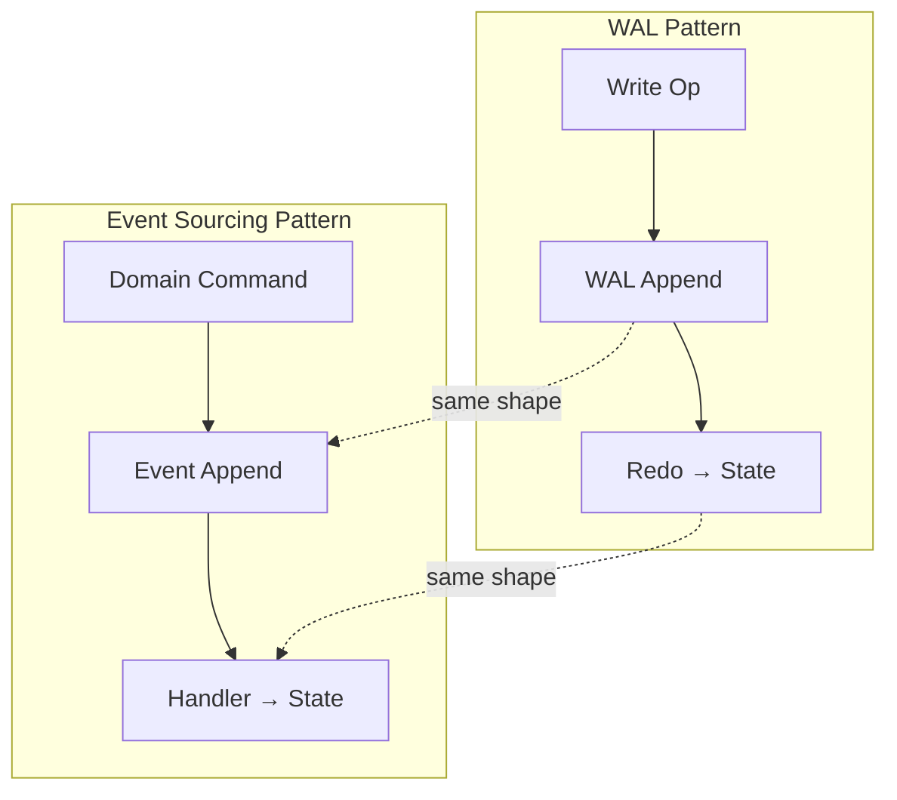
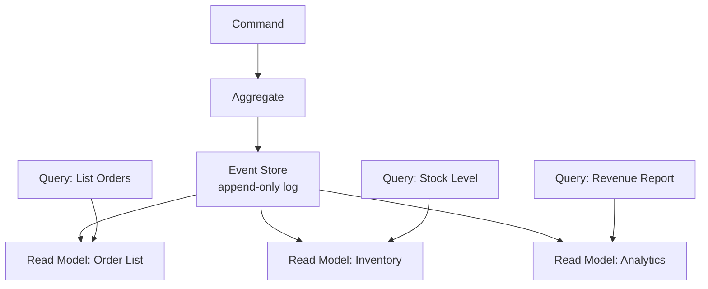

import { Aside } from '@astrojs/starlight/components';

Event sourcing and Write-Ahead Logging are the same idea wearing different clothes: **persist an ordered, append-only log of operations, and derive current state by replaying them**. Once you see the equivalence, design patterns across databases, message queues, and application architecture snap into a unified mental model.

## Conceptual Equivalence

Both WAL and event sourcing share the same fundamental equation:

```
current_state = fold(initial_state, operations[])
```

| Concept | WAL | Event Sourcing |
|---------|-----|----------------|
| **Log** | WAL file / segments | Event store / topic |
| **Entry** | Log record (physical) | Domain event (semantic) |
| **Position** | LSN | Event sequence number / offset |
| **Replay** | Redo pass | Event handler re-apply |
| **Checkpoint** | Flush dirty pages | Snapshot aggregate state |
| **Compaction** | WAL recycling after checkpoint | Snapshot + log truncation |



<Aside type="tip" title="Memory Hook: WAL = Machine Code, Events = Source Code">
WAL records are **machine code** — byte-level operations the storage engine understands. Domain events are **source code** — business-meaningful declarations humans designed. Both compile to state, but at different abstraction levels.
</Aside>

## Key Differences

Despite structural similarity, the two patterns diverge in important ways:

### Semantic vs Physical

```
WAL record:     "Set byte offset 8472 in page 42 to 0xFF"
Domain event:   "OrderPlaced { orderId: 42, total: $99.99 }"
```

WAL describes **how storage changed**; events describe **what the business decided**.

### Permanent vs Recycled

| Aspect | WAL | Event Store |
|--------|-----|-------------|
| **Retention** | Recycled after checkpoint | Permanent (immutable history) |
| **Purpose** | Crash recovery | Audit trail + state derivation |
| **Mutability** | Overwritten (circular/recycled) | Never modified or deleted |
| **Audience** | Storage engine | Application + business |

### Domain Events vs Page Diffs

WAL records are **physiological** — tied to storage structure (pages, B-tree nodes). Domain events are **semantic** — tied to business concepts (orders, payments, inventory). You cannot derive `OrderPlaced` from a heap page UPDATE record without schema knowledge.

## Kafka Commit Log: The Ultimate WAL Analogy

Apache Kafka's commit log is the purest expression of "log IS the data store":

```
Kafka topic "orders":
Offset:  0              1              2              3
         ┌──────────────┬──────────────┬──────────────┬──────────────┐
         │ OrderCreated │ ItemAdded    │ OrderPaid    │ OrderShipped │
         │ {id:1}       │ {id:1,i:42}  │ {id:1,$99}   │ {id:1}       │
         └──────────────┴──────────────┴──────────────┴──────────────┘

Consumer replay:  state = {} 
                  → {orders: {1: {status: created}}}
                  → {orders: {1: {status: created, items: [42]}}}
                  → {orders: {1: {status: paid, total: 99}}}
                  → {orders: {1: {status: shipped}}}
```

| Kafka Concept | WAL Equivalent |
|---------------|----------------|
| Topic partition | WAL file / segment |
| Offset | LSN |
| Retention policy | WAL recycling / checkpoint |
| Consumer group | Redo pass / standby replay |
| Compacted topic | Snapshot (latest value per key) |
| Log end offset | Current WAL insert LSN |

<Aside type="note" title="Kafka IS a WAL">
Confluent's design explicitly models Kafka as "a distributed commit log." The log is not a transport mechanism — it *is* the system of record. Databases add a query layer on top; Kafka exposes the log directly.
</Aside>

### Retention vs Checkpoint

```
Database WAL lifecycle:
  Write → WAL append → (checkpoint) → WAL recycle
                         ↑
                    State captured in data pages

Kafka lifecycle:
  Produce → Log append → (compaction OR retention expiry) → Delete
                          ↑
                     Latest value per key preserved (compacted topics)
                     OR time/size-based deletion (regular topics)
```

## Event Store Implementations

| System | Storage Model | WAL Relationship |
|--------|--------------|------------------|
| **EventStoreDB** | Purpose-built event store | Native append-only log with projections |
| **Apache Kafka** | Distributed commit log | Log IS the store; no separate WAL |
| **PostgreSQL + outbox** | Relational DB + CDC | WAL underneath, events on top |
| **Martens (PostgreSQL)** | JSONB event table | Uses PostgreSQL WAL for durability |
| **Axon Server** | Event store + CQRS | Append-only event log per aggregate |

```sql
-- Simple event store table (PostgreSQL)
CREATE TABLE events (
    event_id    UUID PRIMARY KEY DEFAULT gen_random_uuid(),
    aggregate_id UUID NOT NULL,
    event_type  TEXT NOT NULL,
    payload     JSONB NOT NULL,
    sequence    BIGINT NOT NULL,
    created_at  TIMESTAMPTZ DEFAULT now(),
    UNIQUE (aggregate_id, sequence)
);

CREATE INDEX idx_events_aggregate ON events (aggregate_id, sequence);
-- Every INSERT goes through PostgreSQL WAL → durable by default
```

## CQRS + Event Sourcing Architecture

**Command Query Responsibility Segregation (CQRS)** pairs naturally with event sourcing:



- **Write side**: Commands → aggregate validates → append events to log (the WAL)
- **Read side**: Projections consume events → build optimized query models
- **Separation**: Write model optimized for consistency; read models optimized for queries

## When to Use Which Pattern

| Scenario | Use WAL (Database) | Use Event Sourcing | Use Both |
|----------|-------------------|-------------------|----------|
| CRUD application | ✓ Default choice | Overkill | |
| Audit trail required | Via CDC | ✓ Native | ✓ Outbox + CDC |
| Temporal queries ("state at time T") | PITR (expensive) | ✓ Replay to point | |
| Complex domain logic | ORM + DB | ✓ Aggregates | |
| Cross-service consistency | 2PC (avoid) | ✓ Event choreography | ✓ Outbox pattern |
| High write throughput | ✓ Optimized engines | Kafka log | |
| Regulatory compliance | WAL archives | ✓ Immutable log | ✓ WAL + event store |

<Aside type="caution" title="Event Sourcing Is Not Free">
Event sourcing adds complexity: schema evolution, projection rebuilds, eventual consistency on read models, and storage growth. Use it when the audit trail and temporal replay benefits outweigh the engineering cost.
</Aside>

## The Unified Mental Model

```
┌─────────────────────────────────────────────────────────┐
│                  Append-Only Ordered Log                   │
│                                                         │
│  ┌─────────┐  ┌─────────┐  ┌─────────┐  ┌─────────┐   │
│  │ LSN /   │  │ LSN /   │  │ LSN /   │  │ LSN /   │   │
│  │ Offset  │  │ Offset  │  │ Offset  │  │ Offset  │   │
│  └────┬────┘  └────┬────┘  └────┬────┘  └────┬────┘   │
│       │            │            │            │         │
│  ┌────▼────────────▼────────────▼────────────▼────┐    │
│  │           fold(operations) → state              │    │
│  └────────────────────────────────────────────────┘    │
│                                                         │
│  Implementations:                                       │
│  • PostgreSQL WAL (physical, recycled)                  │
│  • Raft log (distributed, replicated)                   │
│  • Kafka topic (semantic, retained)                     │
│  • EventStoreDB (domain events, permanent)              │
└─────────────────────────────────────────────────────────┘
```

## Key Takeaways

1. **Event sourcing and WAL share the same shape**: append-only log → replay → state
2. **WAL is physical and recycled**; events are semantic and permanent
3. **Kafka's commit log IS a WAL** — the log is the system of record, not a transport
4. **CQRS + event sourcing** separates write (command → event log) from read (projections)
5. **Choose based on needs**: WAL for storage durability, event sourcing for business auditability, both via transactional outbox when you need domain events with DB guarantees

<div class="self-check">
<details>
<summary>Quick Quiz: Event Sourcing</summary>

1. **What is the core equation shared by WAL and event sourcing?**
   → current_state = fold(initial_state, operations[]) — replay an ordered log to derive state.

2. **What is the key difference between a WAL record and a domain event?**
   → WAL records describe physical storage changes (page/byte level); domain events describe business decisions (semantic level).

3. **Why is Kafka called "a distributed commit log"?**
   → The log IS the system of record — data persists as an ordered sequence of records, with consumers deriving state by replay.

4. **What is CQRS and how does it relate to event sourcing?**
   → Command Query Responsibility Segregation — writes append events to the log; separate read models (projections) consume events for optimized queries.

5. **When would you use the transactional outbox pattern?**
   → When you need domain-level events with the same atomicity as database transactions — write business data and outbox event in one txn, CDC publishes from outbox.

6. **What is the Kafka equivalent of a WAL checkpoint?**
   → Log compaction (keeps latest value per key) or retention-based deletion — capturing current state so older log segments can be discarded.

</details>
</div>
