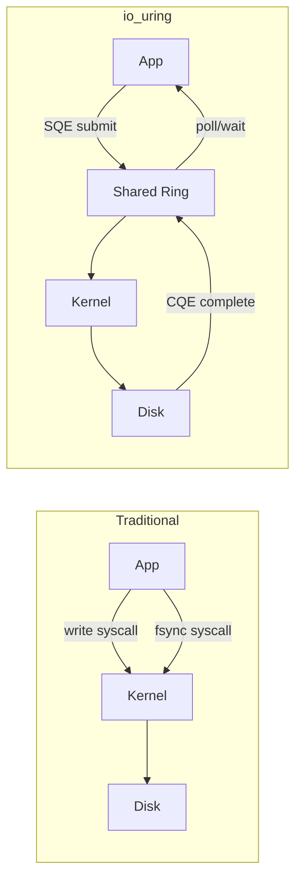

import { Aside } from '@astrojs/starlight/components';

Traditional WAL was designed for spinning disks where fsync costs 5–10ms. Modern hardware — NVMe SSDs with µs latency, persistent memory with byte-addressability, and io_uring's async I/O — fundamentally changes the WAL performance equation. This page covers what changes, what research is exploring, and what production systems can adopt today.

## NVMe Characteristics

NVMe SSDs expose capabilities that HDD-era WAL tuning never contemplated:

| Property | HDD | NVMe |
|----------|-----|------|
| **Random read latency** | 5–10 ms | 10–100 µs |
| **fsync latency** | 5–15 ms | 50–200 µs |
| **Queue depth** | 1 (single arm) | 64K+ commands |
| **Parallelism** | Serial | Multi-queue (per-CPU) |
| **FUA support** | N/A | Force Unit Access — bypass cache |
| **Bandwidth** | 100–200 MB/s | 3–14 GB/s |

### FUA (Force Unit Access)

NVMe supports **FUA** — a write flag that bypasses the device cache and lands directly on persistent media. This is equivalent to `fsync` per write but without a separate syscall:

```
Traditional:  write(WAL) → fsync(fd)     (2 syscalls, 2 round trips)
FUA:          write(WAL, FUA flag)       (1 syscall, data durable on return)
```

PostgreSQL doesn't use FUA directly today, but `O_DIRECT` + `RWF_DSYNC` (see zero-copy section) achieves similar semantics.

### Queue Depth and Parallel WAL

NVMe's deep command queues enable **parallel WAL writes** from multiple backends without serializing on a single I/O queue — a natural fit for group commit where multiple transactions fsync concurrently.

<Aside type="tip" title="Memory Hook: NVMe = Express Lane">
HDD WAL is a single-lane road with a toll booth (fsync) every block. NVMe is a 64-lane highway where each lane has its own toll — group commit becomes nearly free.
</Aside>

## Persistent Memory (PMEM)

Intel Optane (DC Persistent Memory) and similar technologies provide **byte-addressable, persistent storage** mapped directly into the CPU address space via `mmap()`.

```
Traditional I/O path:
  App → write() → kernel buffer → block device driver → NVMe → NAND

PMEM path:
  App → store instruction → CPU cache → CLWB → SFENCE → persistent
  (no syscall, no block layer, no filesystem)
```

### Durability Primitives

PMEM durability requires explicit cache line flush:

```c
// Write data to PMEM-mapped region
memcpy(pmem_addr, wal_record, record_len);

// Ensure durability
for (char *p = pmem_addr; p < pmem_addr + record_len; p += 64)
    _mm_clwb(p);          // Cache Line Write Back
_mm_sfence();             // Store fence — ordering guarantee
// Data is now persistent
```

| Instruction | Purpose |
|-------------|---------|
| `CLWB` | Write cache line back to PMEM (non-evicting) |
| `CLFLUSHOPT` | Flush and invalidate cache line |
| `SFENCE` | Store fence — ensures CLWB completes before proceeding |

### PMEM WAL Advantages

- **No fsync syscall** — durability via CPU instructions (~100ns vs ~100µs)
- **Byte-granular writes** — no 512B/4KB alignment requirement
- **In-place updates** — modify WAL records directly (careful with torn writes)
- **NUMA-local** — PMEM on same socket as CPU avoids cross-socket latency

<Aside type="note" title="PMEM Status">
Intel discontinued Optane in 2023, but the programming model (App Direct mode, CLWB+SFENCE) applies to CXL-attached persistent memory and future NVDIMM technologies.
</Aside>

## Write-Behind Logging (WBL)

CMU researchers proposed **Write-Behind Logging** (VLDB 2016) — inverting the traditional WAL order:

```
Traditional WAL:
  1. Write log record → fsync log     ← DURABILITY BOUNDARY
  2. Write data page (async)

Write-Behind Logging (NVM only):
  1. Write data page to NVM → fsync   ← DURABILITY BOUNDARY
  2. Write log metadata only (much smaller)
```

### Why It Works on NVM

On traditional disks, writing data before the log is dangerous — a crash between data write and log write leaves inconsistent state. On **byte-addressable NVM with atomic 8-byte stores**, writing data first is safe because:

- Data pages can be updated atomically (8-byte granularity)
- Log metadata (which pages changed) is tiny — fast to fsync
- Recovery replays metadata to find dirty pages, not full redo records

### Reported Results

| Metric | Traditional WAL | WBL |
|--------|----------------|-----|
| Throughput | 1x (baseline) | **1.3x** |
| Recovery time | 1x (baseline) | **100x faster** |
| Log volume | Full redo records | Metadata only |
| Requirement | Any storage | **NVM only** |

<Aside type="caution" title="WBL Requires NVM">
WBL's safety proof depends on byte-addressable persistent memory with atomic stores. It is **not safe on block devices** (NVMe, HDD) where page writes can tear.
</Aside>

## io_uring for WAL

Linux's **io_uring** (kernel 5.1+) provides high-performance async I/O through shared submission/completion rings — eliminating syscall overhead for I/O-heavy workloads.



### WAL with io_uring

```c
// Simplified io_uring WAL write + fsync
struct io_uring ring;
io_uring_queue_init(32, &ring, 0);

// Register WAL buffer (zero-copy, pinned pages)
io_uring_register_buffers(&ring, &wal_buf, 1);

// Submit write
struct io_uring_sqe *sqe = io_uring_get_sqe(&ring);
io_uring_prep_write(sqe, wal_fd, wal_buf, len, offset);
io_uring_sqe_set_flags(sqe, IOSQE_IO_LINK);  // link to next op

// Submit fsync (linked — runs after write completes)
sqe = io_uring_get_sqe(&ring);
io_uring_prep_fsync(sqe, wal_fd, IORING_FSYNC_DATASYNC);

io_uring_submit(&ring);

// Wait for BOTH completion events
struct io_uring_cqe *cqe;
io_uring_wait_cqe(&ring, &cqe);  // write CQE
io_uring_wait_cqe(&ring, &cqe);  // fsync CQE ← THIS is durability
```

<Aside type="danger" title="Write CQE ≠ Durable">
The write completion event means data reached the kernel page cache — **not** stable storage. You MUST wait for the fsync CQE before acknowledging commit. This is the most common io_uring WAL bug.
</Aside>

### VLDB 2026 io_uring Paper

Recent research (VLDB 2026) demonstrates io_uring for database logging with:

- **Registered buffers**: Pin WAL buffer pages in memory, eliminating copy overhead
- **Linked SQEs**: Write + fsync as atomic chain — kernel executes sequentially
- **SQPOLL mode**: Kernel thread polls submission queue — zero syscall for steady-state writes
- **Batch commit**: Group multiple transactions' WAL writes into single io_uring submission

Reported improvements: 2–4x WAL throughput on NVMe compared to synchronous `pwrite` + `fdatasync`, with commit latency bounded by fsync CQE latency (~100µs on NVMe).

## Zero-Copy Techniques

### O_DIRECT

Bypass the OS page cache — WAL data goes directly from user buffer to device:

```c
// Open WAL file with O_DIRECT
int fd = open("pg_wal/segment", O_WRONLY | O_DIRECT);

// Buffer MUST be aligned to page size (4096)
void *buf;
posix_memalign(&buf, 4096, wal_record_size);
memcpy(buf, wal_record, wal_record_size);
pwrite(fd, buf, wal_record_size, offset);
fdatasync(fd);
```

Benefits: eliminates double-buffering (user space + page cache), predictable latency.
Requirement: buffer alignment to logical block size.

### pwritev2 with RWF_DSYNC

Linux 4.6+ `pwritev2` with `RWF_DSYNC` flag combines write + durability in one syscall:

```c
struct iovec iov = { .iov_base = wal_record, .iov_len = record_len };
pwritev2(wal_fd, &iov, 1, offset, RWF_DSYNC);
// Returns only when data is durable — equivalent to write + fdatasync
```

| Method | Syscalls | Durability Guarantee |
|--------|----------|---------------------|
| `write` + `fsync` | 2 | Yes (if fsync awaited) |
| `write` + `fdatasync` | 2 | Yes (data only, not metadata) |
| `pwritev2(RWF_DSYNC)` | 1 | Yes (data durable on return) |
| `O_DIRECT` + `fdatasync` | 2 | Yes (no page cache copy) |
| io_uring write CQE only | 1 | **NO** — page cache only |
| io_uring write + fsync CQE | 1 submit | Yes (if fsync CQE awaited) |

## Hardware Decision Matrix

| Hardware | WAL Strategy | Expected fsync | Production Ready? |
|----------|-------------|----------------|-------------------|
| HDD | Traditional WAL, async commit, separate disk | 5–15 ms | ✓ (legacy) |
| SATA SSD | Traditional WAL, wal_compression | 1–3 ms | ✓ |
| NVMe | Traditional WAL, larger buffers | 0.1–0.5 ms | ✓ |
| NVMe + io_uring | Linked write+fsync SQEs | 0.1–0.3 ms | Emerging |
| PMEM | Direct store + CLWB/SFENCE | ~0.0001 ms | Research |
| PMEM + WBL | Write data first, log metadata | ~0.0001 ms | Research |

## Key Takeaways

1. **NVMe reduces fsync to µs** — making synchronous commit viable at high TPS without async tricks
2. **PMEM enables byte-addressable WAL** — CLWB+SFENCE replaces fsync syscalls (~1000x faster)
3. **Write-Behind Logging inverts WAL** on NVM — 1.3x throughput, 100x faster recovery, NVM-only
4. **io_uring write CQE ≠ durable** — always wait for the fsync CQE
5. **Zero-copy** (O_DIRECT, RWF_DSYNC, registered buffers) eliminates page cache overhead for WAL I/O

<div class="self-check">
<details>
<summary>Quick Quiz: Modern Hardware</summary>

1. **What is FUA and why does it matter for WAL?**
   → Force Unit Access — an NVMe write flag that bypasses device cache, achieving durability in a single write operation without a separate fsync.

2. **What CPU instructions ensure PMEM durability?**
   → CLWB (cache line write back) followed by SFENCE (store fence) — ensures data is persistent before proceeding.

3. **How does Write-Behind Logging differ from traditional WAL?**
   → WBL writes data pages first (on NVM), then logs only metadata. Traditional WAL logs first, then writes data pages asynchronously.

4. **Why is the io_uring write CQE not sufficient for commit acknowledgment?**
   → Write CQE means data reached the kernel page cache, not stable storage. You must wait for the fsync CQE.

5. **What is RWF_DSYNC?**
   → A pwritev2 flag that combines write + durability in one syscall — data is persistent when the call returns.

6. **Why does WBL only work on NVM?**
   → It requires byte-addressable persistent memory with atomic stores. Block devices can produce torn page writes if data is written before the log.

</details>
</div>
