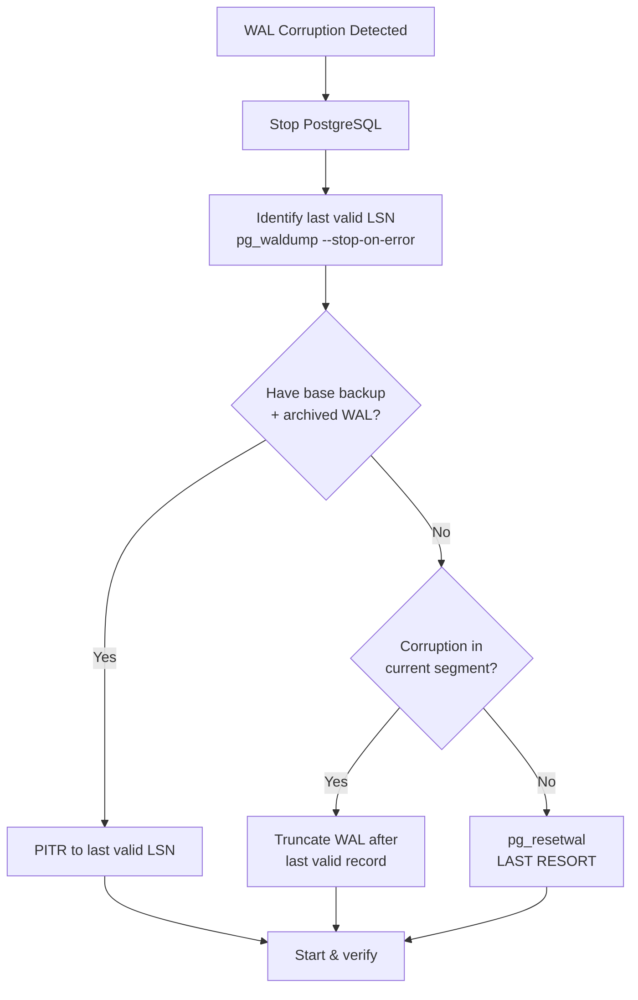
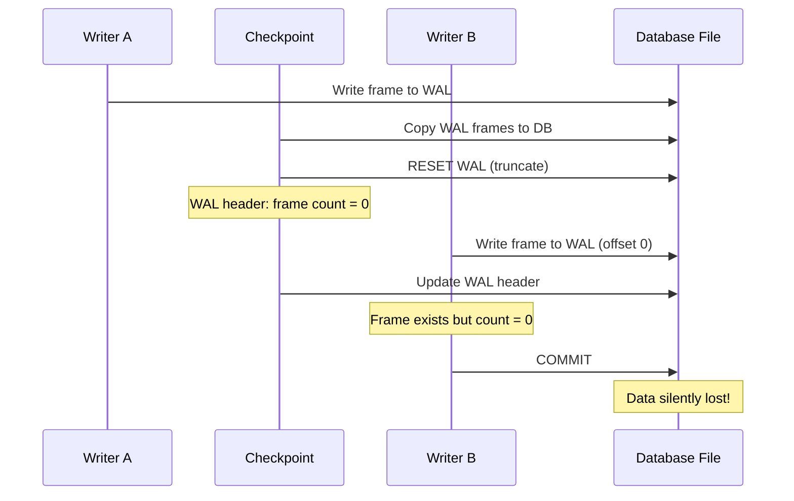

import { Aside } from '@astrojs/starlight/components';

WAL corruption is every DBA's nightmare: the log that guarantees recovery itself is damaged. This page covers systematic diagnosis with PostgreSQL tools, recovery procedures, and a detailed case study of the SQLite WAL-Reset bug — a race condition latent for 16 years that caused 19 production incidents at Tailscale.

## Detecting WAL Corruption

### pg_waldump

The primary offline WAL inspection tool:

```bash
# Decode WAL records from a segment
pg_waldump 000000010000000000000001

# Verify checksums on all records
pg_waldump --verify-checksums 000000010000000000000001

# Stop at first error (don't flood output)
pg_waldump --verify-checksums --stop-on-error pg_wal/

# Filter by resource manager
pg_waldump --rmgr=Heap2 pg_wal/000000010000000000000001

# Show records after a specific LSN
pg_waldump --start=0/3000000 pg_wal/000000010000000000000001
```

Sample corruption output:

```
pg_waldump: error: invalid record length at 0/1A2B3C0: wanted 256, got 0
pg_waldump: error: record with incorrect prev-link at 0/1A2B3C8
pg_waldump: error: checksum mismatch at 0/1A2B3D0: calculated 0xABCD1234, recorded 0xDEADBEEF
```

### pg_walinspect (SQL Functions)

PostgreSQL 15+ provides SQL-accessible WAL inspection:

```sql
-- List records in a WAL range
SELECT start_lsn, end_lsn, prev_lsn, xid, resource_manager, record_type
FROM pg_wal_summary(
    '0/1000000'::pg_lsn,
    '0/2000000'::pg_lsn
);

-- Decode a specific record
SELECT * FROM pg_get_wal_records_info(
    '0/1500000'::pg_lsn,
    '0/1600000'::pg_lsn
);

-- Find the last valid record before corruption
SELECT start_lsn, end_lsn, resource_manager, record_type
FROM pg_get_wal_records_info('0/0'::pg_lsn, pg_current_wal_lsn())
ORDER BY start_lsn DESC
LIMIT 10;
```

<Aside type="tip" title="Memory Hook: pg_waldump = WAL Autopsy">
Think of `pg_waldump --verify-checksums` as an **autopsy** — it reads every record, checks vitals (checksums, prev-links, lengths), and stops at the point of death (first corruption).
</Aside>

## Corruption Recovery Procedure



### Step 1: Identify Last Valid LSN

```bash
# Find the corruption point
pg_waldump --verify-checksums --stop-on-error pg_wal/ > /tmp/wal_dump.txt 2>&1

# Last valid record LSN is in the output before the error
tail -20 /tmp/wal_dump.txt
# rmgr: Heap2  len (rec/tot):  64/  64  tx: 1234  lsn: 0/1A2B3C0
# pg_waldump: error: invalid record length at 0/1A2B3D0
# → Last valid LSN: 0/1A2B3C0
```

### Step 2: PITR Recovery (Preferred)

```bash
# Restore base backup
tar xzf base_backup.tar.gz -C $PGDATA

# Configure recovery to stop at last valid LSN
cat >> $PGDATA/postgresql.conf <<EOF
restore_command = 'cp /archive/%f %p'
recovery_target_lsn = '0/1A2B3C0'
recovery_target_action = 'promote'
EOF

touch $PGDATA/recovery.signal
pg_ctl start
```

### Step 3: pg_resetwal (Last Resort)

<Aside type="danger" title="pg_resetwal Destroys Data">
`pg_resetwal` creates a fresh WAL timeline, potentially **discarding committed transactions** that existed only in corrupted WAL. Use only when PITR is impossible and data loss is acceptable.
</Aside>

```bash
# Dry run — see what would happen
pg_resetwal -n $PGDATA

# Force reset (requires PostgreSQL stopped)
pg_resetwal -f $PGDATA

# Then start and immediately take a new base backup
pg_ctl start
pg_basebackup -D /backup/post-reset -Fp -Xs
```

## Case Study: The SQLite WAL-Reset Bug (2026)

One of the most significant WAL bugs discovered in recent years — a race condition in SQLite's WAL mode that was **latent for 16 years** before causing production incidents.

### The Bug

SQLite WAL mode uses a `-wal` file alongside the main database. During **checkpoint**, SQLite:

1. Copies WAL frames back to the database file
2. Resets the WAL file (truncates to zero)
3. Updates the WAL header

The race condition occurs when a **concurrent writer** appends to the WAL between steps 2 and 3:

```
Timeline (buggy):
Writer A:  BEGIN → write frame 1 to WAL
Checkpoint:  copy frame 1 to DB → RESET WAL (truncate to 0)
Writer B:  BEGIN → write frame 1 to WAL (at offset 0 — looks valid!)
Checkpoint:  update WAL header (frame count = 0, but frame 1 exists!)
Writer B:  COMMIT → frame 1 appears committed but checkpoint already ran
Result:  Frame 1 is INVISIBLE — data silently lost
```



### Impact

| Metric | Value |
|--------|-------|
| **Bug latent since** | SQLite 3.7.0 (2010) — WAL mode introduction |
| **Discovered by** | Antithesis (deterministic testing) |
| **Repro time** | 15 minutes (Antithesis) |
| **Tailscale incidents** | 19 production data loss events |
| **Reproducer** | Phil Eaton published minimal C reproducer |
| **Fix** | SQLite 3.x.x — serialize WAL reset with writer lock |

### Tailscale's Experience

Tailscale uses SQLite (via `gorm`/`modernc.org/sqlite`) for coordination state. The bug manifested as:

- Nodes losing registration state after checkpoint
- Intermittent — depends on write/checkpoint timing
- **No error returned** — silent data loss
- Difficult to diagnose because WAL file looks structurally valid

### Antithesis Discovery

Antithesis runs distributed systems in a deterministic simulator, injecting faults (crash, partition, delay). Their approach:

1. Run SQLite with concurrent writers + aggressive checkpointing
2. Inject thread scheduling variations
3. Compare database state after recovery against expected state
4. Found divergence in 15 minutes — the WAL-Reset race

### Phil Eaton's Reproducer

A minimal C program demonstrating the bug:

```c
// Simplified reproducer logic (Phil Eaton, 2026)
// Thread 1: continuous writes
while (running) {
    sqlite3_exec(db, "INSERT INTO t VALUES (?)", ...);
    sqlite3_exec(db, "COMMIT", ...);
}

// Thread 2: aggressive checkpointing
while (running) {
    sqlite3_wal_checkpoint_v2(db, NULL, SQLITE_CHECKPOINT_RESTART, ...);
    usleep(100);  // checkpoint every 100µs
}

// After N iterations: SELECT count(*) != expected count
// Data silently lost — no error, no corruption detected
```

### Lessons Learned

1. **WAL reset is a critical section** — must be serialized with all writers
2. **Silent data loss is worse than corruption** — checksums can't detect logically missing records
3. **16 years latent** — concurrency bugs in WAL paths require deterministic testing to find
4. **Aggressive checkpointing increases risk** — production checkpoint schedules matter
5. **Test your PITR** — if Tailscale had tested recovery, they might have found state divergence earlier
6. **Deterministic simulation > fuzzing** for WAL race conditions — Antithesis found it in 15 minutes

<Aside type="caution" title="Applies Beyond SQLite">
Any WAL system that resets/recycles log files must ensure no concurrent writer can append between reset and header update. Review your checkpoint + WAL reset paths for similar races.
</Aside>

## Corruption Prevention Checklist

| Practice | Protects Against |
|----------|-----------------|
| `full_page_writes = on` | Torn pages |
| WAL checksums (PG 11+) | Bit rot, partial writes |
| `wal_compression` | Reduced I/O volume (fewer corruption opportunities) |
| Separate WAL disk | I/O interference corruption |
| Regular PITR testing | Undetected silent loss |
| Monitor `pg_stat_wal` | Early warning of anomalous generation |
| Avoid `fsync=off` | Buffer cache corruption on crash |

## Key Takeaways

1. **pg_waldump --verify-checksums --stop-on-error** is your first diagnostic tool
2. **PITR to last valid LSN** is the preferred recovery — pg_resetwal is last resort
3. **The SQLite WAL-Reset bug** was a 16-year latent race between checkpoint reset and concurrent writers
4. **Silent data loss** (no error, no checksum failure) is the hardest WAL bug class to detect
5. **Deterministic testing** (Antithesis) found the bug in 15 minutes; production fuzzing took 16 years

<div class="self-check">
<details>
<summary>Quick Quiz: Debugging Corruption</summary>

1. **What pg_waldump flags verify WAL integrity?**
   → --verify-checksums checks CRC on each record; --stop-on-error halts at the first corruption.

2. **What is the preferred recovery procedure for WAL corruption?**
   → PITR: restore base backup, replay archived WAL up to the last valid LSN, then promote.

3. **When should you use pg_resetwal?**
   → Only as a last resort when PITR is impossible and accepting potential data loss. It creates a fresh WAL timeline.

4. **Describe the SQLite WAL-Reset race condition.**
   → A concurrent writer appends to the WAL after checkpoint truncates it but before the header is updated with frame count = 0, making the frame invisible.

5. **Why was the WAL-Reset bug so hard to detect in production?**
   → Silent data loss — no error returned, WAL file structurally valid, checksums pass. Data is simply missing.

6. **How did Antithesis find the bug so quickly?**
   → Deterministic simulation with controlled thread scheduling, concurrent writes, and aggressive checkpointing — comparing expected vs actual state after recovery.

</details>
</div>
