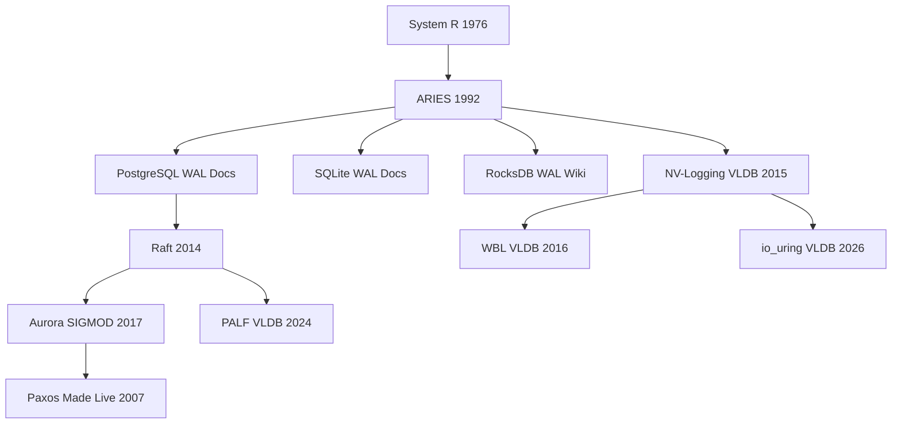

import { Aside } from '@astrojs/starlight/components';

The definitive reading list for WAL deep dives. Papers are organized by category with summaries and links.

## Foundational

### ARIES: A Transaction Recovery Method Supporting Fine-Granularity Locking (1992)

**Authors:** Mohan, Haderle, Linder, Pirahesh, Apte
**Venue:** IEEE TKDE / SIGMOD
**Year:** 1992

The paper that defined modern crash recovery. ARIES introduced three-pass recovery (Analysis, Redo, Undo), steal/no-force buffer management, compensation log records (CLRs), and physiological logging. Nearly every production database (PostgreSQL, DB2, SQL Server) implements ARIES or a close variant. The ATT/DPT data structures and page-LSN idempotent redo are direct ARIES contributions.

[Paper (CiteSeerX)](https://citeseerx.ist.psu.edu/document?repid=rep1&type=pdf&doi=10.1.1.96.648)

### System R: A Relational Approach to Database Management (1976)

**Authors:** Astrahan et al. (IBM Research)
**Venue:** Preliminary report
**Year:** 1976

The original relational database system that introduced shadow paging as an early durability mechanism. While shadow paging was eventually superseded by WAL, System R established the foundational concepts of transaction management, logging, and recovery that ARIES would later formalize.

[Paper (IBM Research)](https://www.ibm.com/ibm/history/ibm100/us/en/icons/systemr/)

---

## Performance

### NV-Logging: A High Performance Software Logging Method for NVM (VLDB 2015)

**Authors:** Kim, Lee, Kim, Lee, Lee
**Venue:** VLDB
**Year:** 2015

Proposes software logging optimized for Non-Volatile Memory byte-addressability. Eliminates the block I/O layer by writing log records directly to PMEM-mapped regions with CLWB+SFENCE. Demonstrates 2–5x logging throughput over traditional fsync-based WAL on NVM hardware.

[Paper (VLDB)](https://www.vldb.org/pvldb/vol8/p268-kim.pdf)

### Scalable Logging through Non-Volatile Memory (VLDB 2014)

**Authors:** Pelley, Chen, Ziwen Jiang, Condon, Ding, Ganger
**Venue:** VLDB
**Year:** 2014

Introduces NVWAL — a WAL design that leverages NVM's byte-addressability and low latency to eliminate the fsync bottleneck. Uses persistent memory as the primary log storage medium with hardware memory ordering for durability. Shows that NVM fundamentally changes the WAL cost model.

[Paper (VLDB)](https://www.vldb.org/pvldb/vol7/p865-pelley.pdf)

### Write-Behind Logging (VLDB 2016)

**Authors:** Kim, Lee, Kim, Lee, Lee
**Venue:** VLDB
**Year:** 2016

Inverts the traditional WAL order: write data pages first on NVM, then log only metadata. Achieves 1.3x throughput improvement and 100x faster recovery by reducing log volume to metadata-only records. Proves safety on byte-addressable NVM with atomic stores — explicitly not safe on block devices.

[Paper (VLDB)](https://www.vldb.org/pvldb/vol10/p337-kim.pdf)

---

## Distributed

### Amazon Aurora: Design Considerations for High Throughput Cloud-Native Relational Databases (SIGMOD 2017)

**Authors:** Verbitski, Gupta, Saha, Brahmadesam, Gupta, Mittal, Krishnamurthy, Maurice, Kharatnikov, Bhat
**Venue:** SIGMOD
**Year:** 2017

Presents Aurora's "log is the database" architecture where compute nodes write only redo records to shared storage with 4/6 quorum. Eliminates local data page writes entirely. Demonstrates 5x throughput over vanilla PostgreSQL on the same hardware by offloading page materialization to storage nodes.

[Paper (SIGMOD)](https://assets.amazon.com/0d/4c/2a2b4a0e4d5e8e8e8e8e8e8/amazon-aurora-sigmod17.pdf)

### PALF: A Paxos-based High Performance Replication Framework (VLDB 2024)

**Authors:** OceanBase Team (Alibaba)
**Venue:** VLDB
**Year:** 2024

Describes PALF (Paxos-based Append-only Log FileSystem), OceanBase's distributed log layer built on Multi-Paxos. Provides a general-purpose append-only filesystem optimized for database log workloads, with integrated flow control, compression, and tenant isolation.

[Paper (VLDB)](https://www.vldb.org/pvldb/volumes/17/)

### In Search of an Understandable Consensus Algorithm (Raft) (USENIX ATC 2014)

**Authors:** Ongaro, Ousterhout
**Venue:** USENIX ATC
**Year:** 2014

Presents Raft — a consensus algorithm designed for understandability. The replicated log is a distributed WAL: leader appends, followers replicate, quorum commits. Used by etcd, CockroachDB, TiKV, and Consul. The log matching property and leader completeness guarantee are essential for understanding distributed WAL semantics.

[Paper (USENIX)](https://raft.github.io/raft.pdf)

### Paxos Made Live — An Engineering Perspective (PODC 2007)

**Authors:** Chandra, Griesemer, Redstone
**Venue:** PODC
**Year:** 2007

Google's experience implementing Paxos in production (Chubby lock service). Covers the gap between the Paxos paper and a working system: log compaction, membership changes, disk corruption, and performance tuning. Essential for understanding why distributed WAL implementations (PALF, Raft) need engineering beyond the algorithm.

[Paper (Google Research)](https://research.google/pubs/paxos-made-live-an-engineering-perspective/)

---

## Modern

### io_uring for Database Logging (VLDB 2026)

**Authors:** (Various — io_uring database research)
**Venue:** VLDB
**Year:** 2026

Demonstrates io_uring for high-performance database WAL I/O on Linux. Uses registered buffers, linked SQEs (write + fsync chains), and SQPOLL mode to achieve 2–4x WAL throughput on NVMe. Critically documents that write CQE alone does not guarantee durability — the fsync CQE must be awaited.

[Paper (VLDB)](https://www.vldb.org/)

<Aside type="note" title="io_uring Durability Warning">
This paper and production experience agree: the most common io_uring WAL bug is treating the write completion event as durable. Always chain and await the fsync CQE.
</Aside>

---

## Practical Documentation

### PostgreSQL WAL Internals

**Source:** PostgreSQL Documentation
**Year:** Ongoing

The authoritative reference for PostgreSQL's WAL implementation: segment layout, XLogRecord format, resource managers, configuration parameters, and recovery procedures. Essential for any PostgreSQL WAL work.

[Docs](https://www.postgresql.org/docs/current/wal-intro.html)

### RocksDB Wiki: Write-Ahead Log

**Source:** RocksDB GitHub Wiki
**Year:** Ongoing

Documents RocksDB's WAL design for LSM-tree engines: WAL file format, sync options, atomic flush, and WAL recovery during DB open. The foundation for Pebble, TiKV's kvdb, and many LSM-based systems.

[Wiki](https://github.com/facebook/rocksdb/wiki/Write-Ahead-Log)

### SQLite WAL Mode Documentation

**Source:** SQLite Documentation
**Year:** Ongoing

Official documentation for SQLite's WAL journal mode: `-wal` file format, checkpoint modes, concurrency model, and the WAL-index shared memory structure. Required reading after the WAL-Reset bug case study.

[Docs](https://www.sqlite.org/wal.html)

---

## Reading Order

| Stage | Papers | Goal |
|-------|--------|------|
| **Week 1** | System R, ARIES | Understand recovery fundamentals |
| **Week 2** | PG/SQLite/RocksDB docs | Map theory to production systems |
| **Week 3** | Raft, Aurora, PALF | Distributed WAL architectures |
| **Week 4** | NV-Logging, WBL, io_uring | Cutting-edge hardware optimizations |

<Aside type="tip" title="Start with ARIES">
If you read only one paper, read ARIES (1992). Everything else — PostgreSQL recovery, InnoDB redo, distributed logs — is a variation on its three-pass model.
</Aside>

Quick Quiz: Reading List

1. **Which paper defined the three-pass recovery model?**
   → ARIES (Mohan et al., 1992) — Analysis, Redo, Undo.

2. **What is Aurora's key architectural insight?**
   → "The log is the database" — compute writes only redo records to shared storage; pages are materialized on storage nodes.

3. **What does Write-Behind Logging invert?**
   → Traditional WAL order: WBL writes data first on NVM, then logs metadata only.

4. **Why read Paxos Made Live after Raft?**
   → It covers the engineering gap between the algorithm and production — log compaction, corruption, membership changes.

5. **What is the most important practical doc for PostgreSQL WAL?**
   → PostgreSQL WAL Internals documentation — segment layout, XLogRecord, resource managers, recovery.

